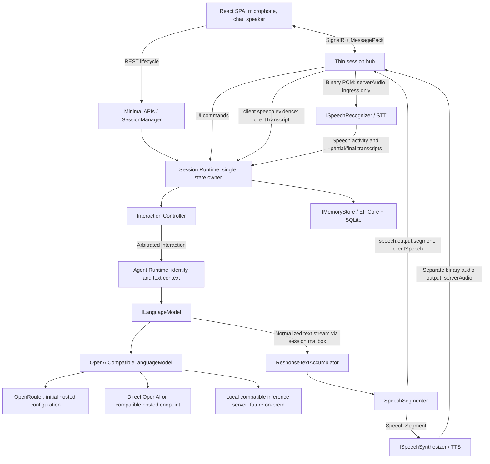

# System Architecture

## Decision

Agent Core is one .NET 10 modular monolith with a React SPA. Its purpose remains to make an AI agent feel present in a live conversation. The Agent Runtime owns conversational meaning; the Interaction Controller arbitrates turn-taking. Both execute under one Session Runtime's state ownership.

The canonical MVP is a composed, text-first voice pipeline: STT → Interaction Controller → Agent Runtime / text Language Model → speech segmentation → TTS. `serverAudio` keeps processing microphone input during generated speech; full-duplex there describes the user's experience, not a requirement for audio reasoning. Browser STT (`clientTranscript`) is currently half-duplex during agent output; see [Voice](06-realtime-voice.md). Native speech-to-speech is future-only and does not participate in MVP startup, routing or provider selection.



The adapter's outgoing edges are deployment choices, not three simultaneous requests. The selected endpoint's normalized response returns through ILanguageModel. STT and TTS each independently select hosted, local or synthetic adapters. **Adapter names are not transports:** Session Runtime sees optional backend `ISpeechRecognizer`/`ISpeechSynthesizer` plus provider-neutral input/output transports (`serverAudio`, `clientTranscript`, `clientSpeech`). Browser speech is a client transport with no backend port; it is not a fake `ISpeechRecognizer`. PCM hub ingress exists only for `serverAudio`. `clientTranscript` never opens a backend recognizer; `clientSpeech` never opens a backend synthesizer. OpenRouter model IDs and provider payloads stay in Infrastructure configuration/mapping. [Technology Decisions](10-technology-decisions.md) explains hosted/on-prem choices; [Voice](06-realtime-voice.md) owns streaming, segmentation, and Browser privacy limits.


[Repository Structure](11-repository-structure.md) specifies project references. [Backend Interfaces](04-backend-interfaces.md) owns C# ports. [Protocol](14-api-and-realtime-protocol.md) owns browser DTOs; no universal event bus DTO bridges every layer.

## Per-session execution

```text
SessionManager (singleton, atomically get/create per sessionId)
  +-- SessionRuntime A (one logical async event loop)
  |     +-- bounded Channel<SessionInput>, single reader
  |     +-- current mode Text|Voice (may transition; one conversation)
  |     +-- Agent Runtime, Interaction Controller, owned mutable state
  |     +-- session lifetime CancellationTokenSource
  |     +-- current response CancellationTokenSource and responseId
  |     +-- active speech recognition session + bounded audio ingress
  |     +-- tracked model/TTS/classifier/persistence tasks
  +-- SessionRuntime B (independent state and event loop)
```

Only the single mailbox reader mutates conversational state, controller state, response status, transcript assembly, application sequence counters, timers' logical generations, and playback estimates. Agent Runtime and Interaction Controller are ordinary application objects invoked by this reader, not additional concurrent state writers. The controller keeps observing inputs while LLM work runs because network enumeration never blocks the reader.

Mailbox handlers perform short deterministic transitions, take immutable snapshots for external work, and launch supervised tasks. Provider tasks publish normalized results tagged with session epoch, responseId or utteranceId, and operation ID. No provider callback mutates runtime state. Persistence completion and classifier decisions also return through the mailbox. Do not hold locks over network calls or await entire model/TTS streams inside handlers.

The manager uses atomic creation/removal and an asynchronous lifecycle gate so concurrent REST/attach operations cannot create two owners. A runtime has a random epoch for its in-process lifetime. Recovery creates a new epoch; old work cannot target it. Hub instances are transient and never own a runtime. DI scopes for persistence are per operation, not a shared DbContext for an entire call.

## Ordering and bounded work

Use `Channel<T>` with capacity 256, `SingleReader=true`, `FullMode=Wait` for normalized session inputs. Producers admit with `TryWrite`: a full mailbox fails immediately so the caller can report a recoverable busy error; they do not block on `WriteAsync`. Admission establishes ordering; client timestamps do not. The reader assigns increasing internal sequence numbers. Provider pumps that use `WriteAsync` await channel capacity outside the loop. Audio is a separate bounded stream (see [Voice](06-realtime-voice.md)); raw frames never occupy this mailbox. Coalesce partial transcripts and playback progress before admission to the newest revision, but never discard finals, interruption confirmations, terminal results, or lifecycle commands.

An ingress enqueue deadline of 250 ms prevents an overloaded connection from waiting forever: reject new commands as recoverable `SessionBusy`; do not report success for unaccepted input. Provider/lifecycle producers remain cancellable and supervised; shutdown cancels them before disposal. Use a separate bounded output sender so the mailbox never waits on a slow browser. Control output has reserved capacity (32 items); text output is bounded at 256 items and audio at 2 seconds. The sender prioritizes stop/error/lifecycle controls, honors response start/terminal ordering fences, and rechecks response validity before every send. It alone owns wire-send sequence counters; the media coordinator alone owns audio frame counters, neither of which mutates conversational state. Audio exhaustion fails the voice response rather than silently dropping PCM; control exhaustion detaches the unresponsive connection and cancels its response. See protocol sequence rules for priority delivery.

Responses have one linked cancellation source for LLM, TTS and response-specific classifier/decision work. STT links to session/voice lifetime, not response lifetime: cancelling output must not cancel listening. Token sources are cancelled promptly and disposed only after their tasks finish. Every task is tracked and faults are observed; shutdown has a 5-second join budget, then quarantines late results by epoch. Adapters must honor cancellation and dispose network streams.

## Lifecycle

A created session is inactive until attached. One connection owns a session at a time. One logical Session is one conversation: interaction mode is `text` or `voice` and may transition; starting voice does not create a second unrelated session or copy-less history fork. Disconnect supersedes active output and suspends audio and initiative. Retain the idle runtime for a 60-second reconnect grace period; then persist a paused snapshot and evict it. A later attach reconstructs the session from SQLite with the same history and current mode. Clean end is terminal and idempotent. Process restart pauses recoverable sessions and marks unfinished responses interrupted; it never resumes an old provider stream. [Protocol](14-api-and-realtime-protocol.md#connection-lifecycle) defines ownership, mode transitions and resynchronization. Additive semantic `lifecycleStatus` is observed beside protocol-v1 `status` via Application `LifecycleTransition`; it does not replace this attach/pause/end model. RequestComplete evaluation remains planned.

`MaxActiveSessions` counts **in-memory Session Runtimes** (attached or in reconnect-grace). Creating a durable inactive session record does not consume a live slot. Attach or other activation that would exceed the limit fails with recoverable `SessionCapacityExceeded` and `RetryAfter` defaulting to 5 seconds; it must not evict another user's runtime.

## Invariants

- One Session Runtime owns mutation of one session's conversational state.
- Provider objects never mutate Agent Runtime state directly; provider-specific DTOs stay in Infrastructure.
- A superseded response never becomes visible again. Already-rendered text may remain marked interrupted; queued or late text/audio/completion cannot extend it.
- Superseding a Response stops new Speech Segments, cancels pending TTS/LLM work and drops queued audio before R2 can start. Late provider and browser playback events cannot affect the current turn.
- Cancellation plus identity checks are mandatory at mailbox acceptance, output send, browser reduction and audio playback.
- Agent output and user input coexist; the microphone remains active during playback except explicit mute/end/disconnect.
- Speech activity may produce Continue rather than Interrupt.
- Raw microphone frames are neither normal domain events nor persisted data. Browser STT does not send PCM to backend STT; that is not a guarantee that the browser vendor keeps recognition on-device.
- Initiative policy gates every proactive response; StaySilent is valid.
- Synthetic mode requires no network or AI credentials; the entire composed pipeline is testable offline without a microphone, speaker or GPU.
- One response is live per session, but historical responses and an in-progress user utterance may coexist.
- Conversation continuity is per Session, independent of the current text/voice mode. Delivery metadata on each assistant entry selects heard vs received prefix for future context; unseen/unheard tails never enter the model. Phase C stores an optional response envelope (speech + blocks) with those receipts. `displayText` / `speechText` / blocks are session response capabilities owned by the runtime and provider contract, not Agent Definition persona fields. Compatibility `[[speech:]]` markers exist only inside Infrastructure unstructured parsing; SessionRuntime consumes validated `speech.mode` (`same`/`custom`/`none`).
- No mutable state, transient audio, provider handles or CancellationTokenSource is stored in an Agent Definition.

## Follow-on P1 observed and frozen

Observed mailbox ownership and protocol-v1 attach/pause/end stay as above. Follow-on P1 does not add a second Session Runtime or put raw audio on the domain mailbox. Observed: bounded `IMemoryStore` restore plus durable `LastEntrySequence`; additive `lifecycleStatus` beside protocol-v1 `status` with `LifecycleTransition`; Application effective speech locale outside SessionRuntime vendor branches; Browser/hosted adapter locale/voice selection; Speech locale Select. Real Chrome `fr-FR` Browser STT/TTS smoke is observed (unedited `p1-repair-fr-smoke-r2`; earlier `p1-final-fr-smoke-r2` on `5764010` stays as written). **P1 freeze:** `dceaccbad9a4db8908af147b5353805a2b1af288` (`dceaccb`). Owners: [Technology Decisions](10-technology-decisions.md#decision-provider-neutral-effective-speech-locale).

## Post-MVP planned until verified

Observed A–H behavior; Phase I WorkItems are not-applicable until the future trigger in [Technology Decisions](10-technology-decisions.md#post-mvp-planned-until-verified).

- Durable **Session** (catalog row, pin, history, workspace ownership, attachments/artifacts) versus ephemeral **SessionRuntime** (mailbox, epoch, providers, voice). Reopen allocates a new epoch that rejects prior-epoch work.
- One writable workspace per SessionId; physical directory is lazy (`data/workspaces/{sessionId}`). Domain/Contracts never receive host paths. Archive, reopen, unload, and deactivate keep the same workspace; durable delete removes it.
- Trusted-local owner capability authorizes catalog, lifecycle, and hub attach; SessionId is not a credential. Connection-lease `attachmentId` is not a user-uploaded Attachment.
- Attachments are session-owned immutable blobs (`IAttachmentStore`) with off-mailbox processors (`IAttachmentProcessor`); Artifacts are a distinct generated/materialized type (`IArtifactStore`). Runtime deactivation, archive, and durable delete remain three operations.
- Typed tools execute through scoped session capabilities (not host paths or `IMemoryStore`); Session Runtime owns the bounded loop. Observed container sandbox (`ISandboxExecutor` / `DockerSandboxExecutor`) sits behind the same `sandbox.run` capability; `process`/`shell` remain forbidden. Phase I WorkItems are not-applicable until a later accepted workflow must survive runtime deactivation.

## P3 tools and integrations (observed)

P3B–P3D extend the same single Session Runtime mailbox model—no second orchestrator. **Registry/policy (P3B):** `ToolRegistry`, `ToolEffect`, and execution-time allowlist rechecks; workspace list/patch and artifact-from-workspace tools sit on observed `ISessionWorkspace`/`IArtifactStore`. **Public web (P3C):** Application `IWebSearchProvider` and `IPublicWebFetcher`; Infrastructure performs SSRF-safe fetch/search with profile-selected Synthetic or Brave adapters; `web.search`/`web.fetch` outputs are not durable history. **Approval (P3D-1):** sensitive tools emit live `agent.approval.requested` and resume only after hub `agent.approval.respond` on the owning response id. Human approval wait uses `ToolApprovalLimits.Lifetime` and does not consume the 30 s/120 s machine-execution tool timers; response cancel, detach, supersession, and epoch changes still abort the wait. Execution policy is evaluated before any Gmail draft preview. **Email (P3D-2):** Application `IEmailProvider` with Synthetic fixtures or Gmail refresh-token OAuth; `email.send` is approval-gated on the exact normalized draft (To/Cc/Bcc/Subject/Body). Indeterminate send outcomes and cancellation after dispatch permanently consume that approval; only a definite provider rejection may retry. Gmail MIME is built and parsed with MimeKit; CR/LF/NUL in header-bearing input is rejected; GetDraft fails closed unless Gmail returns RFC822 raw. Shipped `general-assistant` v2/v4 exercises web and email tool surfaces in Synthetic tests. See [Backend Interfaces](04-backend-interfaces.md#post-mvp), [Protocol](14-api-and-realtime-protocol.md), and [Implementation Plan](18-implementation-plan.md#p3bp3e--tools-web-approval-email-observedfrozen).
