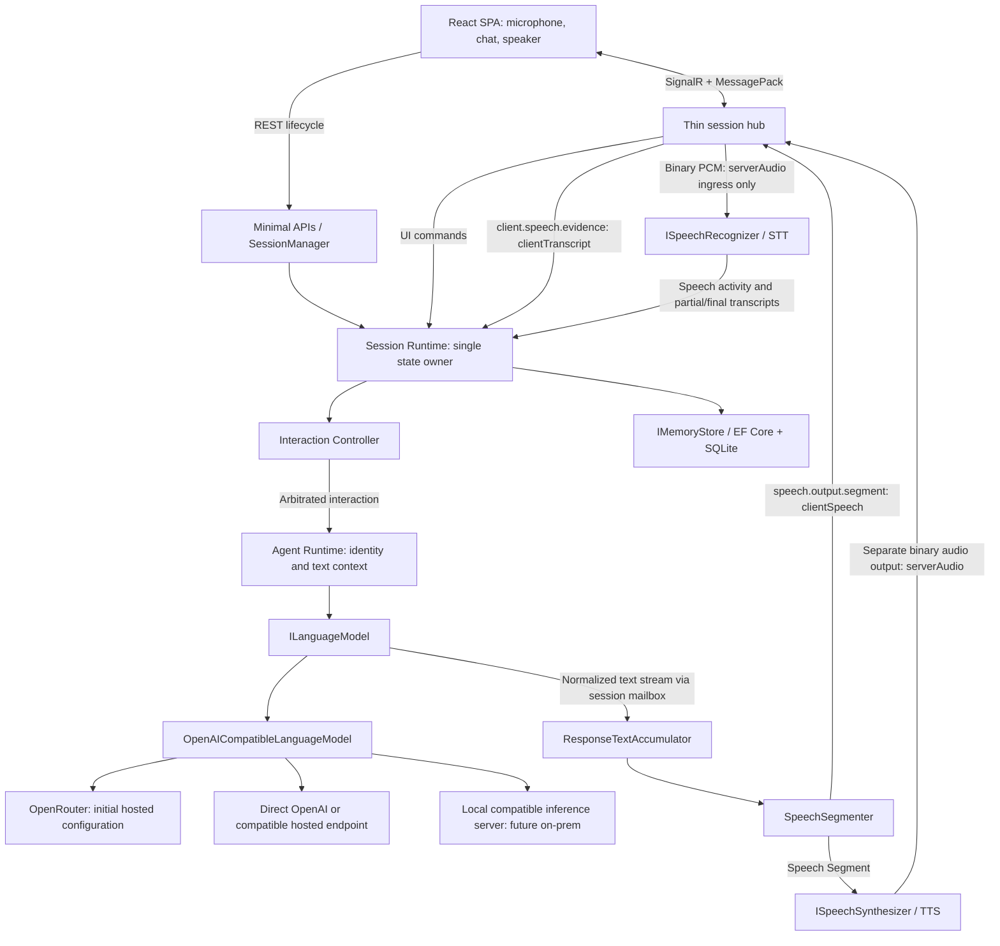
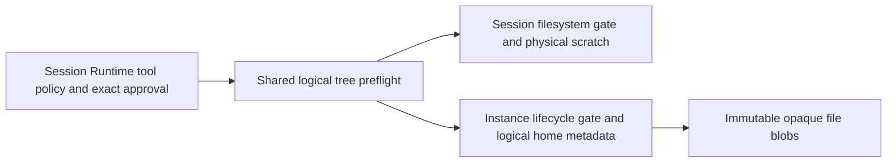

# System Architecture

## Accepted Activation and AgentRun cutover

The approved execution target is `Session → Activation → AgentRun`. A Session remains the durable conversation owned by one Agent Instance and trusted profile. An immutable Activation admits one effective agent turn and freezes its ordered input batch. Exactly one AgentRun owns that Activation's attempts, claim, checkpoint, approvals, effect fence, frozen execution configuration and outcome. Retrying retains run, activation and response identity; conversational continuation creates a new Activation and run in the same Session.

Background work is a normal Session with immutable creation origin and separate mutable surface flags. Immediate work links its originating Session/run; Automation work links its occurrence and creates a distinct Session for each accepted firing. Completing the initial run does not complete the Session. Continue in chat adds ChatList visibility to that same identity. Background Work resolves only the immutable initial Run, preserving its task/result while Chat evolves. New origins retain their original title separately from mutable conversation presentation. Artifacts remain Session-owned, with optional trusted producing AgentRun identity for original-task filtering; no copied result snapshot or new execution path is introduced. Completion delivery stays dynamic against the initial Run. Only an explicitly eligible initial immediate child completion may activate its parent, through a trusted bounded completion receipt. Mentions and cross-Session context attachments are outside this cutover.

`SessionOriginKind.SourceOccurrence` records a native source-owned occurrence that needs detached execution without an authored Automation. It requires an immutable occurrence link and forbids an Automation link or parent report-back. It starts in BackgroundWork with the same Session continuity rules. This distinguishes the path from manual maintenance without changing native live routing.

One SessionRuntime mailbox remains the conversation writer. Live, initiative, native event and detached execution share one claim/approval/retry/effect state machine; the previous production execution engines are removed. There is no legacy adapter, dual writing or endpoint alias in the approved target.

**Implementation status:** Production conversation and detached execution now use the registered SessionRuntime/SessionHost AgentRun path. Durable accepted-input intent is repaired after restart; occurrence intake admits real targeted Sessions; the shared tool loop persists checkpoints and fences dispatch, and background.start returns a committed independent child. Atomic background outcomes and same-Session user continuation are exercised. Report-back, Session-first APIs/UI and approved legacy/schema retirement are implemented. Closed/frozen on final behavior `8cec78c5d47a43e0236a5c38f2e312f4e36ce283` (2026-10-08), with all five required hosted Synthetic/Compose jobs [green](https://github.com/trannamtrung1st/agent-core/actions/runs/37756244306). The [verification report](reports/activation-agent-run-background-sessions-verification.md) records local/runtime evidence and prior failed gates. P10/P11 remain unopened.

## Capability authority and projection

Capability-aware Definitions pin `environment.capabilities` (`mode: Selected|All`, exact `resolvedCapabilities`, SHA-256 `authorizationFingerprint`) separately from `environment.projection.alwaysCapabilities`. All resolves the current trusted registry when a draft is saved and again at publication, excluding workspace interfaces incompatible with its explicit workspace policy. Runtime never resolves All again. Future registrations require a new reviewed publication. Legacy `toolAllowlist` remains supported with historical runtime offers; no Definition authorization count ceiling remains.

`ToolProjectionService` evolves `ToolCatalog.For`; the existing eligibility flow and execution-time `ToolPolicy` stay authoritative. New-mode projection unions authorized bootstrap, always, deterministic context, active Skill requirements and execution-loaded names, then filters configuration, model support and execution eligibility. The existing Browser v2 bootstrap includes `browser.navigate`, `browser.snapshot`, `browser.find`, `browser.click`, `browser.type`, `browser.wait_for` and `browser.close` whenever authorized and eligible, independently of explicit Always selections. This is a Core-managed initial-context exception, not an extra grant. Skills and projection never grant authority. Trusted registry metadata distinguishes discoverable ordinary tools from context-only tools. No user-text keyword capability router or provider authorization logic exists.

Live capability loads pass response/epoch/cancellation and execution revision/claim checks through the Session mailbox. Their exact IDs and invocation count are saved before continuation. Durable work checkpoints explicit loaded IDs/count alongside tool messages; retry/reclaim reconstructs loaded IDs from that bounded execution state and rechecks eligibility. A new AgentRun starts clean. The same execution retains loaded exact interfaces. Discovery is permitted for live UserTurn and trusted connected occurrences (live or detached); unconnected occurrences, continuity-only and unconnected Automation cannot use it. Harness capabilities remain context-only under existing authority.

Accepted live occurrences keep their existing non-replayable receipt and own bounded load state in the Session mailbox, isolated by response/epoch from completed user turns and other occurrences. Their admission rechecks the current connection. Persisted recovery boundaries remain those in [Persistence and Configuration](15-persistence-and-configuration.md).


## Managed workspace refinement

Every Session belongs to a real active Agent Instance at creation. Each Agent Instance owns durable `/home`; each Session owns temporary `/working`. New Sessions and reconstructed runtimes start with cwd `/home`. Definition identity is configuration, never an alternative Session owner. Unsupported historical built-ins remain in Git history, outside the runtime catalog.

The Session Runtime mailbox owns a transient cwd, initially `/home`. Off-mailbox tool execution receives a fenced snapshot; a successful typed `workspace.cwd` effect returns through the mailbox with response/epoch checks before the next tool uses it. Reconnect keeps that runtime's cwd. Runtime reconstruction and a new Session initialize `/home`; cwd is not durable identity state or a workspace file. Setting cwd validates an existing authorized directory. Moving/deleting cwd or its ancestors is rejected until cwd changes.

`AgentInstanceWorkspaceService` orchestrates direct durable writes/patches and individual cross-scope copies through existing lifecycle exclusion. Bounded exact-byte `WorkspaceTransfer` ports share `WorkspaceTransferPlan` and the logical tree planner; adapters keep their independent filesystem or metadata/blob gates. Copy preserves binaries and empty directories, creates parents, preflights destination quota, and never merges. Existing durable file destinations require matching revision/hash; cross-scope move is forbidden and structural batches remain single-scope. No provider DTO, physical path, caller-selected owner, new runtime or storage framework is introduced.


## Decision

Agent Core is one .NET 10 modular monolith with a React SPA. Its purpose remains to make an AI agent feel present in a live conversation. The Agent Runtime owns conversational meaning; the Interaction Controller arbitrates turn-taking. Both execute under one Session Runtime's state ownership.

The pipeline in this section is the live conversation path. Authoring and Operations sit beside that path. The [responsibility model](#responsibility-model) names the current owner of each durable concept. It does not add projects, services, or a second runtime.

The canonical MVP is a composed, text-first voice pipeline: STT → Interaction Controller → Agent Runtime / text Language Model → speech segmentation → TTS. `serverAudio` keeps processing microphone input during generated speech; full-duplex there describes the user's experience, not a requirement for audio reasoning. Browser STT (`clientTranscript`) is currently half-duplex during agent output; see [Voice](06-realtime-voice.md). Native speech-to-speech is future-only and does not participate in MVP startup, routing or provider selection.


```mermaid
flowchart TD
    Browser[React SPA: microphone, chat, speaker] <-->|SignalR + MessagePack| Hub[Thin session hub]
    Browser -->|REST lifecycle| Api[Minimal APIs / SessionManager]
    Api --> Session[Session Runtime: single state owner]
    Hub -->|UI commands| Session
    Hub -->|Binary PCM: serverAudio ingress only| STT[ISpeechRecognizer / STT]
    Hub -->|client.speech.evidence: clientTranscript| Session
    STT -->|Speech activity and partial/final transcripts| Session
    Session --> Controller[Interaction Controller]
    Controller -->|Arbitrated interaction| Agent[Agent Runtime: identity and text context]
    Agent --> LLM[ILanguageModel]
    LLM --> Adapter[OpenAICompatibleLanguageModel]
    Adapter --> OR[OpenRouter: initial hosted configuration]
    Adapter --> Direct[Direct OpenAI or compatible hosted endpoint]
    Adapter --> Local[Local compatible inference server: future on-prem]
    LLM -->|Normalized text stream via session mailbox| Acc[ResponseTextAccumulator]
    Acc --> Segmenter[SpeechSegmenter]
    Segmenter -->|Speech Segment| TTS[ISpeechSynthesizer / TTS]
    Segmenter -->|speech.output.segment: clientSpeech| Hub
    TTS -->|Separate binary audio output: serverAudio| Hub
    Session --> Store[IMemoryStore / EF Core + SQLite]
```

The adapter's outgoing edges are deployment choices, not three simultaneous requests. The selected endpoint's normalized response returns through ILanguageModel. STT and TTS each independently select hosted, local or synthetic adapters. **Adapter names are not transports:** Session Runtime sees optional backend `ISpeechRecognizer`/`ISpeechSynthesizer` plus provider-neutral input/output transports (`serverAudio`, `clientTranscript`, `clientSpeech`). Browser speech is a client transport with no backend port; it is not a fake `ISpeechRecognizer`. PCM hub ingress exists only for `serverAudio`. `clientTranscript` never opens a backend recognizer; `clientSpeech` never opens a backend synthesizer. OpenRouter model IDs and provider payloads stay in Infrastructure configuration/mapping. [Technology Decisions](10-technology-decisions.md) explains hosted/on-prem choices; [Voice](06-realtime-voice.md) owns streaming, segmentation, and Browser privacy limits.


[Repository Structure](11-repository-structure.md) specifies project references. [Backend Interfaces](04-backend-interfaces.md) owns C# ports. [Protocol](14-api-and-realtime-protocol.md) owns browser DTOs; no universal event bus DTO bridges every layer.

## Responsibility model

Authoring, Runtime, and Operations are responsibilities inside the existing modular monolith. Effective configuration is a projection of trusted server state. Use-case authorization stays at the caller. Persistence and providers store or adapt; they do not become the product owner. Observability records identifiers, state, reason, and timing. It does not own lifecycle.

```text
                         Agent Core
                             │
          ┌──────────────────┼──────────────────┐
          │                  │                  │
      Authoring            Runtime           Operations
          │                  │                  │
  Definition drafts     Agent instances     Triggers
  Resources             Sessions            Occurrences
  Validation/evals      Session execution   AgentRuns
  Publication           Tools               Approvals
  Version history       Memory              Admin history
```

**Authoring** prepares immutable configuration. `AgentDefinitionLifecycleService` creates, updates, and deletes drafts and deprecates publications through `IAgentDefinitionAdminStore`. `AgentDefinitionDraftPublishService` runs validation, evaluation evidence, and diff, then asks the lifecycle service to commit the publication. Optional `skills` publish with that Definition version and stay immutable. A missing `skills` list is an empty set. A Skill requires capabilities and Definition resources; it does not add tools, credentials, approval, or owner scope. `AgentDefinitionLifecycleService.CreateNewDraftAsync` stores a server starter (`SourceKind.New`); the browser sends only the definition id. `AgentDefinitionResourceService` mutates draft resource bytes, including one-revision batch bind; publish freezes those bytes. Knowledge retrieval uses `KnowledgeSourcePaths.ResolveBackingPath` (explicit `resourcePath`, otherwise `knowledge/{identity}`). Built-in definition files stay immutable seeds. Publishing or deprecating does not rewrite stored session snapshots.

**Runtime** executes one conversation per session. `SessionManager` activates a session. That session's `SessionRuntime` mailbox is the only writer of live conversational state. Learned memory is `StructuredMemoryService` over `IStructuredMemoryStore`. Session snapshots stay on `IMemoryStore`. Session tools mutate the session workspace and create artifacts under session authorization. The chat catalog lists active managed instances through `AgentInstanceService.ListChatEligibleAsync`. Session creation requires an explicit eligible Agent Instance; no identity is created or backfilled implicitly.

**Operations** uses one Automation authoring owner and the existing TriggerScheduler → TriggerOccurrenceRouter → BackgroundOccurrenceIntake → AgentRunCoordinator → SessionHost/SessionRuntime substrate. Authored runs always execute durably with frozen instructions/model and current authority checks. Internal native environment occurrences can still dispatch to a live runtime. Admin history is append-only evidence, not a policy engine.

`AdminReadService` and `AdminEffectiveConfigurationResolver` project configuration for Admin. They do not own definitions, instances, persona, tools, or policy, and they do not execute tools. Session Runtime files do not call Admin lifecycle services. Admin services do not dispatch conversation turns.

Infrastructure stores persist the rows named below. API routes map commands and results. A route that only checks the trusted-local owner and forwards to an application service is not a second owner.

### Ownership

| Concept | Primary lifecycle owner | Mutation authority | Durable source | Readers / references | Category |
| --- | --- | --- | --- | --- | --- |
| AgentDefinitionDraft | `AgentDefinitionLifecycleService` | draft create, fork, update, delete | `IAgentDefinitionAdminStore` (InMemory or SQLite) | Admin HTTP, validation, diff, evaluation | configuration |
| AgentDefinitionVersion / publication | `AgentDefinitionDraftPublishService` commits through the lifecycle service; deprecate stays on the lifecycle service | publish freezes bytes; deprecate changes metadata only | built-in files plus durable publications via `IAgentDefinitionStore` | sessions, instances, work provenance, Admin reads | configuration |
| DefinitionResource | `AgentDefinitionResourceService` | draft resource bytes; publish freezes them in the publication transaction | definition-resource stores | evaluation manifest, published knowledge reads | configuration |
| AgentInstance, managed | `AdminAgentInstanceService` | create, reassociate/rollback, persona revision, archive/unarchive, and archived hard delete when unreferenced, each with an `AdminEvent` | `IAgentInstanceStore` | sessions pin `agentInstanceId`; chat catalog `GET /api/v2/agent-instances` through `AgentInstanceService.ListChatEligibleAsync`; triggers; work owner; Admin reads | runtime identity |
| PersonaRevision | `AdminAgentInstanceService.UpdatePersonaAsync` | typed persona revision on the managed instance, with history | instance row | prompt context, work provenance | trusted identity |
| Session | `SessionManager` activates; `SessionRuntime` mailbox owns live mutation | mailbox only | `IMemoryStore` snapshots | hub, catalog, history | runtime |
| Activation / AgentRun | Session mailbox atomically admits the effective input batch | shared coordinator claims/retries; mailbox owns execution, checkpoint, approval and terminal outcome | `IAgentRunStore` | Session history, Background Work, Admin Runs | execution |
| Learned memory | `StructuredMemoryService` | admit agent or application proposals; retrieve and reset under memory policy | `IStructuredMemoryStore` | prompt via `SessionMemoryPrompt`; Admin memory operations | learned state. The agent proposes; Core admits. Policy enables scope and does not guarantee every proposal is stored. |
| Admin memory operations | `AdminMemoryHistoryService` for delete/reset; `AdminMemoryService` for list and the allow check | HTTP delete/reset builds an `AdminEvent` and calls `IAdminP7eHistoryMutator`. The mutator calls `EnsureDeleteAllowedAsync` or `EnsureResetAllowedAsync`. InMemory then calls `AdminMemoryService` delete/reset. SQLite tombstones or resets the same scopes inside the history transaction | `IStructuredMemoryStore` plus `IAdminEventStore`. Session lookup for a session-scoped operation uses `IMemoryStore` | Admin UI | learned-state operation |
| Automation | `AdminAutomationAuthoringService` and current-turn authorized commands | create/update/disable/delete and manual admission with CAS and safe history | `ITriggerStore` | scheduler, ingress, Chat and Admin | owner-scoped future behavior |

Known boundaries that stay separate:

- All Agent Instances share `IAgentInstanceStore`. Product HTTP for create, persona, lifecycle, and active-version changes calls `AdminAgentInstanceService` and writes an `AdminEvent`. `AgentInstanceService` still exposes history-free `CreateAsync`, `UpgradeAsync`, `UpdatePersonaAsync`, and `SetLifecycleAsync`. Production HTTP and `SessionManager` do not call those four methods. They remain on `IAgentInstanceService` for existing tests. They are not the Admin owner and are not a second product policy.
- Automation mutation uses current owner or current-turn authorization and the same revisioned domain/store rules; provenance is immutable across later owner edits.

### Effective configuration

Effective configuration is shared authoritative resolution primitives plus use-case-specific composition. It is not one runtime configuration object, and `EffectiveConfigurationComposer` is not that object.

`ComposeAdmin` builds the secret-safe Admin projection. `AdminEffectiveConfigurationResolver` returns it. `MemoryPolicyOf` owns the shared default `definition.MemoryPolicy ?? MemoryPolicy.Disabled`. Session bind, background Session admission, and draft evaluation do not call `ComposeAdmin`.

| Primitive | Rule | Where it is applied |
| --- | --- | --- |
| `MemoryPolicyOf` | A missing policy is `Disabled` | Admin projection, Admin memory allow checks, memory admission |
| `SessionModelBinder.PinDefault` | Catalog default for the definition | Admin projection, durable-work intake, session snapshot default, initiative |
| Session model `Bind` | A live session may select a catalog key and reasoning effort | Live session only |
| `ToolCatalog.For` | Offered tool names from the definition and context | Admin projection, prompt construction |
| `ToolPolicy.EvaluateExecution` | Execution decision, including the action-specific approval grant and detached denial of session-scoped tools | Live tools, detached work, draft evaluation |
| `OccurrenceCompatibility.Allows` | Trigger source eligibility | Admin durable-work eligibility, scheduler, routing, session delivery |
| `RoleEnvironments` | Harness references, knowledge sources, workspace template, tool allowlist | Admin projection, prompt, tool policy, workspace |

Definition-resource bytes stay on `AgentDefinitionResourceService` and `DefinitionPublicationResourceReader`. Admin reads project those bindings. They do not authorize a tool call. A stale Admin projection cannot grant execution, because approval and ownership are checked again at the execution site.

The closure audit found no contradictory model, tool, resource, memory, or trigger default across those callers. No second composer was added.

### Consolidation audit

The file audit below does not move code. Line count is not a reason to split.

| File | Decision | Evidence |
| --- | --- | --- |
| `SessionHost` (`src/AgentCore.Api/Realtime/SessionHost.cs`, plus `AgentRuns` and `Occurrences` partials) | Defer | The host owns the live connection table, command admission, wire `Map`, audio ingress, and detach grace. On attach, when no conversation execution is open, a newer durable revision or `NeedsDurableConversationConvergence` calls `ApplyTransportResumedSnapshotAsync`. When executions are still open, `ConvergeAttachedConversationAsync` waits until they drain and then calls `RefreshDurableConversationProjectionAsync`. That refresh does not use the comparison. `ListCompatible` filters runtimes this host already holds. Those are adapter steps, not a second conversation owner. |
| `AdminEndpoints` | Defer | Routes parse HTTP and call Admin application services. Required-field, confirm, and revision checks are request mapping. `AdminDefinitionResourceHttp` stops an unbounded upload at `AgentResourceLimits.MaxItemBytes`; `DefinitionResourcePolicies.ValidateContentSize` checks the same limit once the bytes exist. `ParseResourceKind` maps the wire string onto `AgentDefinitionResourceKind`. |
| `PromptContextBuilder` | Defer | Methods in the builder assemble prompt sections. `DefaultAgentBrain` starts at the same file and chooses speak or stay-silent by calling the builder. Moving the brain to another file would not remove a duplicated rule. |
| `SessionToolExecutor` | Defer | `ExecuteAsync` is the one execution policy. Workspace and trigger handlers already live in partials. Email, web, sandbox, attachment, and artifact handlers stay behind that dispatch. `LooksLikeHostPath` rejects rooted tool arguments. It does not store a host path. |
| `TriggerScheduleCommands` | Retained command parser | Current-turn authorization and timing parsing delegate to the unified Automation authoring owner. |

Justified non-merges: do not merge attachment, artifact, definition-resource, and workspace stores; do not add a project per box in the diagram above; do not fold Admin into Session Runtime.

## Per-session execution

```text
SessionManager (singleton, atomically get/create per sessionId)
  +-- SessionRuntime A (one logical async event loop)
  |     +-- bounded Channel<SessionInput>, single reader
  |     +-- current mode Text|Voice (may transition; one conversation)
  |     +-- Agent Runtime, Interaction Controller, owned mutable state
  |     +-- session lifetime CancellationTokenSource
  |     +-- current response CancellationTokenSource and responseId
  |     +-- active speech recognition session + bounded audio ingress
  |     +-- tracked model/TTS/classifier/persistence tasks
  +-- SessionRuntime B (independent state and event loop)
```

Only the single mailbox reader mutates conversational state, controller state, response status, transcript assembly, application sequence counters, timers' logical generations, and playback estimates. Agent Runtime and Interaction Controller are ordinary application objects invoked by this reader, not additional concurrent state writers. The controller keeps observing inputs while LLM work runs because network enumeration never blocks the reader.

A contract-bearing model result is normalized in Application to one terminal Agent Step before Chat delivery. Disposition (`Continue`, `Wait`, `Complete`, `Blocked`) is separate from requested actions. The strict provider schema carries that disposition and one `action` (`chat.respond` or null). Omitted step fields, including the plain-text compatibility channel, still map to `Complete` and one `chat.respond`. `Continue` does not start another generation. `IAgentBrain` remains the pre-generation decision and is not that step. A model disposition does not itself mutate Session, AgentRun, approval, trigger, or memory. Unknown or malformed steps fail closed as `InvalidResponse` and execute nothing. A terminal step classified `Repairable` (currently only missing display text) may be requested once more as plain text, with no tools and no response contract; Application wraps non-empty text as `chat.respond` and does not replay completed work. Normalized speech defects are not failures, and every other defect, or a second invalid envelope, fails closed. Chat delivery maps the admitted `ChatRespondAction` through `SemanticResponseMapper`, bound to the runtime Session. Definition Skills are immutable reusable procedures. Each instance stores enabled choices by stable Definition Skill id and owns independent mutable Instance Skills. Skill IDs are unique within one Definition or Agent Instance; different owners may reuse an ID. New Instance Skills accept readable IDs or generate them from their name, and retain that identity through later edits. One resolver combines enabled Skills into an origin-qualified catalog. Every accepted turn and durable Work execution pins its complete catalog: enabled Always procedures start active; OnDemand procedures require `skills.load`. Recovery, prompt rebuilding and required-capability projection use only that snapshot. Skill writes affect future executions, including later turns of a Session pinned to an older Definition version. `app.message.send` appends a completed `applicationMessage` for the bound session and does not speak it or put it in prompt history. Always projection applies to unattended executions too. Requirements do not grant tools. See [Backend Interfaces](04-backend-interfaces.md#terminal-agent-step) and [Definition Skills](04-backend-interfaces.md#definition-skills).

Mailbox handlers perform short deterministic transitions, take immutable snapshots for external work, and launch supervised tasks. Provider tasks publish normalized results tagged with session epoch, responseId or utteranceId, and operation ID. No provider callback mutates runtime state. Persistence completion and classifier decisions also return through the mailbox. Do not hold locks over network calls or await entire model/TTS streams inside handlers.

The manager uses atomic creation/removal and an asynchronous lifecycle gate so concurrent REST/attach operations cannot create two owners. A runtime has a random epoch for its in-process lifetime. Recovery creates a new epoch; old work cannot target it. Hub instances are transient and never own a runtime. DI scopes for persistence are per operation, not a shared DbContext for an entire call.

## Ordering and bounded work

Use `Channel<T>` with capacity 256, `SingleReader=true`, `FullMode=Wait` for normalized session inputs. Producers admit with `TryWrite`: a full mailbox fails immediately so the caller can report a recoverable busy error; they do not block on `WriteAsync`. Admission establishes ordering; client timestamps do not. The reader assigns increasing internal sequence numbers. Provider pumps that use `WriteAsync` await channel capacity outside the loop. Audio is a separate bounded stream (see [Voice](06-realtime-voice.md)); raw frames never occupy this mailbox. Coalesce partial transcripts and playback progress before admission to the newest revision, but never discard finals, interruption confirmations, terminal results, or lifecycle commands.

An ingress enqueue deadline of 250 ms prevents an overloaded connection from waiting forever: reject new commands as recoverable `SessionBusy`; do not report success for unaccepted input. Provider/lifecycle producers remain cancellable and supervised; shutdown cancels them before disposal. Use a separate bounded output sender so the mailbox never waits on a slow browser. Control output has reserved capacity (32 items); text output is bounded at 256 items and audio at 2 seconds. The sender prioritizes stop/error/lifecycle controls, honors response start/terminal ordering fences, and rechecks response validity before every send. It alone owns wire-send sequence counters; the media coordinator alone owns audio frame counters, neither of which mutates conversational state. Audio exhaustion fails the voice response rather than silently dropping PCM; control exhaustion detaches the unresponsive connection and cancels its response. See protocol sequence rules for priority delivery.

Responses have one linked cancellation source for LLM, TTS and response-specific classifier/decision work. STT links to session/voice lifetime, not response lifetime: cancelling output must not cancel listening. Token sources are cancelled promptly and disposed only after their tasks finish. Every task is tracked and faults are observed; shutdown has a 5-second join budget, then quarantines late results by epoch. Adapters must honor cancellation and dispose network streams.

## Lifecycle

A created session is inactive until attached. One connection owns a session at a time. One logical Session is one conversation: interaction mode is `text` or `voice` and may transition; starting voice does not create a second unrelated session or copy-less history fork. Disconnect supersedes active output and suspends audio and initiative. Retain the idle runtime for a 60-second reconnect grace period; then persist a paused snapshot and evict it. A later attach reconstructs the session from SQLite with the same history and current mode. Clean end is terminal and idempotent. Process restart pauses recoverable sessions and marks unfinished responses interrupted; it never resumes an old provider stream. [Protocol](14-api-and-realtime-protocol.md#connection-lifecycle) defines ownership, mode transitions and resynchronization. Additive semantic `lifecycleStatus` is observed beside protocol-v1 `status` via Application `LifecycleTransition`; it does not replace this attach/pause/end model. RequestComplete evaluation remains planned.

`MaxActiveSessions` counts **in-memory Session Runtimes** (attached or in reconnect-grace). Creating a durable inactive session record does not consume a live slot. Attach or other activation that would exceed the limit fails with recoverable `SessionCapacityExceeded` and `RetryAfter` defaulting to 5 seconds; it must not evict another user's runtime.

## Invariants

- One Session Runtime owns mutation of one session's conversational state.
- Provider objects never mutate Agent Runtime state directly; provider-specific DTOs stay in Infrastructure.
- A superseded response never becomes visible again. Already-rendered text may remain marked interrupted; queued or late text/audio/completion cannot extend it.
- Superseding a Response stops new Speech Segments, cancels pending TTS/LLM work and drops queued audio before R2 can start. Late provider and browser playback events cannot affect the current turn.
- Cancellation plus identity checks are mandatory at mailbox acceptance, output send, browser reduction and audio playback.
- Agent output and user input coexist; the microphone remains active during playback except explicit mute/end/disconnect.
- Speech activity may produce Continue rather than Interrupt.
- Raw microphone frames are neither normal domain events nor persisted data. Browser STT does not send PCM to backend STT; that is not a guarantee that the browser vendor keeps recognition on-device.
- Initiative policy gates spontaneous proactive responses; StaySilent is valid. Explicit scheduled conversation responses and requested completion reports have their own authorization contract.
- Synthetic mode requires no network or AI credentials; the entire composed pipeline is testable offline without a microphone, speaker or GPU.
- One response is live per session, but historical responses and an in-progress user utterance may coexist.
- Conversation continuity is per Session, independent of the current text/voice mode. Delivery metadata on each assistant entry selects heard vs received prefix for future context; unseen/unheard tails never enter the model. Phase C stores an optional response envelope (speech + blocks) with those receipts. `displayText` / `speechText` / blocks are session response capabilities owned by the runtime and provider contract, not Agent Definition persona fields. Compatibility `[[speech:]]` markers exist only inside Infrastructure unstructured parsing; SessionRuntime consumes validated `speech.mode` (`same`/`custom`/`none`).
- No mutable state, transient audio, provider handles or CancellationTokenSource is stored in an Agent Definition.
- Semantic compaction runs outside the mailbox after a durable completed turn. Only the mailbox may commit a still-current summary. Compaction does not rewrite raw conversation rows.
- Structured session memory is a separate store from the session snapshot. Learned items do not rewrite trusted profile or persona records, and one session cannot address another session's items.

## Follow-on P1 observed and frozen

Observed mailbox ownership and protocol-v1 attach/pause/end stay as above. Follow-on P1 does not add a second Session Runtime or put raw audio on the domain mailbox. Observed: bounded `IMemoryStore` restore plus durable `LastEntrySequence`; additive `lifecycleStatus` beside protocol-v1 `status` with `LifecycleTransition`; Application effective speech locale outside SessionRuntime vendor branches; Browser/hosted adapter locale/voice selection; Speech locale Select. Real Chrome `fr-FR` Browser STT/TTS smoke is observed (unedited `p1-repair-fr-smoke-r2`; earlier `p1-final-fr-smoke-r2` on `5764010` stays as written). **P1 freeze:** `dceaccbad9a4db8908af147b5353805a2b1af288` (`dceaccb`). Owners: [Technology Decisions](10-technology-decisions.md#decision-provider-neutral-effective-speech-locale).

## Post-MVP planned until verified

Observed A–H behavior; Historical Phase I WorkItems were not-applicable until the future trigger in [Technology Decisions](10-technology-decisions.md#post-mvp-planned-until-verified).

- Durable **Session** (catalog row, pin, history, workspace ownership, attachments/artifacts) versus ephemeral **SessionRuntime** (mailbox, epoch, providers, voice). Reopen allocates a new epoch that rejects prior-epoch work.
- One writable workspace per SessionId; physical directory is lazy (`Persistence:WorkspaceRoot/agent-<instanceN>/sessions/session-<sessionN>/working`). Domain/Contracts never receive host paths. Archive, reopen, unload, and deactivate keep the same workspace; durable delete removes it.
- Trusted-local owner capability authorizes catalog, lifecycle, and hub attach; SessionId is not a credential. Connection-lease `attachmentId` is not a user-uploaded Attachment.
- Attachments are session-owned immutable blobs (`IAttachmentStore`) with off-mailbox processors (`IAttachmentProcessor`); Artifacts are a distinct generated/materialized type (`IArtifactStore`). Runtime deactivation, archive, and durable delete remain three operations.
- Typed tools execute through scoped session capabilities (not host paths or `IMemoryStore`); Session Runtime owns the bounded loop. Observed container sandbox (`ISandboxExecutor` / `DockerSandboxExecutor`) sits behind the same `sandbox.run` capability; `process`/`shell` remain forbidden. Historical Phase I WorkItems were not-applicable until a later accepted workflow must survive runtime deactivation.

## P5 durable triggers (observed)

Durable schedules and one allowlisted application event are not Session Runtime timers or learned memory. `ITriggerStore` owns registrations and occurrences; accepted execution receipts reference Sessions and AgentRuns. A hosted scheduler outside the runtime scans due rows with `TimeProvider`. Every authored occurrence enters `AwaitingDurableWork`, including while Chat is attached. Intake atomically resolves its frozen explicit destination. The scheduler never keeps a runtime alive waiting for a future fire. Configured Instructions express an authorized task; trigger payload is bounded untrusted evidence. Native source-owned live routing remains separate. See [event model](07-event-model.md).

## P7A Admin read boundary (observed)

P7 adds a distinct Admin product area in the same React SPA and owner-protected read APIs under `/api/v2/admin/...`. Application `AdminReadService` resolves built-in definition inventory, durable instance inventory, and secret-safe effective configuration (resolved catalog model, offered tools, harness references, workspace template id, memory/trigger policy, and durable-work eligibility) from exact pinned definition version and current persona. Admin UI navigation suspends the live SignalR hub and releases capture/playback resources before entering `/admin`; returning to Chat reconnects the remembered session without automatically resuming microphone capture. Authorization reuses trusted-local caller checks plus `OwnerCapabilityFilter`; hiding Admin navigation is not security. Resources, persona edits, memory and automation, the publish gate, and deprecation/rollback are the later observed slices below. See [Protocol](14-api-and-realtime-protocol.md#http) and [P7A report](reports/p7a-admin-shell-effective-config.md).

## P7B definition lifecycle (observed)

P7B adds durable Admin draft and publication storage (`IAgentDefinitionAdminStore`) alongside immutable file built-ins. Runtime `IAgentDefinitionStore` is a composite catalog: exact lookup resolves built-in or durable versions; default lookup prefers the highest eligible non-deprecated version across both sources. Application `AgentDefinitionLifecycleService` owns fork/create/update/publish/deprecate with draft revision and publication metadata concurrency. Admin HTTP exposes owner-protected draft and publication routes; Session Runtime and stored session snapshots are not rewritten when new versions publish or deprecate. See [Backend Interfaces](04-backend-interfaces.md#p7b-definition-lifecycle-observed), [Persistence](15-persistence-and-configuration.md#p7b-definition-lifecycle-store-observed), and [P7B report](reports/p7b-definition-lifecycle.md).

## P7C harness resources and workspace boundary (observed)

P7C adds application-owned definition resources bound to drafts and frozen into publications, resolved at runtime through `DefinitionPublicationResourceReader` into the existing read-only `/agent` virtual tree while Session `/working` stays mutable and Session-owned. Admin edits instructions, typed `RoleEnvironment` capabilities, and draft resources; publish copies immutable bindings into the publication transaction. A minimal managed-instance seam creates Agent Instances from exact publications and opens User chat through v2 `agentInstanceId` session create. `/agent` writes remain denied (`FileSessionWorkspace`); publication template bytes may seed `/working` once without write-back. See [Backend Interfaces](04-backend-interfaces.md#p7c-definition-resources-observed), [Persistence](15-persistence-and-configuration.md#p7c-definition-resource-store-observed), [Protocol](14-api-and-realtime-protocol.md#http), and [P7C report](reports/p7c-harness-resources-workspace.md).

## P7D–P7G Admin lifecycle completion (observed)

**P7D** adds durable managed instances with revision-protected persona, explicit active-version reassociation/rollback, archive/unarchive, and session pinning by `agentInstanceId` without rewriting historical sessions. **P7E** exposes scoped learned-memory delete/reset and automation registration cancel through existing P4/P5 boundaries with owner-protected Admin HTTP. **P7F** separates domain validation, Synthetic evaluation evidence bound to exact draft revision, configuration fingerprint (draft candidate plus sorted draft resource bindings), and scenario version, safe human-readable diff, and transactional publish against that revision. **P7G** adds append-only `AdminEvents` recorded atomically with durable harness mutations (draft create/delete, publish, deprecate, instance lifecycle, memory, trigger revoke) plus owner-protected history list; deprecation and rollback change metadata and future eligibility only. Session Runtime ownership, pinned snapshots, and P3/P6 authorization boundaries stay unchanged. Whole-phase verification: Playwright `admin-lifecycle` on disposable SQLite. See slice reports [P7D](reports/p7d-managed-instance-identity.md) through [P7G](reports/p7g-history-rollback-final-gate.md).

P7 **owns Harness Admin W01–W08 only**; it is not a run-control or Workflow orchestration console. **`ConversationTurnExecution`** observer durability is a **post-freeze session-runtime correction** recorded in the [P7 closure report](reports/p7-freeze-candidate.md#bookkeeping-appendix--post-freeze-session-runtime-correction-not-p7-contract) for bookkeeping — not part of the P7 Admin contract.

## P6 durable work (observed)

`BackgroundOccurrenceIntake` atomically accepts waiting occurrences into child Session/Activation/AgentRun graphs. `AgentRunCoordinator` dispatches the shared bounded Session tool loop with current capabilities, model pins, approval and effect fences. Outcomes belong to that child Session. Headless transport does not create a second runtime owner.

## P3 tools and integrations (observed)

P3B–P3F extend the same single Session Runtime mailbox model—no second orchestrator. **Registry/policy (P3B):** `ToolRegistry`, `ToolEffect`, and execution-time allowlist rechecks; workspace list/patch/search/move and artifact-from-workspace tools sit on observed `ISessionWorkspace`/`IArtifactStore`. **Public web (P3C):** Application `IWebSearchProvider` and `IPublicWebFetcher`; Infrastructure performs SSRF-safe fetch/search with profile-selected Synthetic or Brave adapters; `web.search`/`web.fetch` outputs are not durable history. **Approval (P3D-1):** sensitive tools emit live `agent.approval.requested` and resume only after hub `agent.approval.respond` on the owning response id. Human approval wait uses `ToolApprovalLimits.Lifetime` and does not consume the per-tool and overall machine-execution tool timers; response cancel, detach, supersession, and epoch changes still abort the wait. Execution policy is evaluated before any Gmail draft preview. **Email (P3D-2):** Application `IEmailProvider` with Synthetic fixtures or Gmail refresh-token OAuth; `email.send` is approval-gated on the exact normalized draft (To/Cc/Bcc/Subject/Body). Indeterminate send outcomes and cancellation after dispatch permanently consume that approval; only a definite provider rejection may retry. Gmail MIME is built and parsed with MimeKit; CR/LF/NUL in header-bearing input is rejected; GetDraft fails closed unless Gmail returns RFC822 raw; send uses `POST /users/me/drafts/send` with the hash-validated draft encoded as `message.raw`. **Capability closure (P3F):** `workspace.search` and `workspace.move`, plus approval-gated `http.request` for public unauthenticated APIs. Shipped `general-assistant` v7 remains the pre-schedule demo allowlist. v8 adds the five schedule tools and an enabled trigger policy. `demo.sensitive_action` stays on `approval-demo` for the approval harness. Workspace tools resolve bare filenames and relative paths from the current `/home` or `/working` cwd, collapsing `.` and `..` segments without treating `..` inside a file name as traversal. Public fetch tries every permitted address and reports connection failure as `transport_error`. Sandbox networking remains deferred outside P3. See [Backend Interfaces](04-backend-interfaces.md#post-mvp), [Protocol](14-api-and-realtime-protocol.md), and [Implementation Plan](18-implementation-plan.md#p3bp3f--tools-web-approval-email-assistant-capability-closure).

## P9 visible browser (observed)

Application owns `IBrowser`, browser lease and secure password-sink ports plus `BrowserTargetPolicy`; Infrastructure owns Playwright and its fixture. PersistentAgent mode keeps one profile per AgentInstanceId and Session-owned pages and direct semantic targets. No connection resource is needed. Tools require host readiness, explicit provider feature support, Definition authorization and contextual projection. Native semantic Locators resolve each action directly; optional discovery is independent of snapshots. The closed BrowserCommand operation family replaces the optional request union. No element-ref registry exists. Optional current frame inventory IDs select native iframe-root observations on the same typed `BrowserObserve` path. Frame generation, owned-page membership and all ancestor frame policies are rechecked; native snapshots do not traverse unauthorized frame interiors. Bounded native ARIA excerpts provide optional observation without an index, parser or custom caption scanner. Application projects successful observations into the remaining UTF-8 byte budget without changing provider Locator ownership. Scoped provider reads avoid full-page enumeration; exact authorized eligible bootstrap projection includes closure, with advanced discovery and load state still owned by the AgentRun. The single native browser registry owns schemas, groups and effect metadata. Navigation, interaction and subresource policy remain independent host settings. Credentials are reusable protected system resources with explicit AgentCredentialBindings; they never authorize capabilities. Safe metadata is contextual, while secure values move internally to a supported sink. Browser environment inspection and origin-scoped geolocation use the same negotiated port/registry. Context creation emulation stays in Infrastructure; runtime controls retain the owner gate and approvals. Service workers are blocked, and WebSocket resource origins are checked before connection. No page-provided tools, CDP commands or arbitrary code acquire Core authority. See [ports](04-backend-interfaces.md#system-credentials-and-browser-profiles) and [storage](15-persistence-and-configuration.md#system-credentials-and-protection-storage).

## P9.5 connection and attention (closed)

The same Session Runtime and AgentRun owners cover generic browser execution and owner attention. Ordinary loops retain 24 steps/180 seconds, direct authorized browser UserTurns use 48 steps/300 seconds, and detached work holding the active owner's persistent-browser lease uses 32 steps/240 seconds. Core selects the budget. A saved login may be reused; detached password injection is denied and an expired login requires owner attention. The P9.5 nopCommerce Application Connection was a bounded proving slice and is retired by System Credentials. Historical P9.5/P9.6 freeze evidence remains unchanged; current behavior uses explicit credential grants, generic capabilities, and Agent-Instance-owned browser profiles.

## Post-P9.5 bounded browser settle

The browser provider owns a short bounded settle after navigation and after click, press, select, check, and uncheck, and it owns an explicit `browser.wait_for` request with `condition` `stable`. The agent may ask for one settled re-observation of an incomplete page. A successful navigation or browser action clears the observation-repeat streak. Newly discovered semantic matches can also clear that streak; repeated search results alone cannot. The first `browser.snapshot` records page evidence from the URL, visible text, settled flag, and each observed match's role, name, actions and control state, independently of snapshot identity. Two further observations with that same evidence stop the tool loop so the turn answers from the evidence already collected, including uncertain parts. The 48-step ceiling remains the final safety net. `stable` means the visible page stayed quiet for a short interval inside a hard deadline. A wait stays on the current authorized page. Empty `browser.snapshot` stays a fast capture. This enhancement does not move the P9 freeze SHA `bba1de4` or the P9.5 closure SHA `1012653`.

## P9.7 Authoring ownership

Harness Authoring is contextual Agent-Instance authority, never a Definition allowlist grant. Trusted-local single-owner, attached UserTurn Chat is the current authority seam; detached, occurrence and background execution do not receive it. The normal model/tool loop invokes Application capabilities calling existing Authoring owners off the mailbox. Offering intersects enabled instance policy, scope, execution context and model tools support. Execution reloads live instance policy and checks expected active version/policy revision and exact approval. User text expresses intent, not authority.

Source access remains ordinary authorized web/browser/workspace/attachment/knowledge/HTTP tool access. Successful content-bearing results create execution-local provenance receipts; unread or failed sources cannot be retained. Current owner-provided material uses `conversation:user`. External content stays untrusted. No required second Admin URL catalog or backdoor HTTP client exists.

`HarnessManagementService` orchestrates existing draft/resource/validation/evaluation/diff/publication/adoption owners. Managed knowledge use internal candidates and required checks before immutable publication and atomic adoption. Assisted mutations, instructions and all tool changes require action-bound Chat approval. Agent assessment is partial; Core owns actual knowledge readback and structural checks. Production outcomes remain external evidence. Publication and adoption history attribute automatic changes to Agent. Failed adoption may leave an unused immutable publication, but never changes the instance's active version.

Published versions and current Session snapshots remain immutable: improvements apply to future Sessions. The Session Runtime remains the sole mailbox owner of conversation state and does not own draft persistence. Admin governs policy, inspection and freeze. The separate `HarnessPreparationExecution` reasoning loop and HTTP `/continue` were retired. Legacy owner candidate endpoints remain advanced lifecycle operations. P11A replaces trusted-local context with authenticated/delegated authority only when required.

## Unified Automation and Experience execution

An owned Automation contains Name (120 characters), Instructions (2000), a discriminated Schedule/Event trigger, lifecycle and revision, optional tool-capable model selection, and immutable creation provenance. `AdminAutomationAuthoringService` validates current owner/policy/model and writes through `ITriggerStore.SaveAutomationAsync`. Chat's current-turn tools use the same authoring owner after `TriggerAuthorization`; historical text and event payload never grant authority.

Schedule admission snapshots configured Name/Instructions, Automation revision, trigger summary/context and model pin. A shared Event is a webhook resource with a stable internal ID, immutable unique key, editable name and independently hashed bearer secret. An Automation subscribes by Event ID; any bounded JSON data object can provide untrusted trigger evidence. `ExternalEventIngress` authenticates, normalizes and deduplicates each Event/delivery identifier, snapshots active subscribers across Instances, and admits occurrences through the existing Activation/Session/AgentRun substrate. Current active Event/Automation and Definition policy checks apply before pending delivery completion. Event records have no synthetic schedule. Optional rootAgentRunId/triggerDepth are paired; depth above four is rejected with a bounded reason.

All authored Schedule, Event and manual activations route to durable intake even while Chat is attached. The existing bounded tool loop, checkpoint/lease, effect fence, exact approval and recovery owners apply. Accepted instructions/model pins survive later edits; future admissions use the new revision. Busy/nonterminal runs prevent overlapping manual admission; missed intervals coalesce. Internal native environment occurrences retain their interaction-controller transport path.

Every background Run finishes with `work.complete`: Response, NoAction or NeedsAttention, bounded summary, and attention classification validated by Core. NoAction rejects accepted state-changing effects and leaves no fabricated assistant bubble. Failure, retry, cancellation and approval are ordinary AgentRun states.

Experience stays separate from learned Memory and raw history. `experience.source` inspects owned stable Session/terminal substantive AgentRun evidence and returns a bounded cursor; `experience.record` records validated evidence-backed observations against that unchanged cursor. Suppressed/deleted/superseded observations do not re-enter recall. Manual review convenience admits a generic manual background Session/AgentRun with no Automation; deterministic reconciliation repairs missing request-to-background-Session/AgentRun admission only. No hosted model-driven cadence or lifecycle synthesis remains. Recurring review, consolidation and Harness refinement are ordinary Automation instructions, with current policy/authority checked before offering and again at execution or approval resume.

Continuity search/get remains a read projection over separate Memory, Experience and history stores, with same-instance ownership, secret filtering, bounded lexical ranking and untrusted evidence labels. Retrieval never changes the current task or grants capabilities.

## P9.10 identity maintenance (accepted implementation)

Semantic maintenance extends the existing structured Memory and Experience stores with atomic multi-source supersession and bounded lineage. Memory scope/kind/ownership cannot change; Experience stays separate from Memory. Permission is a default-off revisioned instance setting, independent of Automation activation. Existing tool policy and exact approvals govern guarded operations; historical content remains untrusted. Superseded sources remain inspectable and are excluded from normal recall. No second scheduler, runtime, generic mutation surface, or automatic Experience-to-Memory promotion is introduced.

## Bounded Agent Instance workspace

Every Session belongs to a real active Agent Instance at creation. Each Agent Instance owns durable `/home`; each Session owns temporary `/working`. New Sessions and reconstructed runtimes start with cwd `/home`. Definition identity is configuration, never an alternative Session owner. Unsupported historical built-ins remain in Git history, outside the runtime catalog. `AgentInstanceWorkspaceService` derives ownership from trusted Session metadata and uses lifecycle exclusion. `workspace.copy` is the explicit cross-root transfer. Archive preserves inspection and disallows home mutations. Hard deletion commits owner removal, metadata removal and the `InstanceDeleted` receipt before physical purge; startup and five-minute recovery retry leftovers and never purge an existing owner. One authoritative writer owns each database/blob persistence root. Source Session ids record provenance without cascading ownership.

## Bounded workspace virtual filesystem

Workspace tools manage files/directories; sandbox tools execute programs. The canonical vocabulary is `cwd`, `list`, `read`, `write`, `patch`, `search`, `mkdir`, `copy`, `move`, `delete`, and `batch`. Relative model paths resolve from mailbox-owned cwd. Home content edits require revision/hash CAS; home structural changes require the whole-tree token.

A shared pure Application `WorkspaceTreePlanner` models the complete ordered result before any structural mutation. `FileSessionWorkspace` uses a physical tree and a per-Session filesystem gate; `FileAgentInstanceWorkspaceStore` uses logical directory metadata and immutable opaque blobs under the existing per-instance/lifecycle gates. This shares scope/path/conflict/parent/dependency/quota rules without exposing physical names or coupling the two storage adapters. The Session Runtime continues to own conversation state through its mailbox.

Empty directories are first-class entries. Copy preserves complete trees and exact file bytes; move includes rename and keeps complete descendants. Destinations never overwrite or merge. Root/internal entries, unauthorized scope changes, mutation globs, traversal and symlinks are rejected; new-mode individual cross-root copy is the explicit exception. Non-empty directory deletion requires explicit `recursive:true` and approval. Batches accept at most 16 operations, preflight all dependencies and cumulative bounds, execute in order, and stop on unexpected failure. Earlier changes remain; preflight does not promise atomic rollback. Whole-home tree tokens prevent stale durable plans. See [interfaces](04-backend-interfaces.md#workspace-structure-ports), [tools](12-backend-implementation-spec.md#native-workspace-filesystem-tools) and [verification](reports/workspace-filesystem-final-verification.md).


```mermaid
flowchart LR
    Runtime[Session Runtime tool policy and exact approval] --> Planner[Shared logical tree preflight]
    Planner --> Scratch[Session filesystem gate and physical scratch]
    Planner --> Home[Instance lifecycle gate and logical home metadata]
    Home --> Blobs[Immutable opaque file blobs]
```

## Unified Automation cutover (accepted implementation target)

The post-P9.10 convergence replaces separate behavioral Schedule, Thought and event-subscription registrations with one owner-scoped `Automation`: name, instructions, a Schedule or Event trigger, revisioned lifecycle, model override and provenance. Instructions and structured, untrusted trigger evidence determine the task; Agent Instance capabilities and execution policy determine authority. Trigger → Occurrence → targeted Session/Activation/AgentRun is the sole durable substrate. Manual invocation uses that same execution path. Generic `work.complete` reports NoAction, Response or NeedsAttention with independent effect evidence. Shared Events remain global Connections resources; Instance Automations own subscriptions and behavior. Agent-judgment continuity review uses ordinary runs; deterministic store housekeeping stays internal. Disposable legacy automation data is reset, with no runtime compatibility readers. Historical freeze reports remain unchanged. Implementation and verification status belongs to the new convergence report.

### Unified Automation execution routing

Every authored Automation occurrence snapshots an execution target and completion-delivery policy. `ExistingSession(exact SessionId)` admits a zero-user-entry Activation/AgentRun into that owned Session, using its pinned model and normal conversational output. A detached resumable Session is reconstructed by SessionHost and commits text through its sole mailbox. `BackgroundSession` creates one child and finishes through `work.complete`. Only explicit `ToSession` requests create a separate bounded, tool-free completion report. Manual invocation follows the saved destination. Native source-owned routing retains its compatible-live heuristic and quiet evaluation.

## Automation destinations and completion obligations

Trigger answers when, execution target answers where, and completion delivery answers whether a background result returns to another conversation. Authorship provenance never selects a destination. Existing-Session jobs require no separate completion delivery; background jobs default to None. Chat binds current Session IDs in Core, while Admin selects eligible same-instance/profile Sessions.

Admission freezes `AgentRunOutputContract`: ConversationResponse, BackgroundOutcome or CompletionReport. Runtime policy and prompt construction use that value rather than guessing from trigger kind or Session origin. Scheduled responses insert no fabricated user turn. Requested reporting is independent of spontaneous Initiative, including General Assistant v17 with Initiative disabled; current owner, model, lifecycle, policy and effect fences still apply. An unavailable destination never falls back to a new child.

Session claims serialize scheduled, conversational and completion work. Unstarted mailbox refusal defers the same Run for five seconds without consuming a provider attempt. Unique per-Session active execution and oldest-runnable-per-Session selection prevent concurrent mutation and claim starvation. Results and reporting receipts remain separately inspectable. [Verification](reports/automation-targets-background-reportback-verification.md) owns enhancement evidence; earlier frozen reports retain their original SHAs.

## Durable completion inbox and execution waits

A reportable initial child terminal outcome publishes one parent-Session-owned completion inbox item in the existing AgentRun store transaction. The child Run remains the result authority; the inbox stores identities and accounting only. Pending, Claimed, Handled, DeliveryQueued, Delivered and Skipped are mutually exclusive states. Read does not consume. An exact active parent Run and claim generation may take an expiring token and stage an acknowledgment. Only a successful durable parent outcome commits Handled atomically with its assistant entry and Run result; cancellation, failure and expired claims release uncommitted consumption. Automatic reporting reserves only Pending items after the parent execution drains, gives pending user input priority, and retains requested delivery across detach/restart/capacity refusal.

`execution.wait` persists a typed duration or owned-background condition and the pending tool checkpoint on the same Run. WaitingForSignal releases the execution lease and worker while retaining exclusive Session execution ownership. The existing coordinator wakes by CAS, appends exactly one result, and resumes the same Activation, Run, response and logical attempt with a new generation. Timeout is a tool result. Cancellation fences wakeup. Waits cannot grant access to child workspaces, tools, credentials or artifact bytes.

## Configurable execution budgets

Execution budgets are resource policy, independently inherited for Standard, Interactive Browser and Unattended Bound Browser. Definition defaults and revision-checked Instance overrides resolve beneath host ceilings. Admission pins the effective class, numeric limits and source in the existing immutable AgentRun admission payload; active/reclaimed Runs never reread mutable budget settings. Missing historical pins retain their original class defaults and checkpoint accounting. Budget changes apply to the next Run, including an existing Session's next user batch. Authorization, origin and credential grants remain independent.

Requested browser cleanup shares the total Run budget. Derived step, time and checkpoint headroom protect the model-guided cleanup phase and bounded final response. Core cannot invent sign-out, infer sign-out from close, replay uncertain effects or admit new effects after exhaustion. Read-only observation compaction preserves pending exact arguments, action confirmation distinctions and recovery evidence.

## Core Event Automation routing

Committed terminal Run/Session transitions and guarded effective Instance writes stage trusted Core Event outbox receipts in the source transaction. `CoreEventDispatcher` freezes owner-eligible subscriptions on first fan-out, evaluates the shared read-only event filter and admits ordinary TriggerOccurrences. Routing, target selection, mailbox ownership, model pins, approvals, claims and background Session execution use the existing Automation path. Raw audio and runtime checkpoint/token events never enter this catalog. Core fan-out requires the exact originating Instance/Profile pair; webhook resources retain their separate multi-subscriber behavior.

Presets expand into editable normal Automations with immutable template provenance. They install disabled, require current prerequisites to enable/run, and introduce no maintenance execution engine. See [event catalog](07-event-model.md#automation-core-events) and [durability](15-persistence-and-configuration.md#core-event-outbox-and-filter-snapshots).
