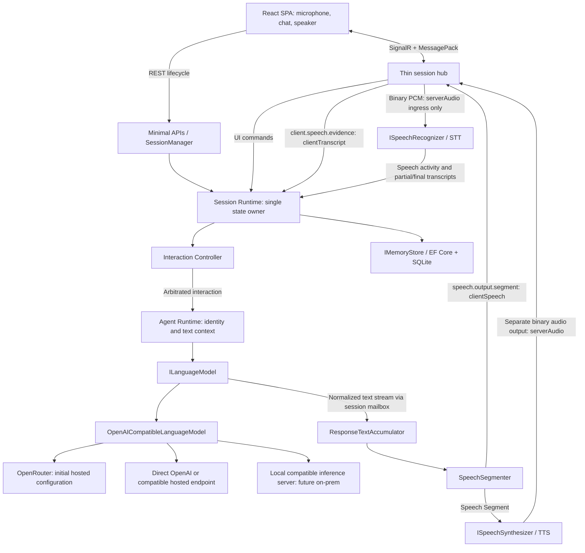
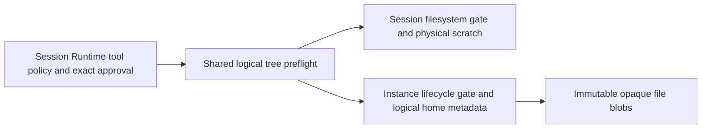

# System Architecture

## Capability authority and projection

Capability-aware Definitions pin `environment.capabilities` (`mode: Selected|All`, exact `resolvedCapabilities`, SHA-256 `authorizationFingerprint`) separately from `environment.projection.alwaysCapabilities`. All resolves the current trusted registry when a draft is saved and again at publication, excluding workspace interfaces incompatible with its explicit workspace policy. Runtime never resolves All again. Future registrations require a new reviewed publication. Legacy `toolAllowlist` remains supported with historical runtime offers; no Definition authorization count ceiling remains.

`ToolProjectionService` evolves `ToolCatalog.For`; the existing eligibility flow and execution-time `ToolPolicy` stay authoritative. New-mode projection unions authorized bootstrap, always, deterministic context, active Skill requirements and execution-loaded names, then filters configuration, model support and execution eligibility. Skills and projection never grant authority. Trusted registry metadata distinguishes discoverable ordinary tools from context-only tools. No user-text keyword capability router or provider authorization logic exists.

Live capability loads pass response/epoch/cancellation and execution revision/claim checks through the Session mailbox. Their exact IDs and invocation count are saved before continuation. Durable work checkpoints explicit loaded IDs/count alongside tool messages; retry/reclaim reconstructs loaded IDs from that bounded execution state and rechecks eligibility. A new turn/WorkItem starts clean. The same execution retains loaded exact interfaces. Discovery is permitted for live UserTurn and trusted connected occurrences (live or detached); unconnected occurrences, continuity-only and unconnected Thought cannot use it. Harness capabilities remain context-only under existing authority.

Accepted live occurrences keep their existing non-replayable receipt and own bounded load state in the Session mailbox, isolated by response/epoch from completed user turns and other occurrences. Their admission rechecks the current connection. Persisted recovery boundaries remain those in [Persistence and Configuration](15-persistence-and-configuration.md).


## Managed workspace refinement

An explicit `environment.workspace.semantics: "agentWorkspaceV2"` policy selects the managed working environment. `/home` is durable Agent Instance working material; `/working` is current Session scratch; Artifacts are separate immutable downloads. The policy, pinned Definition and trusted managed Session owner determine authority. Version numbers never do. Existing published definitions keep their contracts, including `/workspace/working`, scratch-relative paths and authorized retain/checkout.

The Session Runtime mailbox owns a transient cwd, initially `/home`. Off-mailbox tool execution receives a fenced snapshot; a successful typed `workspace.cwd` effect returns through the mailbox with response/epoch checks before the next tool uses it. Reconnect keeps that runtime's cwd. Runtime reconstruction and a new Session initialize `/home`; cwd is not durable identity state or a workspace file. Setting cwd validates an existing authorized directory. Moving/deleting cwd or its ancestors is rejected until cwd changes.

`AgentInstanceWorkspaceService` orchestrates direct durable writes/patches and individual cross-scope copies through existing lifecycle exclusion. Bounded exact-byte `WorkspaceTransfer` ports share `WorkspaceTransferPlan` and the logical tree planner; adapters keep their independent filesystem or metadata/blob gates. Copy preserves binaries and empty directories, creates parents, preflights destination quota, and never merges. Existing durable file destinations require matching revision/hash; cross-scope move is forbidden and structural batches remain single-scope. No provider DTO, physical path, caller-selected owner, new runtime or storage framework is introduced. The earlier workspace sections below describe the compatibility contract where retain/checkout remain relevant.


## Decision

Agent Core is one .NET 10 modular monolith with a React SPA. Its purpose remains to make an AI agent feel present in a live conversation. The Agent Runtime owns conversational meaning; the Interaction Controller arbitrates turn-taking. Both execute under one Session Runtime's state ownership.

The pipeline in this section is the live conversation path. Authoring and Operations sit beside that path. The [responsibility model](#responsibility-model) names the current owner of each durable concept. It does not add projects, services, or a second runtime.

The canonical MVP is a composed, text-first voice pipeline: STT → Interaction Controller → Agent Runtime / text Language Model → speech segmentation → TTS. `serverAudio` keeps processing microphone input during generated speech; full-duplex there describes the user's experience, not a requirement for audio reasoning. Browser STT (`clientTranscript`) is currently half-duplex during agent output; see [Voice](06-realtime-voice.md). Native speech-to-speech is future-only and does not participate in MVP startup, routing or provider selection.


```mermaid
flowchart TD
    Browser[React SPA: microphone, chat, speaker] <-->|SignalR + MessagePack| Hub[Thin session hub]
    Browser -->|REST lifecycle| Api[Minimal APIs / SessionManager]
    Api --> Session[Session Runtime: single state owner]
    Hub -->|UI commands| Session
    Hub -->|Binary PCM: serverAudio ingress only| STT[ISpeechRecognizer / STT]
    Hub -->|client.speech.evidence: clientTranscript| Session
    STT -->|Speech activity and partial/final transcripts| Session
    Session --> Controller[Interaction Controller]
    Controller -->|Arbitrated interaction| Agent[Agent Runtime: identity and text context]
    Agent --> LLM[ILanguageModel]
    LLM --> Adapter[OpenAICompatibleLanguageModel]
    Adapter --> OR[OpenRouter: initial hosted configuration]
    Adapter --> Direct[Direct OpenAI or compatible hosted endpoint]
    Adapter --> Local[Local compatible inference server: future on-prem]
    LLM -->|Normalized text stream via session mailbox| Acc[ResponseTextAccumulator]
    Acc --> Segmenter[SpeechSegmenter]
    Segmenter -->|Speech Segment| TTS[ISpeechSynthesizer / TTS]
    Segmenter -->|speech.output.segment: clientSpeech| Hub
    TTS -->|Separate binary audio output: serverAudio| Hub
    Session --> Store[IMemoryStore / EF Core + SQLite]
```

The adapter's outgoing edges are deployment choices, not three simultaneous requests. The selected endpoint's normalized response returns through ILanguageModel. STT and TTS each independently select hosted, local or synthetic adapters. **Adapter names are not transports:** Session Runtime sees optional backend `ISpeechRecognizer`/`ISpeechSynthesizer` plus provider-neutral input/output transports (`serverAudio`, `clientTranscript`, `clientSpeech`). Browser speech is a client transport with no backend port; it is not a fake `ISpeechRecognizer`. PCM hub ingress exists only for `serverAudio`. `clientTranscript` never opens a backend recognizer; `clientSpeech` never opens a backend synthesizer. OpenRouter model IDs and provider payloads stay in Infrastructure configuration/mapping. [Technology Decisions](10-technology-decisions.md) explains hosted/on-prem choices; [Voice](06-realtime-voice.md) owns streaming, segmentation, and Browser privacy limits.


[Repository Structure](11-repository-structure.md) specifies project references. [Backend Interfaces](04-backend-interfaces.md) owns C# ports. [Protocol](14-api-and-realtime-protocol.md) owns browser DTOs; no universal event bus DTO bridges every layer.

## Responsibility model

Authoring, Runtime, and Operations are responsibilities inside the existing modular monolith. Effective configuration is a projection of trusted server state. Use-case authorization stays at the caller. Persistence and providers store or adapt; they do not become the product owner. Observability records identifiers, state, reason, and timing. It does not own lifecycle.

```text
                         Agent Core
                             │
          ┌──────────────────┼──────────────────┐
          │                  │                  │
      Authoring            Runtime           Operations
          │                  │                  │
  Definition drafts     Agent instances     Triggers
  Resources             Sessions            Occurrences
  Validation/evals      Conversation exec   WorkItems
  Publication           Tools               Approvals
  Version history       Memory              Admin history
```

**Authoring** prepares immutable configuration. `AgentDefinitionLifecycleService` creates, updates, and deletes drafts and deprecates publications through `IAgentDefinitionAdminStore`. `AgentDefinitionDraftPublishService` runs validation, evaluation evidence, and diff, then asks the lifecycle service to commit the publication. Optional `skills` publish with that Definition version and stay immutable. A missing `skills` list is an empty set. A Skill requires capabilities and Definition resources; it does not add tools, credentials, approval, or owner scope. `AgentDefinitionLifecycleService.CreateNewDraftAsync` stores a server starter (`SourceKind.New`); the browser sends only the definition id. `AgentDefinitionResourceService` mutates draft resource bytes, including one-revision batch bind; publish freezes those bytes. Knowledge retrieval uses `KnowledgeSourcePaths.ResolveBackingPath` (explicit `resourcePath`, otherwise `knowledge/{identity}`). Built-in definition files stay immutable seeds. Publishing or deprecating does not rewrite stored session snapshots.

**Runtime** executes one conversation per session. `SessionManager` activates a session. That session's `SessionRuntime` mailbox is the only writer of live conversational state. Learned memory is `StructuredMemoryService` over `IStructuredMemoryStore`. Session snapshots stay on `IMemoryStore`. Session tools mutate the session workspace and create artifacts under session authorization. The chat catalog lists active managed instances through `AgentInstanceService.ListChatEligibleAsync`. Compatibility agent instances are resolved by `AgentInstanceService` when a chat session has no managed instance.

**Operations** covers future and background work plus harness evidence. `TriggerRegistrationService` writes registration rows for live schedule commands. Admin cancel applies the same `TriggerRegistrationMutations.Cancel` and records a revoke event. `TriggerScheduler` admits due schedules. `DurableOrderEventIngress` admits an allowlisted application event into the same occurrence store. `ExecutionModelPolicy` resolves the occurrence model before routing: trigger override, then the Agent Instance unattended default, then the conversation/catalog default from `SessionModelBinder.PinDefault`. The resulting pin is stored on the occurrence and copied onto the `WorkItem`. A live occurrence uses that pin with `ModelPurpose.Conversation`. `TriggerOccurrenceRouter` routes an admitted occurrence to one live runtime or leaves it `AwaitingDurableWork`. It rejects `model-unavailable` or `model-capability-unsupported` before either path starts, and it does not substitute another catalog entry. `DurableWorkIntake`, hosted by `DurableWorkIntakeHostedService`, accepts that waiting occurrence as one `WorkItem`. `DurableReminderExecutor`, run by `DurableWorkHostedService`, claims and completes due work. Admin history is append-only evidence of a harness mutation, not a second policy engine.

`AdminReadService` and `AdminEffectiveConfigurationResolver` project configuration for Admin. They do not own definitions, instances, persona, tools, or policy, and they do not execute tools. Session Runtime files do not call Admin lifecycle services. Admin services do not dispatch conversation turns.

Infrastructure stores persist the rows named below. API routes map commands and results. A route that only checks the trusted-local owner and forwards to an application service is not a second owner.

### Ownership

| Concept | Primary lifecycle owner | Mutation authority | Durable source | Readers / references | Category |
| --- | --- | --- | --- | --- | --- |
| AgentDefinitionDraft | `AgentDefinitionLifecycleService` | draft create, fork, update, delete | `IAgentDefinitionAdminStore` (InMemory or SQLite) | Admin HTTP, validation, diff, evaluation | configuration |
| AgentDefinitionVersion / publication | `AgentDefinitionDraftPublishService` commits through the lifecycle service; deprecate stays on the lifecycle service | publish freezes bytes; deprecate changes metadata only | built-in files plus durable publications via `IAgentDefinitionStore` | sessions, instances, work provenance, Admin reads | configuration |
| DefinitionResource | `AgentDefinitionResourceService` | draft resource bytes; publish freezes them in the publication transaction | definition-resource stores | evaluation manifest, published knowledge reads | configuration |
| AgentInstance, managed | `AdminAgentInstanceService` | create, reassociate/rollback, persona revision, archive/unarchive, and archived hard delete when unreferenced, each with an `AdminEvent` | `IAgentInstanceStore` | sessions pin `agentInstanceId`; chat catalog `GET /api/v2/agent-instances` through `AgentInstanceService.ListChatEligibleAsync`; triggers; work owner; Admin reads | runtime identity |
| AgentInstance, compatibility | `AgentInstanceService` | resolve, backfill, and forward-align `Compatibility: true` rows | same `IAgentInstanceStore` | legacy chat sessions that have no managed instance | runtime identity |
| PersonaRevision | `AdminAgentInstanceService.UpdatePersonaAsync` | typed persona revision on the managed instance, with history | instance row | prompt context, work provenance | trusted identity |
| Session | `SessionManager` activates; `SessionRuntime` mailbox owns live mutation | mailbox only | `IMemoryStore` snapshots | hub, catalog, history | runtime |
| ConversationTurnExecution | Session runtime creates the row when a user turn is accepted | session claims on live start and completes, fails, or cancels the row; `ConversationExecutionCoordinator` recovers expired claims, claims runnable rows, and dispatches through `ConversationTurnRunner` back to the session | `IConversationTurnExecutionStore` | `session.ready`, sequenced events | runtime evidence |
| Learned memory | `StructuredMemoryService` | admit agent or application proposals; retrieve and reset under memory policy | `IStructuredMemoryStore` | prompt via `SessionMemoryPrompt`; Admin memory operations | learned state. The agent proposes; Core admits. Policy enables scope and does not guarantee every proposal is stored. |
| Admin memory operations | `AdminMemoryHistoryService` for delete/reset; `AdminMemoryService` for list and the allow check | HTTP delete/reset builds an `AdminEvent` and calls `IAdminP7eHistoryMutator`. The mutator calls `EnsureDeleteAllowedAsync` or `EnsureResetAllowedAsync`. InMemory then calls `AdminMemoryService` delete/reset. SQLite tombstones or resets the same scopes inside the history transaction | `IStructuredMemoryStore` plus `IAdminEventStore`. Session lookup for a session-scoped operation uses `IMemoryStore` | Admin UI | learned-state operation |
| TriggerRegistration | `TriggerRegistrationService` for live commands | create, update, and cancel. Admin HTTP cancel goes through `AdminAutomationHistoryService`. InMemory reaches `TriggerRegistrationService`. SQLite applies `TriggerRegistrationMutations.Cancel` in `SqliteAdminP7eHistoryPersistence` inside the revoke transaction | `ITriggerStore` | scheduler, live schedule commands, Admin automation | security / future-event state |
| TriggerOccurrence | `TriggerScheduler` admits due schedules; `DurableOrderEventIngress` admits allowlisted application events; `TriggerOccurrenceRouter` routes | admit, route live, or leave `AwaitingDurableWork` | `ITriggerStore` | live runtime or `DurableWorkIntake` | runtime |
| WorkItem | `DurableWorkIntake`, hosted by `DurableWorkIntakeHostedService`; then `DurableReminderExecutor`, run by `DurableWorkHostedService` | accept, checkpoint, approve-resume, complete/cancel | work store | Background Work UI, recovery | runtime execution |
| Approval | `ToolPolicy` decides | live wait in `SessionRuntime.Approval`; durable resume in work checkpoints; grant matches the action hash | session/work receipts | hub `agent.approval.*`, work HTTP | security |
| AdminEvent | harness mutation that owns the change | append-only in the same transaction as that mutation | `IAdminEventStore` | `AdminHistoryService`, owner-protected GET | evidence |
| Attachment | session authorization in `SessionManager`; bytes in `IAttachmentStore` | upload, bind, TTL delete | attachment store | composer, history chips | runtime input |
| Artifact | session tools and `SessionManager` through `IArtifactStore` | create under session authorization | artifact store | history refs | runtime output |
| SessionWorkspace | `ISessionWorkspace`; `FileSessionWorkspace` in Infrastructure | session-owned file mutations from `SessionToolExecutor` and `SessionManager` | host filesystem; paths stay in Infrastructure | workspace tools, sandbox | runtime mutable files |
| Agent Workspace | `AgentInstanceWorkspaceService`; `IAgentInstanceWorkspaceStore` | managed Agent Instance, guarded working files | SQLite metadata + local opaque blobs | Session tools and owner Admin; source Session deletion preserves copies | durable working material; archive read-only; hard delete purges |

Known boundaries that stay separate:

- Managed and compatibility instances share `IAgentInstanceStore` and stay different use cases. Product HTTP for create, persona, lifecycle, and active-version changes calls `AdminAgentInstanceService` and writes an `AdminEvent`. `AgentInstanceService` still exposes history-free `CreateAsync`, `UpgradeAsync`, `UpdatePersonaAsync`, and `SetLifecycleAsync`. Production HTTP and `SessionManager` do not call those four methods. They remain on `IAgentInstanceService` for existing tests. They are not the Admin owner and are not a second product policy.
- Admin HTTP cancel goes through `AdminAutomationHistoryService`. Live schedule commands authorize with `TriggerAuthorization` and then use `TriggerRegistrationService`. The InMemory history mutator also uses that service, via `AdminAutomationService.CancelRegistrationAsync`. The SQLite history mutator applies `TriggerRegistrationMutations.Cancel` in the same database transaction as the revoke event. `AdminAutomationService.CancelRegistrationAsync` is not the Admin HTTP entry. The cancel rule is the domain mutation, not a second registration policy.
- Definition draft create/delete, publication create/deprecate, and durable-only logical definition delete append `AdminEvent` rows. Instance, persona, and archived instance-delete events are built by `AdminAgentInstanceService` and written with the instance mutation. Memory and trigger-revoke events are built by `AdminMemoryHistoryService` and `AdminAutomationHistoryService` and written by `IAdminP7eHistoryMutator` in the same mutation. The store does not decide whether the mutation is allowed.
- `ConversationTurnExecution` stays a session/runtime contract. Admin does not absorb it.
- `DurableOrderEventIngress.PublishOrderStatusAsync` admits the allowlisted `order_status_changed` shape and is registered as `IDurableApplicationEventIngress`. `ExternalEventIngress` admits an allowlisted `order.placed` envelope for an Event Source, stores one delivery row per subscription active at that moment, and creates one occurrence per pending delivery in the same `ITriggerStore`. A later subscription change does not alter that snapshot. The scheduler pass finishes deliveries that are still pending after a restart. `TriggerOccurrenceRouter` remains the only dispatcher. The webhook request does not run the agent or the browser. `TriggerRegistrationService.AdmitOccurrenceAsync` can insert an occurrence and has no production caller. That method is a test-only port leftover, not a second product owner.

### Effective configuration

Effective configuration is shared authoritative resolution primitives plus use-case-specific composition. It is not one runtime configuration object, and `EffectiveConfigurationComposer` is not that object.

`ComposeAdmin` builds the secret-safe Admin projection. `AdminEffectiveConfigurationResolver` returns it. `MemoryPolicyOf` owns the shared default `definition.MemoryPolicy ?? MemoryPolicy.Disabled`. Session bind, `DurableWorkContextFactory`, and draft evaluation do not call `ComposeAdmin`.

| Primitive | Rule | Where it is applied |
| --- | --- | --- |
| `MemoryPolicyOf` | A missing policy is `Disabled` | Admin projection, Admin memory allow checks, memory admission |
| `SessionModelBinder.PinDefault` | Catalog default for the definition | Admin projection, durable-work intake, session snapshot default, initiative |
| Session model `Bind` | A live session may select a catalog key and reasoning effort | Live session only |
| `ToolCatalog.For` | Offered tool names from the definition and context | Admin projection, prompt construction |
| `ToolPolicy.EvaluateExecution` | Execution decision, including the action-specific approval grant and detached denial of session-scoped tools | Live tools, detached work, draft evaluation |
| `OccurrenceCompatibility.Allows` | Trigger source eligibility | Admin durable-work eligibility, scheduler, routing, session delivery |
| `RoleEnvironments` | Harness references, knowledge sources, workspace template, tool allowlist | Admin projection, prompt, tool policy, workspace |

Definition-resource bytes stay on `AgentDefinitionResourceService` and `DefinitionPublicationResourceReader`. Admin reads project those bindings. They do not authorize a tool call. A stale Admin projection cannot grant execution, because approval and ownership are checked again at the execution site.

The closure audit found no contradictory model, tool, resource, memory, or trigger default across those callers. No second composer was added.

### Consolidation audit

The file audit below does not move code. Line count is not a reason to split.

| File | Decision | Evidence |
| --- | --- | --- |
| `SessionHost` (`src/AgentCore.Api/Realtime/SessionHost.cs`, plus `ConversationExecution` and `Occurrences` partials) | Defer | The host owns the live connection table, command admission, wire `Map`, audio ingress, and detach grace. On attach, when no conversation execution is open, a newer durable revision or `NeedsDurableConversationConvergence` calls `ApplyTransportResumedSnapshotAsync`. When executions are still open, `ConvergeAttachedConversationAsync` waits until they drain and then calls `RefreshDurableConversationProjectionAsync`. That refresh does not use the comparison. `ListCompatible` filters runtimes this host already holds. Those are adapter steps, not a second conversation owner. |
| `AdminEndpoints` | Defer | Routes parse HTTP and call Admin application services. Required-field, confirm, and revision checks are request mapping. `AdminDefinitionResourceHttp` stops an unbounded upload at `AgentResourceLimits.MaxItemBytes`; `DefinitionResourcePolicies.ValidateContentSize` checks the same limit once the bytes exist. `ParseResourceKind` maps the wire string onto `AgentDefinitionResourceKind`. |
| `PromptContextBuilder` | Defer | Methods in the builder assemble prompt sections. `DefaultAgentBrain` starts at the same file and chooses speak or stay-silent by calling the builder. Moving the brain to another file would not remove a duplicated rule. |
| `SessionToolExecutor` | Defer | `ExecuteAsync` is the one execution policy. Workspace and trigger handlers already live in partials. Email, web, sandbox, attachment, and artifact handlers stay behind that dispatch. `LooksLikeHostPath` rejects rooted tool arguments. It does not store a host path. |
| `TriggerScheduleCommands` | Defer | `TriggerAuthorization` classifies the current turn. `TriggerScheduleCommands` parses the tool arguments and writes through `ITriggerRegistrationService`. Schedule resolution stays inside that command. |
| `SessionRuntime` partials | Defer | `Controller`, `ConversationExecution`, `Tts`, `Approval`, `AcceptedWork`, `Compaction`, `Memory`, `Triggers`, and `Speech` each follow one mailbox concern. `Initiative` also handles rename, speech locale, model selection, and resume. Those are still mailbox handlers on the same runtime. Another partial would not remove a second writer. The main file keeps the mailbox loop, user text, brain, model stream, tools, receipts, and persist. |
| `AgentInstanceService` history-free managed methods | Defer | `CreateAsync`, `UpgradeAsync`, `UpdatePersonaAsync`, and `SetLifecycleAsync` have no production HTTP caller. Tests still call them. Retiring the port would move those tests, and pointing them at `AdminAgentInstanceService` would start writing `AdminEvent` rows the current tests do not expect. |

Justified non-merges: do not merge managed and compatibility instance services; do not merge attachment, artifact, definition-resource, and workspace stores; do not add a project per box in the diagram above; do not fold Admin into Session Runtime.

## Per-session execution

```text
SessionManager (singleton, atomically get/create per sessionId)
  +-- SessionRuntime A (one logical async event loop)
  |     +-- bounded Channel<SessionInput>, single reader
  |     +-- current mode Text|Voice (may transition; one conversation)
  |     +-- Agent Runtime, Interaction Controller, owned mutable state
  |     +-- session lifetime CancellationTokenSource
  |     +-- current response CancellationTokenSource and responseId
  |     +-- active speech recognition session + bounded audio ingress
  |     +-- tracked model/TTS/classifier/persistence tasks
  +-- SessionRuntime B (independent state and event loop)
```

Only the single mailbox reader mutates conversational state, controller state, response status, transcript assembly, application sequence counters, timers' logical generations, and playback estimates. Agent Runtime and Interaction Controller are ordinary application objects invoked by this reader, not additional concurrent state writers. The controller keeps observing inputs while LLM work runs because network enumeration never blocks the reader.

A contract-bearing model result is normalized in Application to one terminal Agent Step before Chat delivery. Disposition (`Continue`, `Wait`, `Complete`, `Blocked`) is separate from requested actions. The strict provider schema carries that disposition and one `action` (`chat.respond` or null). Omitted step fields, including the plain-text compatibility channel, still map to `Complete` and one `chat.respond`. `Continue` does not start another generation. `IAgentBrain` remains the pre-generation decision and is not that step. A model disposition does not itself mutate Session, WorkItem, approval, trigger, or memory. Unknown or malformed steps fail closed as `InvalidResponse` and execute nothing. A terminal step classified `Repairable` (currently only missing display text) may be requested once more as plain text, with no tools and no response contract; Application wraps non-empty text as `chat.respond` and does not replay completed work. Normalized speech defects are not failures, and every other defect, or a second invalid envelope, fails closed. Chat delivery maps the admitted `ChatRespondAction` through `SemanticResponseMapper`, bound to the runtime Session. Optional Definition Skills are procedure configuration on that version. A deterministic selector pins at most three keyword matches on a user turn. On that same tool-capable user turn, `skills.load` can admit further ids onto the pin, up to four, without granting tools. `app.message.send` appends a completed `applicationMessage` for the bound session and does not speak it or put it in prompt history. Other triggers receive no active skills. Requirements do not grant tools. See [Backend Interfaces](04-backend-interfaces.md#terminal-agent-step) and [Definition Skills](04-backend-interfaces.md#definition-skills).

Mailbox handlers perform short deterministic transitions, take immutable snapshots for external work, and launch supervised tasks. Provider tasks publish normalized results tagged with session epoch, responseId or utteranceId, and operation ID. No provider callback mutates runtime state. Persistence completion and classifier decisions also return through the mailbox. Do not hold locks over network calls or await entire model/TTS streams inside handlers.

The manager uses atomic creation/removal and an asynchronous lifecycle gate so concurrent REST/attach operations cannot create two owners. A runtime has a random epoch for its in-process lifetime. Recovery creates a new epoch; old work cannot target it. Hub instances are transient and never own a runtime. DI scopes for persistence are per operation, not a shared DbContext for an entire call.

## Ordering and bounded work

Use `Channel<T>` with capacity 256, `SingleReader=true`, `FullMode=Wait` for normalized session inputs. Producers admit with `TryWrite`: a full mailbox fails immediately so the caller can report a recoverable busy error; they do not block on `WriteAsync`. Admission establishes ordering; client timestamps do not. The reader assigns increasing internal sequence numbers. Provider pumps that use `WriteAsync` await channel capacity outside the loop. Audio is a separate bounded stream (see [Voice](06-realtime-voice.md)); raw frames never occupy this mailbox. Coalesce partial transcripts and playback progress before admission to the newest revision, but never discard finals, interruption confirmations, terminal results, or lifecycle commands.

An ingress enqueue deadline of 250 ms prevents an overloaded connection from waiting forever: reject new commands as recoverable `SessionBusy`; do not report success for unaccepted input. Provider/lifecycle producers remain cancellable and supervised; shutdown cancels them before disposal. Use a separate bounded output sender so the mailbox never waits on a slow browser. Control output has reserved capacity (32 items); text output is bounded at 256 items and audio at 2 seconds. The sender prioritizes stop/error/lifecycle controls, honors response start/terminal ordering fences, and rechecks response validity before every send. It alone owns wire-send sequence counters; the media coordinator alone owns audio frame counters, neither of which mutates conversational state. Audio exhaustion fails the voice response rather than silently dropping PCM; control exhaustion detaches the unresponsive connection and cancels its response. See protocol sequence rules for priority delivery.

Responses have one linked cancellation source for LLM, TTS and response-specific classifier/decision work. STT links to session/voice lifetime, not response lifetime: cancelling output must not cancel listening. Token sources are cancelled promptly and disposed only after their tasks finish. Every task is tracked and faults are observed; shutdown has a 5-second join budget, then quarantines late results by epoch. Adapters must honor cancellation and dispose network streams.

## Lifecycle

A created session is inactive until attached. One connection owns a session at a time. One logical Session is one conversation: interaction mode is `text` or `voice` and may transition; starting voice does not create a second unrelated session or copy-less history fork. Disconnect supersedes active output and suspends audio and initiative. Retain the idle runtime for a 60-second reconnect grace period; then persist a paused snapshot and evict it. A later attach reconstructs the session from SQLite with the same history and current mode. Clean end is terminal and idempotent. Process restart pauses recoverable sessions and marks unfinished responses interrupted; it never resumes an old provider stream. [Protocol](14-api-and-realtime-protocol.md#connection-lifecycle) defines ownership, mode transitions and resynchronization. Additive semantic `lifecycleStatus` is observed beside protocol-v1 `status` via Application `LifecycleTransition`; it does not replace this attach/pause/end model. RequestComplete evaluation remains planned.

`MaxActiveSessions` counts **in-memory Session Runtimes** (attached or in reconnect-grace). Creating a durable inactive session record does not consume a live slot. Attach or other activation that would exceed the limit fails with recoverable `SessionCapacityExceeded` and `RetryAfter` defaulting to 5 seconds; it must not evict another user's runtime.

## Invariants

- One Session Runtime owns mutation of one session's conversational state.
- Provider objects never mutate Agent Runtime state directly; provider-specific DTOs stay in Infrastructure.
- A superseded response never becomes visible again. Already-rendered text may remain marked interrupted; queued or late text/audio/completion cannot extend it.
- Superseding a Response stops new Speech Segments, cancels pending TTS/LLM work and drops queued audio before R2 can start. Late provider and browser playback events cannot affect the current turn.
- Cancellation plus identity checks are mandatory at mailbox acceptance, output send, browser reduction and audio playback.
- Agent output and user input coexist; the microphone remains active during playback except explicit mute/end/disconnect.
- Speech activity may produce Continue rather than Interrupt.
- Raw microphone frames are neither normal domain events nor persisted data. Browser STT does not send PCM to backend STT; that is not a guarantee that the browser vendor keeps recognition on-device.
- Initiative policy gates every proactive response; StaySilent is valid.
- Synthetic mode requires no network or AI credentials; the entire composed pipeline is testable offline without a microphone, speaker or GPU.
- One response is live per session, but historical responses and an in-progress user utterance may coexist.
- Conversation continuity is per Session, independent of the current text/voice mode. Delivery metadata on each assistant entry selects heard vs received prefix for future context; unseen/unheard tails never enter the model. Phase C stores an optional response envelope (speech + blocks) with those receipts. `displayText` / `speechText` / blocks are session response capabilities owned by the runtime and provider contract, not Agent Definition persona fields. Compatibility `[[speech:]]` markers exist only inside Infrastructure unstructured parsing; SessionRuntime consumes validated `speech.mode` (`same`/`custom`/`none`).
- No mutable state, transient audio, provider handles or CancellationTokenSource is stored in an Agent Definition.
- Semantic compaction runs outside the mailbox after a durable completed turn. Only the mailbox may commit a still-current summary. Compaction does not rewrite raw conversation rows.
- Structured session memory is a separate store from the session snapshot. Learned items do not rewrite trusted profile or persona records, and one session cannot address another session's items.

## Follow-on P1 observed and frozen

Observed mailbox ownership and protocol-v1 attach/pause/end stay as above. Follow-on P1 does not add a second Session Runtime or put raw audio on the domain mailbox. Observed: bounded `IMemoryStore` restore plus durable `LastEntrySequence`; additive `lifecycleStatus` beside protocol-v1 `status` with `LifecycleTransition`; Application effective speech locale outside SessionRuntime vendor branches; Browser/hosted adapter locale/voice selection; Speech locale Select. Real Chrome `fr-FR` Browser STT/TTS smoke is observed (unedited `p1-repair-fr-smoke-r2`; earlier `p1-final-fr-smoke-r2` on `5764010` stays as written). **P1 freeze:** `dceaccbad9a4db8908af147b5353805a2b1af288` (`dceaccb`). Owners: [Technology Decisions](10-technology-decisions.md#decision-provider-neutral-effective-speech-locale).

## Post-MVP planned until verified

Observed A–H behavior; Phase I WorkItems are not-applicable until the future trigger in [Technology Decisions](10-technology-decisions.md#post-mvp-planned-until-verified).

- Durable **Session** (catalog row, pin, history, workspace ownership, attachments/artifacts) versus ephemeral **SessionRuntime** (mailbox, epoch, providers, voice). Reopen allocates a new epoch that rejects prior-epoch work.
- One writable workspace per SessionId; physical directory is lazy (`data/workspaces/{sessionId}`). Domain/Contracts never receive host paths. Archive, reopen, unload, and deactivate keep the same workspace; durable delete removes it.
- Trusted-local owner capability authorizes catalog, lifecycle, and hub attach; SessionId is not a credential. Connection-lease `attachmentId` is not a user-uploaded Attachment.
- Attachments are session-owned immutable blobs (`IAttachmentStore`) with off-mailbox processors (`IAttachmentProcessor`); Artifacts are a distinct generated/materialized type (`IArtifactStore`). Runtime deactivation, archive, and durable delete remain three operations.
- Typed tools execute through scoped session capabilities (not host paths or `IMemoryStore`); Session Runtime owns the bounded loop. Observed container sandbox (`ISandboxExecutor` / `DockerSandboxExecutor`) sits behind the same `sandbox.run` capability; `process`/`shell` remain forbidden. Phase I WorkItems are not-applicable until a later accepted workflow must survive runtime deactivation.

## P5 durable triggers (observed)

Durable schedules and one allowlisted application event are not Session Runtime timers and are not learned memory. `ITriggerStore` owns registrations and occurrences, with no foreign key to sessions or memory. A hosted scheduler outside the runtime scans due rows with `TimeProvider`. An admitted occurrence routes to one compatible live runtime, or remains `AwaitingDurableWork` when no single compatible runtime can take it. P5 does not create a `WorkItem` or keep a runtime alive to wait for a future fire. Occurrence text enters the prompt as untrusted user-role data, not as a system instruction. The existing live-only environment ingress stays separate. See [P5 closure report](reports/p5-freeze-candidate.md).

## P7A Admin read boundary (observed)

P7 adds a distinct Admin product area in the same React SPA and owner-protected read APIs under `/api/v2/admin/...`. Application `AdminReadService` resolves built-in definition inventory, durable instance inventory, and secret-safe effective configuration (resolved catalog model, offered tools, harness references, workspace template id, memory/trigger policy, and durable-work eligibility) from exact pinned definition version and current persona. Admin UI navigation suspends the live SignalR hub and releases capture/playback resources before entering `/admin`; returning to Chat reconnects the remembered session without automatically resuming microphone capture. Authorization reuses trusted-local caller checks plus `OwnerCapabilityFilter`; hiding Admin navigation is not security. Resources, persona edits, memory and automation, the publish gate, and deprecation/rollback are the later observed slices below. See [Protocol](14-api-and-realtime-protocol.md#http) and [P7A report](reports/p7a-admin-shell-effective-config.md).

## P7B definition lifecycle (observed)

P7B adds durable Admin draft and publication storage (`IAgentDefinitionAdminStore`) alongside immutable file built-ins. Runtime `IAgentDefinitionStore` is a composite catalog: exact lookup resolves built-in or durable versions; default lookup prefers the highest eligible non-deprecated version across both sources. Application `AgentDefinitionLifecycleService` owns fork/create/update/publish/deprecate with draft revision and publication metadata concurrency. Admin HTTP exposes owner-protected draft and publication routes; Session Runtime and stored session snapshots are not rewritten when new versions publish or deprecate. See [Backend Interfaces](04-backend-interfaces.md#p7b-definition-lifecycle-observed), [Persistence](15-persistence-and-configuration.md#p7b-definition-lifecycle-store-observed), and [P7B report](reports/p7b-definition-lifecycle.md).

## P7C harness resources and workspace boundary (observed)

P7C adds application-owned definition resources bound to drafts and frozen into publications, resolved at runtime through `DefinitionPublicationResourceReader` into the existing read-only `/agent` virtual tree while session `/workspace` stays mutable and session-owned. Admin edits instructions, typed `RoleEnvironment` capabilities, and draft resources; publish copies immutable bindings into the publication transaction. A minimal managed-instance seam creates `Compatibility=false` instances from exact publications and opens User chat through v2 `agentInstanceId` session create. `/agent` writes remain denied (`FileSessionWorkspace`); publication template bytes may seed `/workspace/working` once without write-back. See [Backend Interfaces](04-backend-interfaces.md#p7c-definition-resources-observed), [Persistence](15-persistence-and-configuration.md#p7c-definition-resource-store-observed), [Protocol](14-api-and-realtime-protocol.md#http), and [P7C report](reports/p7c-harness-resources-workspace.md).

## P7D–P7G Admin lifecycle completion (observed)

**P7D** adds durable managed instances with revision-protected persona, explicit active-version reassociation/rollback, archive/unarchive, and session pinning by `agentInstanceId` without rewriting historical sessions. **P7E** exposes scoped learned-memory delete/reset and automation registration cancel through existing P4/P5 boundaries with owner-protected Admin HTTP. **P7F** separates domain validation, Synthetic evaluation evidence bound to exact draft revision, configuration fingerprint (draft candidate plus sorted draft resource bindings), and scenario version, safe human-readable diff, and transactional publish against that revision. **P7G** adds append-only `AdminEvents` recorded atomically with durable harness mutations (draft create/delete, publish, deprecate, instance lifecycle, memory, trigger revoke) plus owner-protected history list; deprecation and rollback change metadata and future eligibility only. Session Runtime ownership, pinned snapshots, and P3/P6 authorization boundaries stay unchanged. Whole-phase verification: Playwright `admin-lifecycle` on disposable SQLite. See slice reports [P7D](reports/p7d-managed-instance-identity.md) through [P7G](reports/p7g-history-rollback-final-gate.md).

P7 **owns Harness Admin W01–W08 only**; it is not a run-control or Workflow orchestration console. **`ConversationTurnExecution`** observer durability is a **post-freeze session-runtime correction** recorded in the [P7 closure report](reports/p7-freeze-candidate.md#bookkeeping-appendix--post-freeze-session-runtime-correction-not-p7-contract) for bookkeeping — not part of the P7 Admin contract.

## P6 durable work (observed)

`DurableWorkIntake`, hosted by `DurableWorkIntakeHostedService`, accepts each `AwaitingDurableWork` occurrence as one `WorkItem`. `DurableReminderExecutor`, run by `DurableWorkHostedService`, claims and completes due work on a separate cadence from P5 scheduling and routing. P5 still admits schedules and chooses live versus durable. The owner is Agent Instance plus trusted profile. The source session is provenance only. A scheduled reminder is tool-free. An application event without the bound application-browser lease uses the standard 24-step/180-second tool profile and a narrower offer: session-scoped tools and trigger writes are not available. A scheduled or application-event WorkItem that holds that lease uses the unattended browser profile instead. Sensitive tools suspend without a claim until Background Work approves the exact action hash. Results stay out of chat history. Phase I remains not-applicable: Support, Compliance, and `sandbox.run` still do not continue after `RequestDeactivate`. See [P6 freeze candidate](reports/p6-freeze-candidate.md).

## P3 tools and integrations (observed)

P3B–P3F extend the same single Session Runtime mailbox model—no second orchestrator. **Registry/policy (P3B):** `ToolRegistry`, `ToolEffect`, and execution-time allowlist rechecks; workspace list/patch/search/move and artifact-from-workspace tools sit on observed `ISessionWorkspace`/`IArtifactStore`. **Public web (P3C):** Application `IWebSearchProvider` and `IPublicWebFetcher`; Infrastructure performs SSRF-safe fetch/search with profile-selected Synthetic or Brave adapters; `web.search`/`web.fetch` outputs are not durable history. **Approval (P3D-1):** sensitive tools emit live `agent.approval.requested` and resume only after hub `agent.approval.respond` on the owning response id. Human approval wait uses `ToolApprovalLimits.Lifetime` and does not consume the per-tool and overall machine-execution tool timers; response cancel, detach, supersession, and epoch changes still abort the wait. Execution policy is evaluated before any Gmail draft preview. **Email (P3D-2):** Application `IEmailProvider` with Synthetic fixtures or Gmail refresh-token OAuth; `email.send` is approval-gated on the exact normalized draft (To/Cc/Bcc/Subject/Body). Indeterminate send outcomes and cancellation after dispatch permanently consume that approval; only a definite provider rejection may retry. Gmail MIME is built and parsed with MimeKit; CR/LF/NUL in header-bearing input is rejected; GetDraft fails closed unless Gmail returns RFC822 raw; send uses `POST /users/me/drafts/send` with the hash-validated draft encoded as `message.raw`. **Capability closure (P3F):** `workspace.search` and `workspace.move`, plus approval-gated `http.request` for public unauthenticated APIs. Shipped `general-assistant` v7 remains the pre-schedule demo allowlist. v8 adds the five schedule tools and an enabled trigger policy. `demo.sensitive_action` stays on `approval-demo` for the approval harness. Workspace tools resolve bare filenames and relative paths from `/workspace/working`, collapsing `.` and `..` segments without treating `..` inside a file name as traversal. Public fetch tries every permitted address and reports connection failure as `transport_error`. Sandbox networking remains deferred outside P3. See [Backend Interfaces](04-backend-interfaces.md#post-mvp), [Protocol](14-api-and-realtime-protocol.md), and [Implementation Plan](18-implementation-plan.md#p3bp3f--tools-web-approval-email-assistant-capability-closure).

## P9 visible browser (observed)

Application owns `IBrowserSession`, `IBrowserSessionLease`, and `BrowserTargetPolicy`. Infrastructure owns `PlaywrightBrowserSession` and the loopback fixture. Playwright types do not leave Infrastructure. At the P9 freeze, one browser context belonged to one session and was released when that conversation ended. A later host setting, `ProfileMode` `PersistentAgent`, keeps one browser profile per `AgentInstanceId` on disk and reuses that context across sessions of the same instance. Element refs stay session-scoped. The model does not receive cookies, storage, password-field values, or the profile directory. An Agent Instance may own one application connection. The first concrete kind is nopCommerce. Application stores that connection's status and the trusted origin derived from the operator base URL. The profile directory remains `ProfileRoot/{agentInstanceId}`. Reset deletes only that directory. `browser.close` does not. Short values are redacted as whole tokens. `browser.*` is offered only when the host enables Browser and Infrastructure confirms the configured launch target (Playwright Chromium when `Channel` is unset, or a successful probe of the configured `Channel`). Navigation, interaction, and subresource origins are separate host lists. The loopback fixture is optional. Closure evidence: [p9-freeze-candidate.md](reports/p9-freeze-candidate.md).

## P9.5 connection and attention (closed)

The same Session Runtime and WorkItem owners cover the secretary connection. Admin is the only surface that changes or displays connection state in the web UI. A detached occurrence may complete with attention required; the alert is durable and the result stays out of the transcript. Browser tools remain limited to a Connected application connection. Ordinary tool loops stay on the standard 24-step/180-second profile. A user turn that is authorized to use the browser uses 48 steps and 300 seconds. A scheduled or application-event WorkItem holding the bound application-browser lease uses 32 steps and 240 seconds. Core chooses that budget; the model cannot raise it. Local Journey A session `fcd46bb2-d1fb-4ea1-9560-4b39b0873281` established the storefront postcondition inside the interactive browser profile. P9.5 is closed on `1012653`. Hosted Synthetic [`37111979501`](https://github.com/trannamtrung1st/agent-core/actions/runs/37111979501) is green. Journey D is accepted on the recovery result recorded in [p9.5-freeze-candidate.md](reports/p9.5-freeze-candidate.md).

## Post-P9.5 bounded browser settle

The browser provider owns a short bounded settle after navigation and after click, press, select, check, and uncheck, and it owns an explicit `browser.observe` wait when the model passes `waitFor` `stable`. The agent may ask for one settled re-observation of an incomplete page. A successful navigation or browser action clears the observation-repeat streak. The first `browser.observe` records page evidence from the URL, visible text, settled flag, and each element's role, name, actions, and control state, ignoring element refs. Two further observations with that same evidence stop the tool loop so the turn answers from the evidence already collected, including uncertain parts. The 48-step ceiling remains the final safety net. `stable` means the visible page stayed quiet for a short interval inside a hard deadline. A wait stays on the current authorized page. Empty `browser.observe` stays a fast capture. This enhancement does not move the P9 freeze SHA `bba1de4` or the P9.5 closure SHA `1012653`.

## P9.7 Authoring ownership

Harness Authoring is contextual Agent-Instance authority, never a Definition allowlist grant. Trusted-local single-owner, attached UserTurn Chat is the current authority seam; detached, occurrence and background execution do not receive it. The normal model/tool loop invokes Application capabilities calling existing Authoring owners off the mailbox. Offering intersects enabled instance policy, scope, execution context and model tools support. Execution reloads live instance policy and checks expected active version/policy revision and exact approval. User text expresses intent, not authority.

Source access remains ordinary authorized web/browser/workspace/attachment/knowledge/HTTP tool access. Successful content-bearing results create execution-local provenance receipts; unread or failed sources cannot be retained. Current owner-provided material uses `conversation:user`. External content stays untrusted. No required second Admin URL catalog or backdoor HTTP client exists.

`HarnessManagementService` orchestrates existing draft/resource/validation/evaluation/diff/publication/adoption owners. Managed knowledge/Skills use internal candidates and required checks before immutable publication and atomic adoption. Assisted mutations, instructions and all tool changes require action-bound Chat approval. Agent assessment is partial; Core owns actual readback/Skill activation and structural checks. Production outcomes remain external evidence. Publication and adoption history attribute automatic changes to Agent. Failed adoption may leave an unused immutable publication, but never changes the instance's active version.

Published versions and current Session snapshots remain immutable: improvements apply to future Sessions. The Session Runtime remains the sole mailbox owner of conversation state and does not own draft persistence. Admin governs policy, inspection and freeze. The separate `HarnessPreparationExecution` reasoning loop and HTTP `/continue` were retired. Legacy owner candidate endpoints remain advanced lifecycle operations. P11A replaces trusted-local context with authenticated/delegated authority only when required.

## P9.8-P9.9 Experience and thought activation

`ExperienceService` derives a bounded retrospective from durable observable history or terminal substantive WorkItems. A Session cutoff is selected by Core, before the first streaming assistant entry. Source projections use received/heard assistant text and safe effect receipts, never hidden reasoning or unreceived generated tails. Request identity is `(AgentInstanceId, source kind, source id, through cursor)`. The source commit/outcome remains independent: Session persistence applies and acknowledges completion before secondary admission, and generation runs as its own `Retrospection` WorkItem.

The durable Experience request acts as an outbox. The existing WorkItem executor repairs an interrupted request → WorkItem admission using deterministic identities. Generation uses the ordinary provider-neutral language model port with a named `experience.record` tool, strict bounded JSON and sensitive-content rejection. It offers no ordinary action tools. Completed observations are immutable; visibility mutations use revisions, deletion/reset leave content-free tombstones, and late generation cannot restore them.

Prompt composition adds a labelled untrusted historical User context layer: at most five eligible same-instance records and 6000 characters including provenance and the warning. Core policy, Definition, trusted persona and current task remain authoritative. `experience.recent` provides bounded read-only lookup by query or experience identity; it derives ownership from Core execution admission and rechecks eligibility. This store is separate from `IMemoryStore` and `IStructuredMemoryStore`.

Thought activations reuse `TriggerRegistration` with `AdminThought` provenance, `FixedIntervalSchedule`, and `ThoughtActivation` occurrence/work source kinds. Scheduler admission atomically snapshots the thinking prompt, registration revision and resolved model pin. Existing routing always sends thoughts to durable intake, even with a live compatible Session. An existing nonterminal occurrence/work item prevents overlap; overdue slots coalesce forward. Accepted prompt/model snapshots survive later registration edits.

Server-owned `TriggerKind` reaches `ToolExecutionAdmission` and the existing `ToolPolicy`. `ThoughtActivation` is context for that policy, not another policy engine. Detached Session resources remain unavailable except already-governed browser resources and P9.7 harness operations. Current P9.7 scope/freeze/policy revision is checked before offering and again before executing/resuming an approved action. Tool-selection/configuration and registration writes are denied for thoughts; thinking prompt, Experience and tool arguments cannot supply user authorization or change origin.

The existing bounded durable tool loop requires `work.complete` with a typed thought outcome. No-op and ordinary non-attention success create no owner alert. Attention uses the existing idempotent owner-attention record/delivery path. Approvals retain occurrence, generation, checkpoint, revision, exact action hash and durable decision semantics. No hidden Session, raw audio path, second timer, hidden reasoning store or automatic self-grant is added.

## Continuity enhancement (accepted implementation scope)

Continuity unifies read-only retrieval over Memory, Experience and same-instance historical Sessions; their stores and trust semantics stay separate. `continuity.search` and `continuity.get` derive ownership from Core execution admission, recheck visibility, filter sensitive content and expose bounded provenance-backed untrusted data. Automatic selection ranks lexical relevance then recency within a 6000-character budget; whole prior transcripts are never automatically injected. Automatic Session/structured Memory stays solely in the existing learned-memory path; automatic Continuity adds Experience and historical hints. Explicit Continuity tools search all three kinds. Session title/summary ranking bounds automatic entry reads to five Sessions.

One hosted Continuity Maintenance loop uses operator polling policy and separate revisioned per-instance intervals with durable atomic evaluation claims; it creates no per-instance timer or trigger registration. This deterministic review cadence is independent of Experience enablement, agent consolidation permission and autonomous Thought cadence. It periodically inspects durable active managed Sessions for a completed observable assistant checkpoint, reusing Experience's deterministic outbox admission and independent Retrospection WorkItems. Unchanged checkpoints and no-op/inactive Sessions create no new work. Stable pause/end and substantive-work hooks remain. Thought consumes the same retrieval but does not own synthesis.

Admin authors schedules through the existing TriggerRegistration store with `AdminOwner` provenance. Chat-origin provenance is retained on owner edits. Revision-checked owner configuration and manual occurrence admission share store transactions with Thought, with distinct Schedule and ThoughtActivation sources. Run now freezes intent/model at admission and routes through normal durable work; it never invokes a model directly. Background Work remains execution-only.

## P9.10 identity maintenance (accepted implementation)

Semantic maintenance extends the existing structured Memory and Experience stores with atomic multi-source supersession and bounded lineage. Memory scope/kind/ownership cannot change; Experience stays separate from Memory. Permission is a default-off revisioned instance setting, independent of Thought activation. Existing tool policy and exact approvals govern guarded operations; historical content remains untrusted. Superseded sources remain inspectable and are excluded from normal recall. No second scheduler, runtime, generic mutation surface, or automatic Experience-to-Memory promotion is introduced.

## Bounded Agent Instance workspace

A managed Agent Instance owns a separate durable `/home`; compatibility SessionWorkspace remains isolated `/workspace` scratch, and Artifacts remain immutable Session deliverables. `AgentInstanceWorkspaceService` derives the owner from trusted Session metadata, checks managed/active eligibility, and uses `AdminLifecycleCoordinator` for lifecycle exclusion. Explicit retain copies scratch bytes into home; checkout copies home bytes into scratch without overwriting an existing destination. Read/list/search are bounded and do not inject the inventory into prompts. Compatibility instances have no home. Archive preserves owner inspection; hard deletion commits logical removal and its Admin receipt before idempotent byte cleanup. Committed receipts drive retry/recovery of inaccessible leftover blobs. One authoritative process writes each database/blob persistence root; process-local owner gates do not support writable replicas sharing that root. See [workspace persistence](15-persistence-and-configuration.md#agent-instance-home-persistence). Source Session ids are informational provenance with no cascading ownership. No shared/application/task workspace is introduced.

## Bounded workspace virtual filesystem

Workspace tools manage files/directories. Sandbox tools execute programs. The native vocabulary is `list`, `read`, `write`, `patch`, `search`, `mkdir`, `copy`, `move`, `delete`, and `batch`; retain/checkout remain intentional copy boundaries between scratch and durable home. Compatibility `write`/`patch` edit scratch content; new-mode home content edits use revision/hash guards.

A shared pure Application `WorkspaceTreePlanner` models the complete ordered result before any structural mutation. `FileSessionWorkspace` uses a physical tree and a per-Session filesystem gate; `FileAgentInstanceWorkspaceStore` uses logical directory metadata and immutable opaque blobs under the existing per-instance/lifecycle gates. This shares scope/path/conflict/parent/dependency/quota rules without exposing physical names or coupling the two storage adapters. The Session Runtime continues to own conversation state through its mailbox.

Empty directories are first-class entries. Copy preserves complete trees and exact file bytes; move includes rename and keeps complete descendants. Destinations never overwrite or merge. Root/internal entries, unauthorized scope changes, mutation globs, traversal and symlinks are rejected; new-mode individual cross-root copy is the explicit exception. Non-empty directory deletion requires explicit `recursive:true` and approval. Batches accept at most 16 operations, preflight all dependencies and cumulative bounds, execute in order, and stop on unexpected failure. Earlier changes remain; preflight does not promise atomic rollback. Whole-home tree tokens prevent stale durable plans. See [interfaces](04-backend-interfaces.md#workspace-structure-ports), [tools](12-backend-implementation-spec.md#native-workspace-filesystem-tools) and [verification](reports/workspace-filesystem-final-verification.md).


```mermaid
flowchart LR
    Runtime[Session Runtime tool policy and exact approval] --> Planner[Shared logical tree preflight]
    Planner --> Scratch[Session filesystem gate and physical scratch]
    Planner --> Home[Instance lifecycle gate and logical home metadata]
    Home --> Blobs[Immutable opaque file blobs]
```
