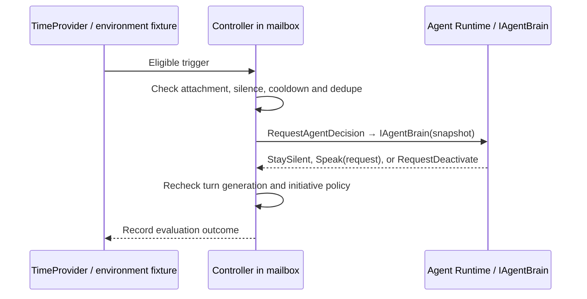

# Interaction Controller

The Interaction Controller asks “What is happening in the conversation?” It observes speech activity, partial/final transcripts, agent/playback state, idle timers and environment events, then arbitrates Ignore/Continue/Queue/Interrupt/InjectEvent/RequestInterruptionClassification/RequestAgentDecision. It does not perform general agent reasoning. Agent Runtime asks “What should the agent do about it?” and owns identity, policy, context, text-model reasoning, response generation and initiative decisions. Controller evaluations run synchronously inside the Session Runtime mailbox; optional classification and brain decisions run outside it against snapshots. [Architecture](03-system-architecture.md) defines ownership and queues.

Client-transcript evidence uses the same mailbox rows as backend STT after Session Runtime admits `client.speech.evidence`. Admission requires matching attachment, epoch, voice mode, and monotonically increasing per-utterance revision; mute, stale identity, and PCM frames on this transport are rejected. Input transport `clientTranscript` does not open `ISpeechRecognizer`. The controller does not branch on adapter names.

## State representation

Avoid a single enum that incorrectly forbids simultaneous user input and agent output. Store these orthogonal fields:

| Field | Values |
| --- | --- |
| Lifecycle | Created, Attached, Paused, Ending, Ended |
| Mode | Text, Voice (one conversation; mode may transition) |
| Input | Idle, Listening, UserSpeaking, Finalizing |
| Output | Idle, ProcessingAttachments, RunningTools, WaitingForAgent, AgentGenerating, AgentSpeaking, Interrupted |
| Candidate | None or (candidateId, utteranceId, responseId, revision, deadline) |
| Response | responseId, status (Live, Superseded, Completed, Failed), modelDone, audioDone, playbackDone |
| PendingMode | None or requested Text/Voice while waiting for a safe transition; Voice pending is cleared on disconnect, crash recovery, cancel, or timeout |

The UI derives one label with precedence: Ended, Reconnecting, Interrupted (brief notice), User speaking, Agent speaking, Thinking, Listening. InterruptionCandidate is a debug state layered over input/output; it does not erase the underlying state.

## Transition table

All rows run in mailbox admission order. Missing/old epoch, attachment, utterance revision or response identity is ignored before applying a row.

| Event and guard | Decision | State/action |
| --- | --- | --- |
| Attach Created/Paused | InjectEvent | Attached using stored Mode (attach payload has no mode); text Input=Idle, voice Input=Listening; start backend recognition only when voice and input transport is `serverAudio` |
| session.mode.set | See [mode transitions](#mode-transitions) | Queue or apply; never a second session |
| user.text while attached | `behavior=interrupt` or omitted: Interrupt if response live, else InjectEvent. `behavior=queue`: persist the user entry; Interrupt only when no response is live | Persist the user turn before ACK. Queue keeps the live response. After the live response is durably terminal, the trailing user suffix is one next turn. Interrupt supersedes after persist so earlier queued user entries stay ordered. Unknown behavior is rejected |
| SpeechStarted while no output | InjectEvent | UserSpeaking; reset silence generation |
| SpeechStarted while live output | Queue evidence | UserSpeaking; create InterruptionCandidate, optional duck |
| SpeechPartial explicit stop/question | Interrupt | Supersede captured response; keep accepting utterance |
| Short complete backchannel during output | Continue | Clear candidate, restore gain, retain as non-turn acknowledgement |
| Low activityScore noise/echo | Ignore | Clear candidate; restore gain; no user history turn |
| Ambiguous sustained speech | RequestInterruptionClassification | One bounded IInterruptionClassifier request per candidate, never per audio frame |
| SpeechEnded | Queue | Finalizing; wait for capability-specific final deadline (below) |
| SpeechFinal nonempty, not backchannel | Interrupt if still live; InjectEvent | Commit exactly one user entry; WaitingForAgent; launch brain |
| Brain Speak, current turn generation valid | InjectEvent | Allocate live Response with supplied ID; AgentGenerating; start LLM |
| Brain StaySilent | Continue | Output Idle; schedule next eligible initiative check |
| First actual playback ack | Continue | AgentSpeaking (input remains independently active) |
| Model terminal, text mode | Continue | Await terminal persistence then complete on success; fail on error |
| Model/TTS terminal, voice mode | Queue | Success waits for final audio sent and playback.completed |
| Playback completed, model/TTS done | Continue | Await terminal persistence then complete; Input Listening if no user speech |
| Confirmed interrupt | Interrupt | Output Interrupted; stop/cancel, then wait for final user text |
| Idle/environment trigger while eligible | RequestAgentDecision | Invoke IAgentBrain against immutable context |
| Environment trigger while speaking/busy | Queue | At most one newest event per kind, maximum 16, expiry 30 seconds |
| Disconnect | Interrupt | Paused; cancel output/STT/timers; clear `PendingMode`; reject old attachment input |
| End from any nonterminal state | Interrupt | Ending; cancel/flush, durable terminal save, then Ended |

Invalid transitions never resurrect output: completion for Superseded is ignored; duplicate finals/commands are deduplicated; playback progress for an unknown response is rejected; attach to Ended is a conflict. Final transcript may precede SpeechEnded and commits immediately; later Ended does not reopen the utterance. Empty final restores Listening. Final deadline is 2 seconds for partial-capable streaming STT and 20 seconds for batch/no-partial STT, measured from Ended. Final timeout produces recoverable SpeechRecognitionTimeout and discards the incomplete utterance. A final arriving after timeout is ignored. New speech during brain evaluation invalidates that decision's turn generation; no old Speak result may begin. Classifier replies never start an Agent response by themselves.

## Mode transitions

One Session remains one conversation. Mode is not a second session.

The browser must complete audio **preflight** on the Voice click (user activation) before or as it sends `session.mode.set(voice)`. The server still owns when Mode becomes Voice. See [Frontend](13-frontend-implementation-spec.md#voice-preflight).

```text
text → local audio preflight (no PCM) → session.mode.set(voice) → [optional pending] → Mode=Voice → start PCM / STT / playback
voice → session.mode.set(text) → dispose speech resources → text
```

A transition is admitted only when safe:

| Current condition | Rule |
| --- | --- |
| Output live, request voice | **Wait.** Queue at most one pending mode change (`PendingMode=Voice`). Do not supersede the live text response. Apply voice start after that response is Completed or Failed, or Interrupted by a **user** action that is not disconnect/end (`userBargeIn`/`newText`). Do not apply pending voice because disconnect interrupted the response. Project `pendingMode` so the UI can show Starting voice… until the transition applies. Bound the wait with `PendingVoiceTimeoutMs` (default 30000): on timeout clear `PendingMode`, remain Text, and emit `session.state.changed`. |
| Output live, request text (leaving voice) | **Supersede** the live voice response using the normal stop/cancel sequence (`playback.stop` and `agent.response.interrupted` with reason `modeChange`), freeze Spoken Until, dispose speech resources, then set Mode=Text. Playback cannot continue after speech resources are released. |
| Request text while `PendingMode=Voice` | **Cancel pending.** Clear `PendingMode`; remain Text. Do not apply voice later for that request. |
| Input UserSpeaking or Finalizing | **Wait** until the utterance commits, is discarded, or times out. Do not split an utterance across modes. |
| Ending or Ended | Reject the mode command. |
| Voice requested but `voiceAvailable` is false | `VoiceUnavailable`; remain in text. |
| Created/Paused with no live response | Record **applied** Mode on the snapshot. Do not honor a leftover `PendingMode=Voice` after disconnect or crash recovery. |
| Disconnect or crash recovery | Interrupt live output. Set `PendingMode=null`. If voice was never applied, Mode remains Text. Reconnect must not start STT or expect PCM from the old pending request. |

After a successful switch to voice, Input becomes Listening and recognition starts. After a successful switch to text, Input becomes Idle, streamId is null, and STT/TTS sessions are disposed. History, summary, profile and response identity are unchanged. Each assistant entry keeps the delivery mode it was generated under so later prompt building can apply received vs heard prefixes.

## Interruption policy and defaults

Use deterministic rules first. Normalize text with invariant case, trim whitespace and punctuation for phrase matching, and preserve original text for history. Explicit phrase matches at the beginning of the utterance (whole words, not substrings) such as `stop`, `wait`, `hang on`, `hold on`, `what do you mean`, and `no` or `that's not what I asked` take the turn immediately. A full utterance matching `mhm`, `yeah`, `right`, `okay`, `uh huh` or `uh-huh`, duration <=700 ms, usually continues. A partial `yeah` is provisional: a subsequent `yeah, but ...` must be reconsidered. An acknowledgement during idle is a normal user turn, not discarded.

Speech activity with activityScore >= configured threshold (default 0.7) and duration >=120 ms creates a candidate; shorter/noisy activity is ignored unless an explicit command transcript exists. Browser `activityScore` is an uncalibrated energy/hysteresis observation, not a statistical confidence. Echo matching alone must not suppress explicit stop phrases. Tune VAD thresholds with microphone tests; headphones are the initial demo recommendation. VAD is evidence only and never authorizes an Agent response.

Default semantic policy: use partial text when available; one optional fast IInterruptionClassifier call after 250 ms of ambiguous evidence, deadline 200 ms. Classifier replies must match candidateId, responseId, utteranceId and latest evidence revision. Ignore stale replies. A partial matching a backchannel delays the sustained-speech fallback until 700 ms or a non-backchannel revision. Otherwise at 500 ms sustained confident speech with no decisive text, interrupt; if speech has ended and only ambiguous brief evidence remains, continue until a final transcript resolves it. Classifier errors/timeouts take this deterministic fallback. No LLM request per microphone buffer.

## STT capability fallback and local ducking

| Effective policy | Evidence | Exact default behavior |
| --- | --- | --- |
| semantic (best case) | VAD + Partial Transcripts + deterministic semantics, optional bounded classifier | Use the rules above; brief acknowledgements usually Continue |
| speechAndFinal (degraded; default without partials) | Confident speech + Final Transcript | Duck locally if enabled; classify a final that arrives before 250 ms of sustained speech; otherwise interrupt at 250 ms and use the eventual final for the new turn |
| speechActivity (minimal; explicit configured fallback) | Speech activity only for the interruption decision | Interrupt at 250 ms confident sustained speech regardless of transcript availability; wait for a usable final before generating a reply |

PartialTranscripts=false selects Interaction.NoPartialPolicy (`speechAndFinal` default; `speechActivity` permitted). These policies cannot preserve all backchannels; an acknowledgement arriving after the activity deadline never resurrects a Superseded Response. Threshold DegradedInterruptMs is configurable. Without provider SpeechBoundaryEvents, browser VAD supplies activity boundaries. Batch-only STT buffers an utterance and returns its final later; capture remains active while that request or TTS runs. A recognizer failure can still stop playback based on speech activity, but does not manufacture a user transcript or trigger a reply; follow the voice error/reconnect path.

Local ducking is an optional frontend UX optimization, enabled by default, not a required domain state. Local speech reduces playback gain to 0.2 with a 20 ms ramp while the controller gathers evidence. Continue/Ignore restores gain; confirmed interruption flushes completely. Playback progression continues at reduced volume. If no decision arrives within 600 ms, restore locally; a later authoritative stop still applies. The existing playback.gain control is a transport hint, not agent reasoning. Ducking must be independently disableable without changing interruption correctness.

```mermaid
sequenceDiagram
    participant B as Browser
    participant R as STT
    participant C as Controller in Session Runtime
    B->>B: R1 playing; microphone remains active
    B->>R: User says mhm
    B->>B: Optional local duck
    R-->>C: Partial then final acknowledgement
    C->>C: Backchannel rule selects Continue
    C-->>B: Restore gain for R1
    B->>B: Continue R1, no new Response or TTS restart
```

## Barge-in and races

```mermaid
sequenceDiagram
    participant B as Browser / audio worklet
    participant S as Session Runtime + Controller
    participant P as LLM / TTS workers
    B->>S: SpeechStarted(U1) while R1 plays
    B->>B: Duck; microphone stays active
    B->>S: Partial(U1, "wait")
    S->>S: Mark R1 Superseded first; freeze last heard estimate
    S->>S: Invalidate unsent text, segment timer and queued TTS jobs
    S->>B: playback.stop(R1)
    S->>P: Cancel TTS and LLM response work (STT continues)
    S->>B: agent.response.interrupted(R1)
    B->>B: Tombstone R1; flush queue and worklet; retain interrupted text
    B->>S: playback.stopped(R1, consumedSamples)
    P-->>S: Late R1 text/audio/completion
    S->>S: Reject by status + responseId
    B->>S: Final(U1, "Wait, what did you mean?")
    S->>S: Commit user turn; create R2 from conservative heard context
    S->>P: Generate R2
    P-->>B: R1 bytes already in flight
    B->>B: Reject tombstoned R1 even after R2 starts
```

Ordering is mark superseded, invalidate pending segments/output, queue high-priority playback.stop, cancel pending/active TTS and LLM work, then emit interrupted. Do not wait for a browser acknowledgement or provider cancellation before continuing input processing. A browser may already have played in-flight samples before receiving stop; the invariant applies after each side learns supersession, not retroactively to physical audio. Freeze Spoken Until from the last validated Playback Progress when marking superseded. Late browser started/progress/completed/stopped events for R1 are ignored for conversational state, history and context (a stop acknowledgement may be counted only in diagnostics). R2 never waits for or consumes stale R1 playback feedback. This deliberately conservative estimate may omit the final fraction of speech.

## Timers and initiative

Timers use TimeProvider and enqueue events containing a timer generation. User activity, detach/end and response starts invalidate old generations. Fire only while attached, input quiet, output idle, and no accepted trailing-user suffix is waiting. Defaults: idle threshold from Agent Definition (8 seconds), minimum evaluation interval/cooldown 30 seconds. StaySilent consumes evaluation cooldown to prevent timer storms. New user activity rearms the silence period. Environment events are deduplicated by EventId and expire after 30 seconds. Repeated Speak/StaySilent/RequestDeactivate and definition-owned caps are in [Observed Phase D initiative](#observed-phase-d-initiative).



Initiative supports LongSilence, EnvironmentUpdate, UnfinishedInteraction only during an active attached application session. No push, email, SMS, agent automation platform or background notification service. Queue expires instead of interrupting a user to deliver a stale proactive update.

## Observed Phase D initiative

Timers use TimeProvider generations. User activity, pending upload, parsing/tool hold, detach/end/deactivate, and response starts invalidate old generations. Fire only while attached, input quiet, output idle, no live assistant response, and no accepted trailing-user suffix is waiting. Definition pins set baseline silence/cooldown; text mode applies higher runtime floors (minimum silence 60s, cooldown 30s) than voice. Defaults when omitted: idle threshold 8 seconds, cooldown 30 seconds, `MaxConsecutiveProactiveTurns=1`, `MaxSilentEvaluations=8`, `MaxInactivityMs=900000`. `maxPerSilencePeriod` is 1..8 (shipped examiner/compliance 1, customer-support 2). Visible LongSilence Speak increments proactive counters; semantic `StaySilent` from initiative evaluation increments silent evaluations; hard-cap `StaySilent` does not. User text, speech commit, pending-upload staging, explicit reopen/resume, and attach reset activity timestamps and proactive counters. Environment/unfinished Speak does not consume the silence consecutive cap. Reaching proactive caps suppresses further LongSilence brain evaluation without pausing the session. Silent-evaluation and inactivity bounds pause via `ApplyDeactivate` (`pauseReason` `silentEvaluation` or `inactivity`); brain `RequestDeactivate` uses `initiative`. `POST /api/v2/sessions/{id}/deactivate` persists `pauseReason=manual`. Pause disposes the live runtime on the host; reopen/resume bumps `RuntimeEpoch`, sets `LastUserActivityAt`, and attach clears `PauseReason`. They are not archive and not v1 end. Proactive usefulness is decided by a compact LLM initiative evaluation (`initiative-decision-v2`) before generation, not by punctuation heuristics. That evaluation receives agent identity, goals, clipped instructions, conversation/initiative policy, recent turns, silence duration, and proactive counters; only a `speak` result builds the full generation prompt.

**R2 receipts (observed):** speech-coordinate playback progress is independent of display receipts. Conservative heard context uses speech receipts only. Display receipts do not copy onto heard. When `reply.speech` is absent, TTS synthesizes `reply.text` once; a later speech field on the same response does not start a second TTS source.

## Follow-on P1 planned until verified

Observed controller Lifecycle remains Created/Attached/Paused/Ending/Ended (protocol-v1 `status`). Do not treat those values as Completed/Expired/Cancelled. Application `LifecycleTransition` owns additive durable `lifecycleStatus` (Active/Paused/Completed/Expired/Cancelled/Ended), terminalization (cancel generation, stop STT/TTS/playback, persist reason, constrain input, publish `session.state.changed` with `lifecycleStatus`), and idempotent same-outcome repeats. Archive stays orthogonal. Attached deadlines use TimeProvider mailbox timers; detached admission checks expiry atomically with no durable scheduler. A configured completion evaluator may yield `continue` or `RequestComplete` (not `RequestDeactivate`, not an inline response marker). Ongoing sessions and `AgentCompletion=Disabled` skip evaluation. Evaluation runs only after a completed assistant turn. `continue` and advisory `requestComplete` stay Active (advisory publishes `session.completion.intent`). Allowed `requestComplete` transitions to Completed only after that turn has terminalized. Host/system completion calls `LifecycleTransition` with no model request. Domain-specific completion rules stay in host integrations. The first-party UI presents Completed/Expired/Cancelled/Ended as outcome-specific read-only history on the existing ended shell. See [Technology Decisions](10-technology-decisions.md#decision-additive-semantic-lifecycle-beside-protocol-v1-status).
