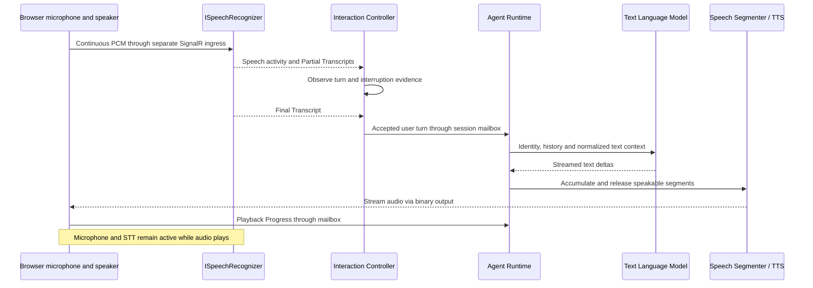

# Realtime Voice and Conversation

## Canonical composed pipeline

The default and primary MVP is **STT → Interaction Controller → text Agent Runtime / LLM → TTS**. It continuously processes microphone input, including during TTS playback. It is full-duplex from the user's perspective even though reasoning is text-first. It must never alternate between disabling capture to play an answer and recording the next turn.

```text
Browser microphone → PCM frames → ISpeechRecognizer   (input transport serverAudio)
Browser Web Speech → client transcripts                 (input transport clientTranscript)
    → speech/Partial Transcript/Final Transcript events
    → Interaction Controller → Agent Runtime → ILanguageModel
    → streamed text → ResponseTextAccumulator → SpeechSegmenter
    → Speech Segment → ISpeechSynthesizer → streamed PCM → browser playback  (output transport serverAudio)
                    or client speech playback                                 (output transport clientSpeech)
```

A speech **provider** (Synthetic, OpenAI, batch, future local) is the Infrastructure adapter behind a port. A speech **transport** (`serverAudio`, `clientTranscript`, `clientSpeech`) is how the session moves audio or transcripts. Session Runtime must not branch on adapter names. Browser has no backend STT/TTS port. PCM admission for `serverAudio` still uses the hub ingress described below; `clientTranscript` does not push microphone PCM into `ISpeechRecognizer`.

### Browser speech privacy

Selecting Browser STT does not send PCM to a backend STT adapter. The browser vendor’s Speech Recognition implementation may still use a cloud recognizer; Agent Core does not claim Browser STT is local or offline. Browser TTS (`speechSynthesis`) privacy is platform-dependent. Operators who need backend-controlled or on-device speech should select another STT/TTS adapter. Default `LogConversationContent` remains `false`; speech meters and timeline stages do not carry transcript, PCM, keys, or vendor bodies.

Stream every feasible stage. Partial Transcripts/VAD guide interruption immediately; a committed Final Transcript starts the normal user-turn model request. MVP does not speculatively generate answers to unstable partial text. This turn boundary is intentional, not a reason to buffer microphone input before sending it to streaming STT. Likewise do not wait for the full LLM response or entire-message TTS before playback. Non-streaming providers use the explicit degraded policies below.

## Transport and canonical format

Decision: SignalR + MessagePack over WebSockets for the MVP browser connection; fail voice connection with a clear unsupported-transport error if WebSockets are unavailable. REST handles lifecycle. No WebRTC implementation in version 1. SignalR narrows the implementation surface while supporting binary messages; application and audio ingress boundaries allow a future WebRTC adapter. [Protocol](14-api-and-realtime-protocol.md) specifies dedicated audio DTOs.

PCM signed 16-bit little endian, mono, 24,000 Hz is the canonical session format (`pcm_s16le`). Frames default to 20 ms = 480 samples = 960 bytes; accept up to 40 ms = 960 samples = 1,920 bytes. Final short frames may contain any positive whole sample count. No WAV headers in streamed frames. SampleOffset counts samples from stream/response start, not wall time; FrameSequence starts at 1. Adapters own resampling, codecs, WAV wrapping and vendor format conversion. Tune frame size from measurements without changing runtime concepts.

Raw microphone frames go directly from hub audio ingress to the active ISpeechRecognitionSession using a dedicated bounded channel. The ingress coordinator validates attachment/stream identity and serializes audio plus boundary markers. It emits only meaningful recognition/boundary/failure events into the session mailbox. An audio queue holds at most 500 ms; overflow or a sample gap terminates that input stream with recoverable AudioDiscontinuity. Restart recognition with a new streamId; do not silently splice missing speech. Maximum utterance is 30 seconds, after which force an ended boundary through ingress, restart recognition with a new streamId, and notify the client.

## Browser modules

| Module | Responsibility |
| --- | --- |
| MicrophoneCapture | getUserMedia during Voice-click **preflight** (user activation); request echoCancellation/noiseSuppression/autoGainControl where supported; hold tracks without sending PCM until server Mode is voice; release on end, cancel, timeout, failure or disconnect |
| InputAudioWorklet | Capture device float samples, stateful resample from actual AudioContext sample rate to 24 kHz, clamp and encode PCM16 LE |
| VoiceActivityObserver | 20 ms energy/noise-floor activityScore; emit speech-start/end evidence; never gate capture during agent speech |
| RealtimeConnection | SignalR connection, attachment, bounded sending, command identity and reconnect |
| OutputAudioQueue | Validate responseId/frame order, bounded canonical PCM queue, resample for actual output sample rate |
| OutputAudioWorklet | Render PCM continuously, fill silence on underrun, apply gain ramps and flush by responseId |
| PlaybackTracker | Report actually consumed canonical samples, started/progress/completed/stopped |

Use Web Audio API and AudioWorklets, not HTML audio elements for streamed PCM. Do not assume the requested capture rate is honored. Transfer ArrayBuffers between worklets and main thread; do not require SharedArrayBuffer or cross-origin isolation for MVP. Keep React rendering outside the audio loop. Create/resume AudioContext and load worklets during Voice-click preflight so a later queued mode wait does not depend on leftover user activation. Do not send PCM, start STT, or claim Listening until the server has applied voice mode. Microphone remains active during agent speech. Mute stops sending microphone frames and ends the current utterance, but retains the permission/capture service; unmute starts a new input stream. End/disconnect, pending-voice cancel/timeout, or a successful mode switch to text stops capture and playback and releases preflight resources. Resume voice after reconnect requires a **new** Voice click (preflight + `session.mode.set`); do not auto-apply a previous `PendingMode=Voice`. [Frontend voice preflight](13-frontend-implementation-spec.md#voice-preflight) owns the click sequence; [Controller](05-interaction-controller.md#mode-transitions) owns when Mode becomes Voice.

## Browser VAD (MVP)

MVP uses a small in-browser energy / adaptive noise-floor observer. It does **not** use a third-party VAD model in the first implementation. The published score is `activityScore` in `[0, 1]`, not calibrated statistical confidence.

| Parameter | Default | Meaning |
| --- | --- | --- |
| FrameDurationMs | 20 | Observation hop; matches canonical capture frames |
| NoiseFloorAdapt | 0.05 | Exponential move of noise floor toward quiet frames |
| StartThreshold | 0.7 | activityScore must exceed this to consider speech-start |
| StartHangFrames | 3 | Consecutive above-threshold frames before SpeechStarted |
| EndThreshold | 0.4 | activityScore must fall below this to consider speech-end |
| EndHangFrames | 15 | Consecutive below-threshold frames before SpeechEnded |
| MinActivityMs | 120 | Shorter bursts are not emitted as start/end |
| ActivityScoreSmoothing | 0.3 | EMA smoothing of per-frame energy above noise floor |

Algorithm sketch: for each 20 ms frame, compute RMS energy; while not in speech, raise/lower an adaptive noise floor toward quiet energy; `activityScore = clamp((energy - noiseFloor) / (speechRef - noiseFloor), 0, 1)` with a configurable speechRef (default a few times the floor, floored to a minimum). Apply start hysteresis, then end hysteresis and MinActivityMs. Device change, track restart, mute, or new input streamId **resets** noise floor, hang counters and in-speech state. All values live under Voice.Vad and are tuned with hardware tests.

VAD emits `user.speech.started` / `user.speech.ended` evidence only. It never starts an Agent response, never commits a user history turn, and never bypasses STT/controller policy. Provider turn-detection events, if present, are likewise evidence. [Controller](05-interaction-controller.md) remains authoritative.

## Speech segmentation

ResponseTextAccumulator and SpeechSegmenter are concrete Application components, separate from the LLM adapter and TTS adapter. The accumulator owns the exact generated text and UTF-16 offsets under Session Runtime mutation ownership. The segmenter consumes accepted ModelTextDelta records and emits immutable segments; it needs no public interface. Provider adapters do not decide where a conversational phrase ends.

```csharp
public sealed record SpeechSegment(Guid ResponseId, int SegmentIndex,
    int TextStart, string Text);
```

Keep a response-specific unsent text buffer and TimeProvider deadline. SegmentIndex starts at 0; TextStart is the response-wide UTF-16 offset. Release a segment using these ordered rules:

1. Sentence-ending `.`, `?` or `!`, including following closing quotes/brackets, with at least 20 buffered characters. Very short complete replies remain buffered until model completion or the latency rule below. Do not treat a decimal point between digits as a sentence boundary.
2. A strong clause boundary `;` or `:` with at least 40 buffered characters. A comma alone does not flush a tiny fragment.
3. After 300 ms since the first buffered character, release through the last whitespace boundary when at least 20 characters are buffered.
4. At 120 characters, release through the last available whitespace boundary at or beyond 20 characters. If no such boundary exists, wait only to the 240-character hard cap, then split on a Unicode scalar boundary to keep memory and latency bounded.
5. Model completion releases the remaining nonempty buffer, even a short reply such as “Okay.” Whitespace-only remainder produces no speech job.

Offsets include original whitespace, even when TTS ignores leading/trailing whitespace. Never duplicate/drop text or split a surrogate pair. These thresholds are configurable in Voice.Segmentation. Timer callbacks carry response identity/generation and recheck it in the mailbox. Buffer less than 20 characters may wait for the next delta/completion within the model idle timeout; the latency threshold is not permission to synthesize every isolated token. Initial defaults balance prosody, latency and avoiding tiny audio fragments; measure before tuning.

Example input: `Sure, there are three things I'd suggest. First, check the connection. Then try again.`

```text
Segment 0: "Sure, there are three things I'd suggest."
Segment 1: " First, check the connection."
Segment 2: " Then try again."
```

Token boundaries such as `Sure`, `, there`, `are three` are not speech-job boundaries. Each segment becomes one SpeechRequest with the same Response ID and captured offsets when output transport is `serverAudio`. When output transport is `clientSpeech`, the same SpeechSegmenter releases become `speech.output.segment` events (speakable text, speech-text `textStart`, strictly increasing `segmentIndex`) followed by `speech.output.completed`; do not synthesize those segments on a backend port or change server-audio PCM DTOs. One TTS job streams at a time in segment order; browser playback begins with its first audio while later text/segments are still being generated. Keep at most 4 pending segments and stop advancing the model enumerator when that queue is full. Supersession invalidates the unsent text buffer, segment timer and pending jobs before any new job can start.

## Response generation and streaming speech

```mermaid
sequenceDiagram
    participant L as ILanguageModel
    participant S as Session Runtime / accumulator
    participant G as SpeechSegmenter
    participant T as ISpeechSynthesizer
    participant B as Browser playback
    S->>S: Create Response R1
    S->>L: Text ModelRequest(R1)
    L-->>S: ModelTextDelta(R1)
    S->>G: Accepted text and offsets
    G-->>S: SpeechSegment(R1, 0)
    S->>T: SpeechRequest(R1, 0)
    T-->>B: Binary audio via guarded output sender
    B->>S: Playback Progress(R1)
    Note over L,B: Later model deltas and segments overlap first playback
    L-->>S: More text then ModelCompleted
    G-->>S: Remaining segments(R1)
    T-->>B: Last segment audio and final marker
    B->>S: playback.completed(R1)
    S->>S: Persist terminal response; complete R1
```

R1 transitions Live→Superseded on interruption. From that instant no new Speech Segment or TTS job may be produced for R1; cancel LLM/TTS, drop queued R1 audio, tell the browser to stop, freeze Spoken Until and discard late model/TTS/provider completion/playback events. R2 uses a fresh ID. Listening continues through this transition. [Controller](05-interaction-controller.md#barge-in-and-races) owns the exact stop/cancel sequence.

## Output backpressure

Before sending a segment's first audio, the sender must have sent all text deltas covering that segment, so audio cannot introduce text the client has not received. Response audio has one continuous sequence/sample offset across segments. TTS workers label segment-local frames; the runtime output coordinator rebases these. Browser prebuffer target is 60 ms and maximum audio queue is 2 seconds. Server output backpressure uses playback acknowledgements to keep at most 2 seconds of sent-but-unplayed audio; never block playback.stop behind PCM. A 5-second stalled playback acknowledgement fails voice output, flushes audio and leaves text chat available. Text completion means model text is complete; response completion waits for playback end in voice mode. Last audio frame has isFinal=true, with an empty final marker allowed only when there is no remaining PCM to mark. The empty marker does not advance sample offset.

## Normal voice turn




## Spoken-until

Track generatedText, synthesized segment boundaries/durations, and last acknowledged consumedSamples separately. Browser reports progress every 100 ms while playing, and immediately at start, completion and stop. Only samples actually consumed by the output worklet count; buffering, time spent underrunning and speculative queued audio do not. Canonical sample counts remain valid after output resampling. Progress is monotonic and capped at sent samples.

Heard text is a **conservative undercount**. Never infer that a user heard a word from proportional audio duration; speech timing is nonuniform.

| Timing information | Heard credit rule |
| --- | --- |
| TTS timing marks present | Greatest `TextEndExclusive` at or before `consumedSamples` (response-wide after adding segment offsets). Clamp to valid UTF-16 boundaries. |
| No timing marks | Credit **entire text** of each **fully played completed** Speech Segment. Credit **zero text** from the currently playing (partially consumed) segment, even if more than half its samples have played. Sum only those completed segments. |

The existing relatively small Speech Segments bound the undercount. A fully played completed segment credits its entire text. Do not use `textLength * playedSamples / totalSamples`.

When output transport is `clientSpeech`, playback acknowledgements carry `consumedSamples=0` and credit heard only from conservative `textEndExclusive`. Assistant completion requires model done, emitted segments, `speech.output.completed`, and a matching `playback.completed`. Successful completion may dispatch the queued-text head; explicit Stop does not.

When input transport is `clientTranscript`, Voice mode becomes Listening without opening a backend `ISpeechRecognizer` session. Transcript evidence arrives as `client.speech.evidence`; `TryAdmitAudio` ignores PCM. Native Web Speech `onstart`/`onend` are recognition-service session events, not user-utterance boundaries. Map `onspeechstart` to Agent Core `started` (falling back to the first result). Treat `onspeechend` as a **pending** boundary only: a native `result`, including a final, may arrive afterward, so close the utterance after the trailing final or a short grace timer, and also flush safely on the next `speechstart` or native `onend`. Emit native `isFinal` chunks as `final` so the long-utterance accumulator can concatenate them. Unexpected native `onend` uses bounded restart/backoff with a cap on consecutive idle ends without `speechstart`/`result` progress; exceed the cap with `SpeechRecognitionRestartLimit` while the session remains voice, unmuted, and current-epoch. Browser STT uses the agent's conversation language; Browser TTS applies `speech.output.segment` `language` and `speakingRate` to `SpeechSynthesisUtterance`. `BrowserSpeechSynthesizer.speak` resolves when that utterance ends (or fails on `onerror`); only explicit cancel calls `speechSynthesis.cancel()`.

On interruption, persist full generated text internally, receivedTextEndExclusive for the public history projection, and heardTextEndExclusive for future context. Record the response's **delivery mode** (`text` or `voice`) on the conversation entry. The prompt uses heard prefix for voice-delivered assistant entries and received prefix for text-delivered entries, plus an application-owned interruption note, never the unplayed/unrendered tail. Unseen/unheard assistant tails must not enter future model context after a later mode switch. Text-mode responses count as delivered only through the latest acknowledged rendered text offset, conservatively zero if none; `response.received` at final render normally credits the whole completed response.

When `playback.stop` arrives, tombstone the response before flushing main-thread and worklet queues. The worklet must check response identity itself so posted buffers cannot race a flush. `playback.stopped` confirms local flush for diagnostics; after supersession its late offset is ignored for state/history/context, just like late started/progress/completed. Freeze the last validated pre-supersession Spoken Until; conservatively undercounting is preferable to changing R2 context from stale feedback. [Controller](05-interaction-controller.md#barge-in-and-races) owns the interruption sequence.

## Post-MVP

Observed: optional independent `reply.speech` uses speech-coordinate playback receipts; display receipts stay on `reply.text` and blocks. Do not apply speech offsets to display text. TTS uses `[[speech:]]` when present, otherwise display text once, and never narrates attachment bytes, AttachmentId dumps, or long extracts; those stay on display/blocks while speech remains a short summary. Binary file upload remains HTTP, never the PCM path. Runtime deactivation tears down voice resources; reopen uses a fresh epoch and streamId. Text/voice mode switches keep the same Session identity, attachment/artifact refs, and response/epoch guards for late tool results.

## Capability degradation

STT and TTS are independently selected. Planned streaming hosted STT is OpenAI realtime transcription via `OpenAiSpeechRecognizer`; it is speech-to-text only and is **not selectable** while the live session remains a no-op. The supported hosted STT selection is non-streaming batch STT (`OpenAICompatibleBatch`), which transcribes at utterance end with **no partials**; barge-in uses `speechAndFinal` or configured `speechActivity`. Do not pretend batch recognition provides streaming semantics. Non-streaming TTS buffers a phrase before normalized PCM output; latency increases. Missing timing marks use the conservative completed-segment credit above, never proportional duration. Missing cancellation support still invokes local supersession and discards provider results. Voice setup fails recoverably with `VoiceUnavailable` if format conversion or a required audio direction is unsupported; the same session remains available in text mode. Native realtime speech-to-speech is a future optional optimization only: no MVP adapter, routing branch or milestone implements it. Hosted, hybrid and local STT/TTS remain the same composed pipeline.
