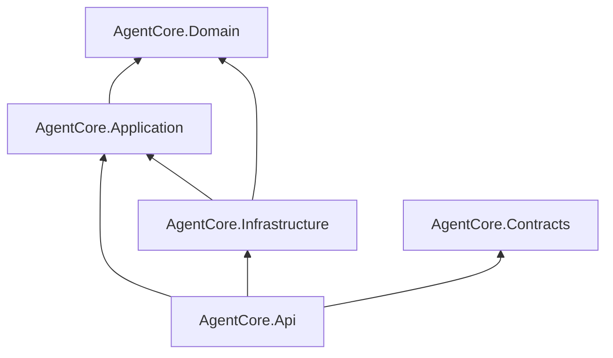

# Repository Structure

The repository contains the Milestone 1 solution (`AgentCore.sln`), versioned demo definitions under `agents/`, a strict React/Vite skeleton in `web/`, README, docs, shared agent instructions in [AGENTS.md](../AGENTS.md), and eleven skills in [.agents/skills](../.agents/skills) used by both Codex and Cursor. The two composition skills, develop and document, load the relevant specialist playbooks. `.agents/` contains development-agent instructions; `agents/` holds product Agent Definitions. Existing editor-specific files configure Playwright MCP only.

The application layout matches the project boundaries below. Root `local/` is a gitignored personal scratch folder (notes, temp files); it is not an application project, not a configuration source, and is never committed. [Persistence and Configuration](15-persistence-and-configuration.md#local-personal-workspace) owns secret-handling rules (environment / user-secrets only).

```text
src/
  AgentCore.Domain/          # definitions, policies, conversation values
  AgentCore.Application/     # runtime, controller, ports, normalized events
  AgentCore.Contracts/       # HTTP and SignalR DTOs only
  AgentCore.Infrastructure/  # HTTP adapters, synthetic adapters, EF/SQLite, JSON store
  AgentCore.Api/             # composition root, endpoints, hub, startup
tests/
  AgentCore.Domain.Tests/
  AgentCore.Application.Tests/
  AgentCore.Infrastructure.Tests/
  AgentCore.Api.Tests/
web/                        # React/Vite SPA and its frontend tests
agents/                     # versioned JSON definitions, created during implementation
docs/                       # this specification
local/                      # gitignored personal workspace; never committed
```

Arrows below mean “references,” not data flow:



| Project | Allowed dependencies and responsibility |
| --- | --- |
| Domain | BCL only; immutable Agent Definition, policy and conversation value records |
| Application | Domain and Microsoft logging abstractions; Agent Runtime, Interaction Controller, Session Runtime/manager, ports including IEnvironmentEventIngress, text context builder, ResponseTextAccumulator/SpeechSegmenter, TimeProvider, Channels |
| Contracts | BCL and MessagePack serialization annotations only; wire records, no Domain/Application/provider references |
| Infrastructure | Application, Domain, EF Core 10/SQLite, HttpClient factory/resilience and concrete adapters; never Contracts |
| Api | Application, Infrastructure, Contracts; ASP.NET Core 10, SignalR, serialization, OpenAPI, health, DI and boundary mapping |
| Tests | Corresponding subject project; Application.Tests may use Infrastructure synthetic adapters for conversation suites; Api.Tests uses WebApplicationFactory |
| web | Consumes wire specification, no backend assembly dependencies |

Namespace folders follow features: Application/Sessions, Interaction, Agents, Ports, Events; Infrastructure/Providers/OpenAICompatible, Providers/Synthetic, Persistence, Definitions; Api/Endpoints, Realtime. Do not add a shared catch-all “Common” project.

Use ordinary services and DI. No MediatR, generic repository per entity, actor framework or internal message broker. The API maps wire DTOs to application commands and application outputs back to DTOs. An application `ISessionOutput` boundary is implemented in Api; it exposes normalized application output, never hub objects. ASP.NET concerns do not travel inward.

Singletons: SessionManager, TimeProvider.System, ID generator, immutable validated definition cache and provider factories. Per runtime: Agent Runtime, controller and cancellation/state. Per operation: EF DbContext via factory. HttpClient lifetime is managed by IHttpClientFactory; no per-frame client creation. Provider adapters must either be stateless/thread-safe or instantiated per provider session.

OpenAICompatibleLanguageModel lives in Infrastructure and accepts OpenRouter/direct-hosted/local-server configuration. There is no OpenRouter core project or interface. STT and TTS adapters are separate capability implementations, including synthetic and local variants. Native realtime remains documentation-only future design, not an MVP project or startup dependency. Intended CI is GitHub Actions after project scripts exist; this documentation pass does not add workflow files.
