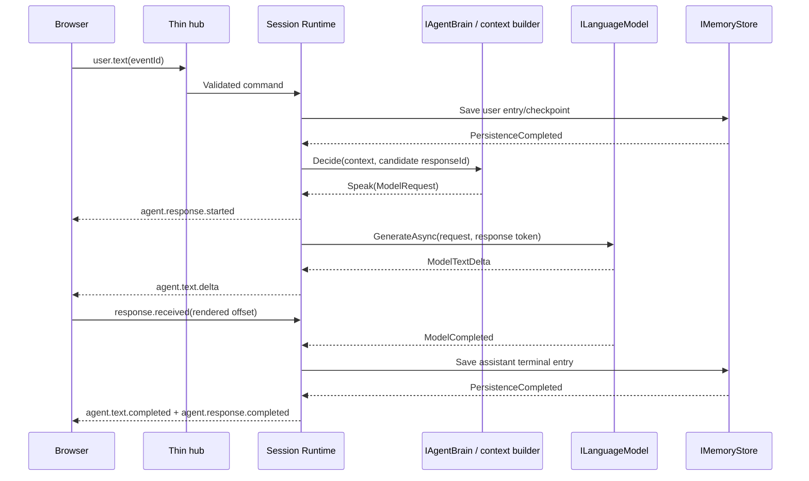
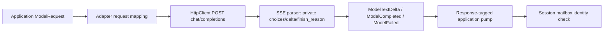

# Backend Implementation Specification

[Interfaces](04-backend-interfaces.md) owns ports, [Architecture](03-system-architecture.md) owns concurrency, and [Controller](05-interaction-controller.md) owns turn-taking. This document owns Agent Definition, text-first context construction and the initial HTTP model adapter. The canonical MVP composes STT → Interaction Controller → text Agent Runtime / LLM → Speech Segmenter → TTS; it requires no multimodal audio-reasoning model.

## Agent Definition

JSON only, UTF-8, files loaded through IAgentDefinitionStore from a configured agents directory. A file contains one definition; initial names are agents/examiner.json and agents/customer-support.json. No files are created by this docs task. Store published older versions in version subdirectories if needed; recursively index by (id, version), fail startup on duplicate keys. Versions are immutable positive integers. schemaVersion=1 identifies the format; version identifies that agent's revision. Reject unknown schema versions and unknown fields to catch spelling mistakes. A session pins and persists the validated definition so editing files cannot alter an existing identity.

Concrete Domain records (camelCase JSON via System.Text.Json):

```csharp
public sealed record AgentDefinition(int SchemaVersion, string Id, int Version,
    AgentIdentity Identity, IReadOnlyList<string> Goals, string SystemInstructions,
    BehaviorPolicy BehaviorPolicy, ConversationPolicy ConversationPolicy,
    InitiativePolicy InitiativePolicy, VoiceConfiguration Voice,
    ProviderPreferences ProviderPreferences, IReadOnlyDictionary<string, string> Metadata);
public sealed record AgentIdentity(string Name, string Role, string Description,
    string Tone);
public sealed record BehaviorPolicy(string InterruptionStyle, bool AcknowledgeInterruption,
    bool AvoidUnsupportedClaims);
public sealed record ConversationPolicy(string ResponseLength, bool AskOneQuestionAtATime,
    string Language, int MaxOutputTokens);
public sealed record InitiativePolicy(bool Enabled, int SilenceThresholdMs,
    int CooldownMs, int MaxPerSilencePeriod, IReadOnlyList<string> Triggers);
public sealed record VoiceConfiguration(bool Enabled, string VoiceId, double SpeakingRate);
public sealed record ProviderPreferences(string LanguageModel, string SpeechRecognizer,
    string SpeechSynthesizer, string InterruptionClassifier);
```

All fields above required; metadata may be empty. id: lowercase `[a-z0-9-]`, 1..64; version positive; identity strings 1..256 except description up to 1,024; goals 1..10 nonempty strings <=500; systemInstructions <=8,000. InterruptionStyle=`acknowledgeThenContinue|answerNewTurn`; ResponseLength=`concise|balanced`; language is a BCP-47 string; maxOutputTokens 1..4,096; silenceThresholdMs 1,000..120,000; cooldownMs 5,000..600,000; maxPerSilencePeriod=1 for MVP. Triggers are unique values `longSilence|environmentUpdate|unfinishedInteraction`. speakingRate=0.5..2.0; provider keys must resolve to configured capability-specific adapters. Metadata <=16 string pairs, values <=256, never secrets. Every nullable or optional policy alternative has been removed from this initial schema; startup validation surfaces missing required values.

Examiner:

```json
{
  "schemaVersion": 1,
  "id": "examiner",
  "version": 1,
  "identity": {"name": "Alex", "role": "Speaking examiner", "description": "Practice a speaking examination.", "tone": "Calm, formal and patient"},
  "goals": ["Conduct a realistic practice speaking examination", "Keep the candidate talking", "Offer feedback only when requested"],
  "systemInstructions": "You are Alex, a practice examiner. Ask one question at a time and wait for the answer. Do not claim to issue an official score or certification. If interrupted, attend to the candidate's new request.",
  "behaviorPolicy": {"interruptionStyle": "acknowledgeThenContinue", "acknowledgeInterruption": true, "avoidUnsupportedClaims": true},
  "conversationPolicy": {"responseLength": "concise", "askOneQuestionAtATime": true, "language": "en", "maxOutputTokens": 256},
  "initiativePolicy": {"enabled": true, "silenceThresholdMs": 8000, "cooldownMs": 30000, "maxPerSilencePeriod": 1, "triggers": ["longSilence", "unfinishedInteraction"]},
  "voice": {"enabled": true, "voiceId": "default", "speakingRate": 1.0},
  "providerPreferences": {"languageModel": "primary-llm", "speechRecognizer": "primary-stt", "speechSynthesizer": "primary-tts", "interruptionClassifier": "heuristic"},
  "metadata": {"scenario": "practice-exam", "owner": "demo"}
}
```

Customer Support Representative:

```json
{
  "schemaVersion": 1,
  "id": "customer-support",
  "version": 1,
  "identity": {"name": "Sam", "role": "Customer support representative", "description": "Resolve a simulated support issue.", "tone": "Warm, practical and clear"},
  "goals": ["Understand the customer's issue", "Explain available simulated order updates", "Summarize useful next steps"],
  "systemInstructions": "You are Sam in a support demonstration. Ask for missing context. Treat order updates as supplied simulation data. Never claim that you actually issued a refund, changed an order or accessed a live customer account.",
  "behaviorPolicy": {"interruptionStyle": "answerNewTurn", "acknowledgeInterruption": true, "avoidUnsupportedClaims": true},
  "conversationPolicy": {"responseLength": "balanced", "askOneQuestionAtATime": true, "language": "en", "maxOutputTokens": 512},
  "initiativePolicy": {"enabled": true, "silenceThresholdMs": 10000, "cooldownMs": 30000, "maxPerSilencePeriod": 1, "triggers": ["longSilence", "environmentUpdate", "unfinishedInteraction"]},
  "voice": {"enabled": true, "voiceId": "default", "speakingRate": 1.0},
  "providerPreferences": {"languageModel": "primary-llm", "speechRecognizer": "primary-stt", "speechSynthesizer": "primary-tts", "interruptionClassifier": "heuristic"},
  "metadata": {"scenario": "support", "owner": "demo"}
}
```

The same provider aliases resolve to synthetic or real implementations by profile. VoiceId is an application alias mapped by TTS configuration, not a vendor object. Static definition is distinct from mutable Agent Runtime State: active response, history, current utterance, heard estimate, summary and initiative counters belong to the session.

## Agent Runtime and prompt/context builder

Implement a concrete PromptContextBuilder invoked by the default IAgentBrain. Keep named, independently testable sections in Application, not scattered concatenation inside endpoints or adapters. Order:

1. System message: product interaction guardrails, identity, goals, systemInstructions, behavior and conversation policies.
2. System message: application-owned current mode/state and interrupted-response note. Include only validated heard prefix for voice or acknowledged displayed prefix for text; say that the rest of that response was not delivered.
3. System message: labeled session summary and minimal user preferences, treated as remembered data rather than instructions.
4. Chronological user/assistant messages from retained history; omit unseen assistant tails and non-turn backchannels. Avoid duplicating the current user entry.
5. User message containing the current environment event, when applicable, clearly delimited as observed data. For an idle trigger add an application system instruction to respond briefly if useful, after deterministic initiative approval.

History includes the just-committed user turn exactly once. Do not send partial transcripts as completed turns. Do not grant environment/profile/summary text system instruction authority: wrap as quoted data with a fixed application instruction explaining its status. Adapters receive fully formed ModelRequest and only translate it. No adapter constructs identity prompts.

Context budget baseline: retain newest 20 entries, maximum 24,000 UTF-16 characters of history, summary <=2,000 characters and profile <=2,000 characters. Drop oldest complete entries first and retain the current user turn; reject an over-budget current turn rather than silently changing meaning. Fixed system/definition budget is <=12,000 characters; validate it when loading definitions. These conservative character limits are not universal model token counts: the configured model must support at least a 16k-token context, and provider contract tests must validate the chosen model/limits. A provider with a smaller limit requires lower configured context budgets, not truncation inside the adapter.

MVP summary is a deterministic rolling digest of completed older entries (role-labeled excerpts, bounded to 2,000 characters), refreshed when history rolls over. It is allowed to lose detail and never claims to be semantic memory. Summaries use only context-eligible delivered assistant text. Persist through the last summarized entry sequence to avoid duplication. No extra LLM summarizer, embeddings or vector database is required.

IAgentBrain checks initiative eligibility and contextual usefulness. Default rule: LongSilence speaks only if the last delivered assistant turn ends in a question and no help was offered in that silence period; EnvironmentUpdate speaks only for an allowlisted meaningful status change relevant to this session; UnfinishedInteraction speaks only if a pending topic exists. Otherwise return StaySilent. UserTurn normally returns Speak. The controller rechecks eligibility after asynchronous decisions return.

## Text sequence



MVP waits for user entry persistence before generating a reply, while mailbox processing continues. In-memory store satisfies this boundary in early milestones. agent.text.completed is queued at model terminal behind preceding text; agent.response.completed follows successful terminal persistence (and voice playback if applicable). No provider request executes inside a DbContext transaction.

## OpenAI-compatible HTTP adapter

Decision: Infrastructure/OpenAICompatibleLanguageModel implements ILanguageModel using IHttpClientFactory, System.Text.Json and direct HTTP, no vendor SDK. The preferred hosted configuration targets OpenRouter, while direct OpenAI or local compatible inference use the same adapter. Named configuration supplies BaseUrl, ApiKey, DefaultModel, AdditionalHeaders, Timeouts and capabilities. BaseUrl is the API root ending in `/v1/`; append `chat/completions` without resetting an existing path prefix. Reject non-http(s) URLs and embedded userinfo; allow local HTTP only for explicitly configured demo/self-hosted endpoints. Values come from trusted backend operator configuration, never browser requests.

Map normalized System/User/Assistant messages to endpoint roles, MaxOutputTokens to `max_tokens`, optional Temperature to `temperature`, and the adapter configuration's DefaultModel to `model`. Require `stream=true`. Send Authorization Bearer only when ApiKey is nonempty; forbid AdditionalHeaders overriding Authorization, Host or content framing headers. No tool fields or structured response schema in MVP.

Use ResponseHeadersRead. Parse UTF-8 SSE incrementally across arbitrary network/line/JSON boundaries, tolerate CRLF and comments, combine multiline data fields, bound each SSE event to 1 MiB, process `[DONE]`. Normalize only text from the first supported choice; multiple choices are an InvalidRequest/UnsupportedCapability, never multiple application responses. Ignore known role-only/usage-only chunks; preserve whitespace text exactly. Map finish_reason stop→Completed, length→LengthLimit, content_filter→ContentFiltered; tool/function calls→UnsupportedCapability. Delay ModelCompleted until stream terminator so trailing usage can be included. EOF after a valid finish marker is accepted; EOF without finish marker or `[DONE]` is Unavailable. `[DONE]` without finish marker means Completed if at least a valid choice was observed; otherwise malformed stream. Malformed JSON is normalized failure, not silently skipped.



## Timeouts and retry policy

Use Microsoft.Extensions.Http.Resilience for circuit breaking and bounded setup resilience, but disable standard automatic retries/hedging for generation POSTs. Safe setup retry and replaying a response stream are different operations. Default: **zero automatic POST retries**, even before output; a transient failure can represent billable work already accepted. A future explicitly configured provider capability may permit one retry for a proven pre-send connection failure or explicit 429/503 rejection, respecting RetryAfter and session cancellation. Never retry after any normalized output or provider acceptance with uncertain outcome; never stitch a replay to existing text. Do not retry authentication, invalid request, cancellation or unsupported capability failures.

Separate budgets: headers/connect 10 seconds, stream idle 20 seconds reset on non-comment provider data, total response 120 seconds. HttpClient.Timeout should not accidentally compete with these explicit linked cancellation deadlines; use one owning timeout scheme and normalize which deadline expired. Circuit breaker defaults: 50% transport/5xx failures, minimum 5 requests over 30 seconds, break 15 seconds. It rejects quickly as Unavailable; it does not replay requests. API keys and provider bodies are excluded from logs.

Map 401/403 Authentication, 429 RateLimited (safe RetryAfter), 400/422 InvalidRequest, 5xx/network disconnect Unavailable, local deadline Timeout, caller token Cancelled, requested unsupported feature UnsupportedCapability, others Unknown. A midstream failure yields ModelFailed, cancels downstream TTS and leaves the partial response failed. A future user retry creates a new response ID. [Tests](16-testing-strategy.md) specifies chunk-boundary and partial-failure tests.

Speech adapters independently advertise capabilities and formats. Optional initial speech integrations include a separately configured OpenAI-compatible batch transcription adapter and a speech adapter; these are separately registered adapters with explicit support checks, not implied by this LLM adapter. The primary real demo uses independently selected streaming STT and TTS. Batch STT is an optional degraded configuration with speech-activity/final-transcript barge-in; it does not change the composed architecture or require switching off capture during output.


## Optional compatible speech HTTP mappings

OpenAICompatibleBatch appends `audio/transcriptions` to its own BaseUrl and posts multipart form data: model=DefaultModel, language=RecognitionOptions.Language, response_format=json, and file=a WAV-wrapped canonical utterance. Require a JSON text string, normalize it to one SpeechFinal for the captured utteranceId, then release the buffered WAV. This adapter advertises no partials or streaming input. The 20-second final-transcript application deadline cancels an outstanding batch request even when the general provider total timeout is longer. No automatic POST retries.

OpenAICompatibleSpeech appends `audio/speech` to its own BaseUrl and posts JSON model=DefaultModel, input=segment text, voice=resolved alias, speed=SpeakingRate, response_format=pcm. Its initial supported provider response is raw PCM16 little endian mono 24 kHz; reframe into canonical frames while reading. Require configured support for that response format before enabling voice. If another endpoint returns only compressed media or a different rate, a separately tested adapter conversion is required; do not silently interpret compressed bytes as PCM. The initial HTTP speech adapter has StreamingAudio=true for streamed response bytes, TimingMarks=false, Cancellation=true for local stream cancellation; discovery must lower streaming capability if the endpoint buffers the whole response. Normalize HTTP failures using the LLM error taxonomy. Synthetic implementations implement the same ports without HTTP.

Environment trigger Text contains a serialized, validated data-only representation of the allowlisted payload, including orderReference/status or pending topic. AgentContext supplies Mode, PendingTopic and HelpOfferedDuringSilence explicitly; the brain never reads mutable Session Runtime fields. The runtime sets PendingTopic from an unfinished_interaction fixture and clears it after a delivered intervention or an explicit fixture clear (empty topic); it does not infer a workflow or autonomous task from arbitrary user text.


## Portable protocol versus provider differences

OpenAICompatibleLanguageModel is the architectural HTTP protocol adapter; OpenRouter is the preferred hosted deployment configuration, not an Application dependency. Resolve per-identity aliases to adapter instances with their own DefaultModel. Keep stream variants, usage events, optional reasoning fields, parameter names and error payload quirks within Infrastructure parsing/configuration. For example, a recognized provider error inside an SSE data event must become ModelFailed even if the initial HTTP status was 200. Never concatenate hidden reasoning fields into spoken text or expose provider-specific deltas/model IDs through normalized events.

Only text messages and streamed text output are required. Tool calling and structured output are future/secondary; unexpected tool output produces UnsupportedCapability, not a new tool orchestration path. Do not expand ModelRequest into every vendor option. If a chosen model needs a parameter variant, implement a bounded adapter-local configuration mapping and contract test it. The default mapping remains documented above; compatibility does not promise identical behavior across every model family.

OpenRouter uses the configured API root `/api/v1/`; joining `chat/completions` must preserve `/api/`. Keep the existing no-replay rule for partially observed streams, including gateway errors. Model-specific tuning and selecting a supported catalog model are deployment tasks, not controller/agent reasoning logic. Speech segmentation remains exclusively the application concern specified in [Voice](06-realtime-voice.md#speech-segmentation).
