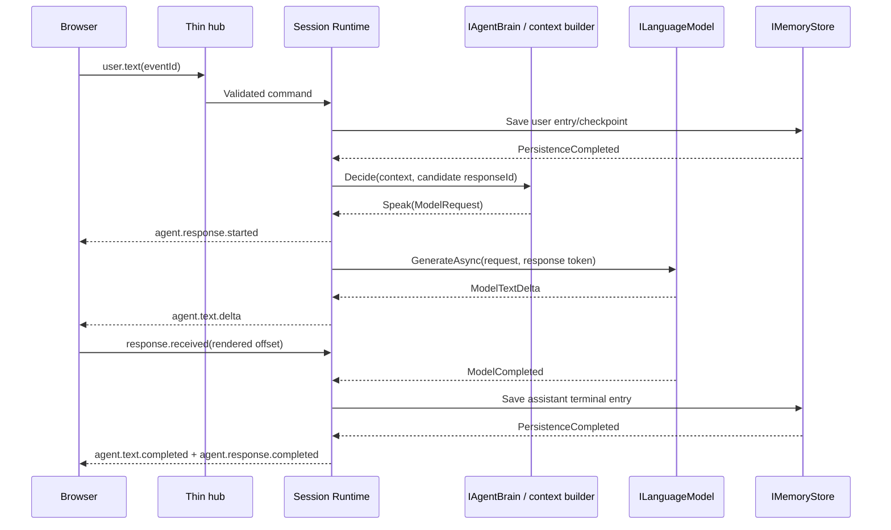
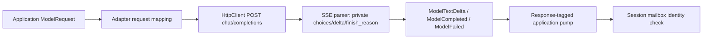

# Backend Implementation Specification

[Interfaces](04-backend-interfaces.md) owns ports, [Architecture](03-system-architecture.md) owns concurrency, and [Controller](05-interaction-controller.md) owns turn-taking. This document owns Agent Definition, text-first context construction and the initial HTTP model adapter. The canonical MVP composes STT → Interaction Controller → text Agent Runtime / LLM → Speech Segmenter → TTS; it requires no multimodal audio-reasoning model.

## Agent Definition

JSON only, UTF-8, files loaded through IAgentDefinitionStore from a configured agents directory. A file contains one definition; shipped names are `agents/examiner.json`, `agents/customer-support.json`, and `agents/compliance.json`. Approved knowledge bodies live beside them under `agents/knowledge/{identity}.md` and are not copied into session workspaces. Store published older versions in version subdirectories if needed; recursively index by (id, version), fail startup on duplicate keys. Versions are immutable positive integers. schemaVersion=1 identifies the format; version identifies that agent's revision. Reject unknown schema versions and unknown fields to catch spelling mistakes. A session pins and persists the validated definition so editing files cannot alter an existing identity. `FileAgentDefinitionStore` validates field rules and that `ProviderPreferences` aliases resolve (`primary-llm`, and when Voice.Enabled `primary-stt` / `primary-tts` in Synthetic). Missing versions return null from `GetAsync`.

Concrete Domain records (camelCase JSON via System.Text.Json):

```csharp
public sealed record AgentDefinition(int SchemaVersion, string Id, int Version,
    AgentIdentity Identity, IReadOnlyList<string> Goals, string SystemInstructions,
    BehaviorPolicy BehaviorPolicy, ConversationPolicy ConversationPolicy,
    InitiativePolicy InitiativePolicy, VoiceConfiguration Voice,
    ProviderPreferences ProviderPreferences, IReadOnlyDictionary<string, string> Metadata);
public sealed record AgentIdentity(string Name, string Role, string Description,
    string Tone);
public sealed record BehaviorPolicy(string InterruptionStyle, bool AcknowledgeInterruption,
    bool AvoidUnsupportedClaims);
public sealed record ConversationPolicy(string ResponseLength, bool AskOneQuestionAtATime,
    string Language, int MaxOutputTokens);
public sealed record InitiativePolicy(bool Enabled, int SilenceThresholdMs,
    int CooldownMs, int MaxPerSilencePeriod, IReadOnlyList<string> Triggers,
    int? MaxConsecutiveProactiveTurns = null, int? MaxSilentEvaluations = null,
    int? MaxInactivityMs = null);
public sealed record VoiceConfiguration(bool Enabled, string VoiceId, double SpeakingRate);
public sealed record ProviderPreferences(string LanguageModel, string? SpeechRecognizer,
    string? SpeechSynthesizer, string InterruptionClassifier = "heuristic");
public sealed record RoleEnvironment(
    IReadOnlyList<string>? Harness = null,
    IReadOnlyList<KnowledgeSourceRef>? KnowledgeSources = null,
    IReadOnlyList<string>? ToolAllowlist = null,
    WorkspaceTemplatePolicy? Workspace = null,
    AttachmentStorePolicy? Attachments = null);
```

Optional `environment` (default empty harness/knowledge/tools, empty workspace template, `allowUnreadUnsupportedTypes=false`) is omitted from historical MVP examples below; shipped fixtures include it. `process`/`shell` remain denied even if listed. Physical template application copies `agents/templates/{templateId}` into `/workspace/working` only (no harness/knowledge corpora). Shipped initiative pins: examiner `maxConsecutiveProactiveTurns=1`, customer-support `2` (`maxPerSilencePeriod=2`, 60s silence / 120s cooldown in JSON; text runtime floors still apply), compliance `0`.

All fields above required except speech provider aliases, the three optional initiative bounds, and `environment`. id: lowercase `[a-z0-9-]`, 1..64; version positive; identity strings 1..256 except description up to 1,024; goals 1..10 nonempty strings <=500; systemInstructions <=8,000. InterruptionStyle=`acknowledgeThenContinue|answerNewTurn`; ResponseLength=`concise|balanced`; `conversationPolicy.language` is `auto` (match the user's conversational language unless they request otherwise) or a fixed BCP-47-like tag for specialized agents; maxOutputTokens 1..4,096; silenceThresholdMs 1,000..120,000; cooldownMs 5,000..600,000; maxPerSilencePeriod 1..8 (shipped examiner/compliance 1, customer-support 2). When omitted, `MaxConsecutiveProactiveTurns` defaults to 1, `MaxSilentEvaluations` to 8, `MaxInactivityMs` to 900000. Triggers are unique values `longSilence|environmentUpdate|unfinishedInteraction`. speakingRate=0.5..2.0. `LanguageModel` is always required and must resolve. When `Voice.Enabled`, `SpeechRecognizer` and `SpeechSynthesizer` are required and must resolve to configured adapters. When `Voice.Enabled` is false, those aliases must be null/omitted; a text-only process must start without STT/TTS. `InterruptionClassifier` defaults to `heuristic` if omitted. Metadata <=16 string pairs, values <=256, never secrets. Every other nullable or optional policy alternative has been removed from this initial schema; startup validation surfaces missing required values.

Examiner:

```json
{
  "schemaVersion": 1,
  "id": "examiner",
  "version": 1,
  "identity": {"name": "Alex", "role": "Speaking examiner", "description": "Practice a speaking examination.", "tone": "Calm, formal and patient"},
  "goals": ["Conduct a realistic practice speaking examination", "Keep the candidate talking", "Offer feedback only when requested"],
  "systemInstructions": "You are Alex, a practice examiner. Ask one question at a time and wait for the answer. Do not claim to issue an official score or certification. If interrupted, attend to the candidate's new request.",
  "behaviorPolicy": {"interruptionStyle": "acknowledgeThenContinue", "acknowledgeInterruption": true, "avoidUnsupportedClaims": true},
  "conversationPolicy": {"responseLength": "concise", "askOneQuestionAtATime": true, "language": "en", "maxOutputTokens": 256},
  "initiativePolicy": {"enabled": true, "silenceThresholdMs": 8000, "cooldownMs": 30000, "maxPerSilencePeriod": 1, "maxConsecutiveProactiveTurns": 1, "triggers": ["longSilence", "unfinishedInteraction"]},
  "voice": {"enabled": true, "voiceId": "default", "speakingRate": 1.0},
  "providerPreferences": {"languageModel": "primary-llm", "speechRecognizer": "primary-stt", "speechSynthesizer": "primary-tts", "interruptionClassifier": "heuristic"},
  "metadata": {"scenario": "practice-exam", "owner": "demo"}
}
```

Customer Support Representative:

```json
{
  "schemaVersion": 1,
  "id": "customer-support",
  "version": 1,
  "identity": {"name": "Sam", "role": "Customer support representative", "description": "Resolve a simulated support issue.", "tone": "Warm, practical and clear"},
  "goals": ["Understand the customer's issue", "Explain available simulated order updates", "Summarize useful next steps"],
  "systemInstructions": "You are Sam in a support demonstration. Ask for missing context. Treat order updates as supplied simulation data. Never claim that you actually issued a refund, changed an order or accessed a live customer account.",
  "behaviorPolicy": {"interruptionStyle": "answerNewTurn", "acknowledgeInterruption": true, "avoidUnsupportedClaims": true},
  "conversationPolicy": {"responseLength": "balanced", "askOneQuestionAtATime": true, "language": "en", "maxOutputTokens": 2048},
  "initiativePolicy": {"enabled": true, "silenceThresholdMs": 60000, "cooldownMs": 120000, "maxPerSilencePeriod": 2, "maxConsecutiveProactiveTurns": 2, "triggers": ["longSilence", "environmentUpdate", "unfinishedInteraction"]},
  "voice": {"enabled": true, "voiceId": "default", "speakingRate": 1.0},
  "providerPreferences": {"languageModel": "primary-llm", "speechRecognizer": "primary-stt", "speechSynthesizer": "primary-tts", "interruptionClassifier": "heuristic"},
  "metadata": {"scenario": "support", "owner": "demo"}
}
```

The same provider aliases resolve to synthetic or real implementations by profile. VoiceId is an application alias mapped by TTS configuration, not a vendor object. Static definition is distinct from mutable Agent Runtime State: active response, history, current utterance, heard estimate, summary and initiative counters belong to the session.

## Agent Runtime and prompt/context builder

Implement a concrete PromptContextBuilder invoked by the default IAgentBrain. Keep named, independently testable sections in Application, not scattered concatenation inside endpoints or adapters. Order:

1. System message: product interaction guardrails, identity, goals, systemInstructions, behavior and conversation policies.
2. System message: application-owned current mode/state and interrupted-response note. For assistant history, use the entry's deliveryMode: `received` prefix for text-delivered responses, `heard` prefix for voice-delivered responses. Include only that validated prefix; say that the rest of that response was not delivered. Unseen/unheard tails never enter this or later turns, including after a mode switch.
3. System message: labeled session summary and minimal user preferences, treated as remembered data rather than instructions.
4. System message: approved harness/knowledge identities and tool allowlist. Permission is runtime-enforced and is not granted by model text.
5. Chronological user/assistant messages from retained history; omit unseen assistant tails and non-turn backchannels. Avoid duplicating the current user entry.
6. User message containing the current environment event, when applicable, clearly delimited as observed data. For proactive triggers, generation runs only after a separate compact initiative evaluation (`initiative-decision-v2`) returns `speak` with `intent` and `objective` plan fields. That evaluation prompt includes a compact agent context (identity, goals, clipped system instructions, conversation and initiative policy) plus session state (trigger, recent turns, silence duration, proactive counters). When the summary boundary is valid, recent turns start after it and the persisted summary is included as labeled remembered data. An invalid boundary keeps raw recent turns. The full turn prompt is built only after `speak`, applying trusted `intent` (server allowlist / `InitiativeIntent`) as fixed framework instructions and passing `objective` only as untrusted planner context (`initiative_planner_observation` JSON) subordinate to identity/system prompts. `InitiativePlan` enforces intent and note bounds at the Ports boundary. Planner JSON is appended as a final User-role model message (internal context, not a human turn).

History includes the just-committed user turn exactly once. Do not send partial transcripts as completed turns. Do not grant environment/profile/summary text system instruction authority: wrap as quoted data with a fixed application instruction explaining its status. Adapters receive fully formed ModelRequest and only translate it. No adapter constructs identity prompts.

Context budget baseline: retain newest 20 entries, maximum 24,000 UTF-16 characters of history, summary <=2,000 characters and profile <=2,000 characters. Drop oldest complete entries first and retain the current user turn; reject an over-budget current turn rather than silently changing meaning. Fixed system/definition budget is <=12,000 characters; validate it when loading definitions. These conservative character limits are not universal model token counts: the configured model must support at least a 16k-token context, and provider contract tests must validate the chosen model/limits. A provider with a smaller limit requires lower configured context budgets, not truncation inside the adapter.

A persisted session summary is remembered data, not a system instruction. It excludes ordinary raw history only when `SummarizedThroughEntrySequence` is a valid boundary: summary text is non-empty, the sequence is positive and no greater than the durable last entry sequence, and it does not reach into the current trailing user batch. Raw entries at or below that sequence are omitted before the newest-20 / 24,000-character history budget. The current trailing user batch still appears exactly once. An invalid or overlapping boundary fails open to raw history, records the content-free `summary_boundary_rejected` diagnostic, and does not rewrite persistence during prompt construction. Initiative and completion evaluation requests use that same boundary: recent turns stay strictly after it, and the persisted summary is included in those payloads as labeled remembered data. An invalid boundary leaves those requests on raw history. Assistant history uses the received prefix for text and the heard prefix for voice. The runtime does not refresh a rolling excerpt summary when a user turn is admitted. `ConversationCompactor` proposes a format-1 summary from the previous summary plus a bounded durable prefix strictly after the committed boundary. It reads at most 41 history rows, keeps at least 20 raw entries, sends no tools or response envelope, and returns a candidate without writing the store. Empty, oversized, malformed, unsafe, or failed model output leaves the prior summary unchanged. Legacy summaries stay format 0 until a candidate replaces them. After a durable completed assistant turn, the session runtime may run that service outside the mailbox when at least 40 eligible rows remain, no approval is pending, and no response or queued user batch is active. The candidate returns through the mailbox. The mailbox commits it only when the operation generation, base summary, and source boundary still match, then persists the summary without rewriting raw rows. Detach and reattach reuse one in-flight operation. Finalization cancels it, and a late result cannot replace a newer summary. A history read that throws, or a result the mailbox cannot accept, releases that operation without changing the summary so a later completed turn can compact. A reopened snapshot loads the newest restore window, so an early raw row can be absent from that window while the committed summary still carries its content. Content-free diagnostics are `compaction_rejected`, `compaction_cancelled`, and `compaction_stale`. No embeddings or vector database. When a definition sets `MemoryPolicy.SessionMemory`, active session memories are added as a separate learned-data system block labeled remembered data, not instructions. That block states that identity and trusted profile values outrank learned session memory on a conflict, and each subject and content stay on one line. Voice unheard suffixes come from speech text, the same string assistant history uses. The block stays apart from the trusted profile and persona lines, omits another session's items, and stays empty when that policy is off.

IAgentBrain checks initiative eligibility and contextual usefulness. UserTurn returns Speak without initiative evaluation. For LongSilence, EnvironmentUpdate, and UnfinishedInteraction, `DefaultAgentBrain` first applies hard gates (caps, completed assistant turn for idle, allowlisted environment, pending topic). Ineligible gates return `StaySilent` with `CountsTowardSilentCap=false` so proactive caps do not advance silent-evaluation pause. When eligible and `ILanguageModel` is configured, a compact JSON initiative evaluation (`speak|staySilent|deactivate`) decides whether generation is worthwhile; only `speak` builds the normal ModelRequest. Optional `nextWaitMs` applies to `staySilent` and proactive `speak` only: the runtime clamps it (text sessions use higher minimum silence/cooldown floors than voice) and treats null/unusable values as the existing deterministic StaySilent backoff or the normal post-Speak silence threshold. `deactivate`/`RequestDeactivate` pauses without arming a next wait. Reaching proactive caps denies further LongSilence evaluation without pausing the session; silent-evaluation and inactivity bounds still pause via `ApplyDeactivate` with durable `pauseReason`. UserTurn normally returns Speak. The controller rechecks eligibility after asynchronous decisions return and enforces hard runtime caps even when the brain returns Speak.

## Text sequence



MVP waits for user entry persistence before generating a reply, while mailbox processing continues. In-memory store satisfies this boundary in early milestones. agent.text.completed is queued at model terminal behind preceding text; agent.response.completed follows successful terminal persistence (and voice playback if applicable). No provider request executes inside a DbContext transaction.

## OpenAI-compatible HTTP adapter

Decision: Infrastructure/OpenAICompatibleLanguageModel implements ILanguageModel using IHttpClientFactory, System.Text.Json and direct HTTP, no vendor SDK. The preferred hosted configuration targets OpenRouter, while direct OpenAI or local compatible inference use the same adapter. Named configuration supplies BaseUrl, ApiKey, DefaultModel, optional ReasoningEffort (OpenAI-compatible `reasoning_effort` on chat completions), AdditionalHeaders, Timeouts and capabilities. For the initial hosted **adapter smoke** configuration only, DefaultModel may be `openrouter/free`. The Real/demo **default** must be a **fixed** operator-selected OpenRouter model ID; do not use the random free-model router as `DefaultKey`. The shipped Real catalog still offers `openrouter/free` and `openai/gpt-4o-mini-2024-07-18` as explicit session choices. Bind ApiKey from `OPENROUTER_API_KEY` or equivalent backend configuration; never from the browser. BaseUrl is the API root ending in `/v1/`; append `chat/completions` without resetting an existing path prefix. Reject non-http(s) URLs and embedded userinfo; allow local HTTP only for explicitly configured demo/self-hosted endpoints. Values come from trusted backend operator configuration, never browser requests.

Map normalized System/User/Assistant messages to endpoint roles, MaxOutputTokens to `max_tokens`, optional Temperature to `temperature`, and the adapter configuration's DefaultModel to `model`. Session-scoped reasoning effort on `ModelRequest` overrides configured `LanguageModelProviderOptions.ReasoningEffort` for that request; do not mutate the singleton options object. When `ReasoningObjectWire` is enabled (OpenRouter Real profile), map effort to a `reasoning` object with `exclude: true` so compute remains available without user-visible chain-of-thought. Stream `delta.reasoning` / `reasoning_details` into `ModelReasoningDelta` only; never concatenate them into `ModelTextDelta` or assistant display. Require `stream=true`. Send Authorization Bearer only when ApiKey is nonempty; forbid AdditionalHeaders overriding Authorization, Host or content framing headers. No tool fields or structured response schema in MVP.

Use ResponseHeadersRead. Parse UTF-8 SSE incrementally across arbitrary network/line/JSON boundaries, tolerate CRLF and comments, combine multiline data fields, bound each SSE event to 1 MiB, process `[DONE]`. Normalize only text from the first supported choice; multiple choices are an InvalidRequest/UnsupportedCapability, never multiple application responses. Ignore known role-only/usage-only chunks; preserve whitespace text exactly. Map finish_reason stop→Completed, length→LengthLimit, content_filter→ContentFiltered; tool/function calls→UnsupportedCapability. Delay ModelCompleted until stream terminator so trailing usage can be included. EOF after a valid finish marker is accepted; EOF without finish marker or `[DONE]` is Unavailable. `[DONE]` without finish marker means Completed if at least a valid choice was observed; otherwise malformed stream. Malformed JSON is normalized failure, not silently skipped.



## Timeouts and retry policy

Use Microsoft.Extensions.Http.Resilience for circuit breaking and bounded setup resilience, but disable standard automatic retries/hedging for generation POSTs. Safe setup retry and replaying a response stream are different operations. Default: **zero automatic POST retries**, even before output; a transient failure can represent billable work already accepted. A future explicitly configured provider capability may permit one retry for a proven pre-send connection failure or explicit 429/503 rejection, respecting RetryAfter and session cancellation. Never retry after any normalized output or provider acceptance with uncertain outcome; never stitch a replay to existing text. Do not retry authentication, invalid request, cancellation or unsupported capability failures.

Separate budgets: headers/connect 10 seconds, stream idle 20 seconds reset on non-comment provider data, total response 120 seconds. HttpClient.Timeout should not accidentally compete with these explicit linked cancellation deadlines; use one owning timeout scheme and normalize which deadline expired. Circuit breaker defaults: 50% transport/5xx failures, minimum 5 requests over 30 seconds, break 15 seconds. It rejects quickly as Unavailable; it does not replay requests. API keys and provider bodies are excluded from logs.

Map 401/403 Authentication, 429 RateLimited (safe RetryAfter), 400/422 InvalidRequest, 5xx/network disconnect Unavailable, local deadline Timeout, caller token Cancelled, requested unsupported feature UnsupportedCapability, others Unknown. Malformed or unusable assistant output after the request was accepted is `InvalidResponse`, not `InvalidRequest`. An Infrastructure `SemanticResponseLanguageModel` decorator around resolved language models validates native completed JSON or compatibility markers into `ModelSemanticResponseReady` and never logs raw JSON or marker payloads. `OpenAICompatibleLanguageModel` sends `response_format` / `json_schema` only when `ModelRequest.ResponseContract` is present and trusted `ModelCapabilities.StructuredOutput` is true; it does not log native structured response bodies. A midstream failure yields ModelFailed, cancels downstream TTS and leaves the partial response failed. A future user retry creates a new response ID. [Tests](16-testing-strategy.md) specifies chunk-boundary and partial-failure tests.

Speech adapters independently advertise **effective** capabilities and formats. Observed selectable hosted speech is `OpenAiSpeechSynthesizer` and `OpenAICompatibleBatchSpeechRecognizer`, selected independently of the OpenRouter text configuration. `OpenAiSpeechRecognizer` remains a registered realtime transcription adapter class but is not a selectable runtime path while its live session is a no-op. It is speech-to-text only; it is not native speech-to-speech reasoning and must not be treated as an INativeRealtimeProvider. Bind hosted speech secrets from `OPENAI_API_KEY` or equivalent backend configuration when the operator supplies it. Implement the adapters on the existing milestone schedule; default tests and Synthetic DI must not resolve or call hosted speech adapters, and missing OpenAI credentials must not fail normal build/test. Selecting Synthesis Adapter=`OpenAI` with a backend API key registers `OpenAiSpeechSynthesizer` without an outbound call until `SynthesizeAsync`. Selecting Recognition Adapter=`OpenAICompatibleBatch` with a backend API key registers `OpenAICompatibleBatchSpeechRecognizer` without an outbound call until utterance-end transcription. The primary real demo uses OpenAI TTS plus the supported hosted STT path (`OpenAICompatibleBatch` until realtime transcription is selectable) with configurable model (recommended realtime default `gpt-live-transcribe`). Batch STT is a separate degraded adapter (`OpenAICompatibleBatch`) with `speechAndFinal` / `speechActivity` barge-in and **no partials**. Recognition Adapter=`OpenAI` must not resolve the no-op `OpenAiSpeechRecognizer`. Provider replacement is governed by the [port rule](04-backend-interfaces.md#speech-provider-replacement-rule) and [configuration/DI mapping](15-persistence-and-configuration.md#provider-selection-and-di), with no vendor branches in runtime/controller code.


## OpenAI realtime transcription adapter

The shipped `OpenAiSpeechRecognizer` live session is a no-op `DeferredSession`; `SpeechFactory` does not select Recognition Adapter=`OpenAI`. The remainder of this section is the **deferred/unshipped** streaming contract, not current runtime behavior. Selectable hosted STT today is `OpenAICompatibleBatch`.

When implemented, `OpenAiSpeechRecognizer` opens an OpenAI Realtime **transcription** session (`session.type = transcription`). Recommended configuration:

```text
OpenAiSpeechRecognizer
    → OpenAI realtime transcription session
    → configurable realtime transcription model
    default recommendation: gpt-live-transcribe
```

Model IDs stay in Infrastructure options (`DefaultModel`); Application never embeds them. The adapter opens a **backend** WebSocket to the current OpenAI Realtime transcription endpoint using the configured API key; the browser never receives that key. Optional vendor fields such as `audio.input.transcription.delay` are **adapter-local**: send them only when the selected API/model version documents support for that field; contract-test both omit and include paths. Do not treat `delay=low` (or any delay value) as a required or default Agent Core setting. Canonical audio is PCM16 mono 24 kHz (`audio/pcm` rate 24000), matching the session format. Continuously forward admitted PCM (`input_audio_buffer.append`). Map `conversation.item.input_audio_transcription.delta` to `SpeechPartial` and `conversation.item.input_audio_transcription.completed` to `SpeechFinal` for the `utteranceId` bound to that provider `item_id`. Map transport/auth/rate-limit/session errors to `RecognitionFailed`/`ProviderFailure`. Cancel and dispose the provider session on voice stream end, mode exit to text, detach, disconnect or recognition cancel. Provider reconnect creates a **new** transcription session and application streamId; do not splice PCM or reuse item bindings.

Prefer `turn_detection: null` and commit with `input_audio_buffer.commit` from `ObserveBoundaryAsync(Ended)` so Agent Core owns turns. If a concrete API revision requires provider turn detection, treat its speech-started/stopped events as evidence only: they may refine activity timing but must not authorize `Speak`, allocate a response, or split/merge browser `utteranceId`s. Browser VAD and the Interaction Controller remain authoritative.

Utterance mapping and races are specified on [ISpeechRecognizer](04-backend-interfaces.md#independent-speech-ports). Advertise effective `StreamingAudio=true`, `PartialTranscripts=true`, `SpeechBoundaryEvents` according to whether provider VAD events are consumed as evidence, and `Cancellation=true` for local session disposal. Do not claim timing/confidence fields `gpt-live-transcribe` does not return.

## Compatible batch STT (degraded)

`OpenAICompatibleBatch` is a **separate** adapter. Do not configure `OpenAiSpeechRecognizer` as batch and pretend it streams. It appends `audio/transcriptions` to its own BaseUrl and posts multipart form data: model=DefaultModel, language=RecognitionOptions.Language, response_format=json, and file=a WAV-wrapped canonical utterance. Require a JSON text string, normalize it to one SpeechFinal for the captured utteranceId, then release the buffered WAV. Effective capabilities: StreamingAudio=false, PartialTranscripts=false, SpeechBoundaryEvents=false. Barge-in policy is `speechAndFinal` (default) or configured `speechActivity`. The 20-second final-transcript application deadline cancels an outstanding batch request even when the general provider total timeout is longer. No automatic POST retries.

## Compatible speech HTTP mappings (TTS)

The speech HTTP implementation (OpenAiSpeechSynthesizer for the initial OpenAI configuration; OpenAICompatibleSpeech for another compatible endpoint) appends `audio/speech` to its own BaseUrl and posts JSON model=DefaultModel, input=segment text, voice=resolved alias, speed=SpeakingRate, response_format=pcm. Its initial supported provider response is raw PCM16 little endian mono 24 kHz; reframe into canonical frames while reading. Require configured support for that response format before enabling voice. If another endpoint returns only compressed media or a different rate, a separately tested adapter conversion is required; do not silently interpret compressed bytes as PCM. The initial HTTP speech adapter has StreamingAudio=true for streamed response bytes, TimingMarks=false, Cancellation=true for local stream cancellation; discovery must lower streaming capability if the endpoint buffers the whole response. Normalize HTTP failures using the LLM error taxonomy. Synthetic implementations implement the same ports without HTTP.

## Session ready projection

Application builds `SessionReadyProjection` / `ReadyOutput` ([Event Model](07-event-model.md)). It contains only data the API may map to `session.ready` and HTTP session/history views: public agent descriptor, mode, pendingMode, status, streamId, audioFormat, **effective** capabilities, public history (received-clamped text, deliveryMode), lastEntrySequence. It must not include session summary, Agent system instructions, provider configuration, credentials, unreceived generated assistant tails, mailbox/queue/timer/provider handles or other internal runtime state. Persistence `SessionSnapshot` stays on IMemoryStore and is never sent to Contracts. The rolling session summary remains server-only prompt/context data.

Environment trigger Text contains a serialized, validated data-only representation of the allowlisted payload, including orderReference/status or pending topic. AgentContext supplies Mode, PendingTopic and HelpOfferedDuringSilence explicitly; the brain never reads mutable Session Runtime fields. The runtime sets PendingTopic from an unfinished_interaction fixture via `IEnvironmentEventIngress` and clears it after a delivered intervention or an explicit fixture clear (empty topic); it does not infer a workflow or autonomous task from arbitrary user text.


## Portable protocol versus provider differences

OpenAICompatibleLanguageModel is the architectural HTTP protocol adapter; OpenRouter is the preferred hosted deployment configuration, not an Application dependency. Resolve per-identity aliases to adapter instances with their own DefaultModel. Keep stream variants, usage events, optional reasoning fields, parameter names and error payload quirks within Infrastructure parsing/configuration. For example, a recognized provider error inside an SSE data event must become ModelFailed even if the initial HTTP status was 200. Never concatenate hidden reasoning fields into spoken text or expose provider-specific deltas/model IDs through normalized events.

Only text messages and streamed text output are required for the composed voice path. Tool calling is observed on the OpenAI-compatible adapter: when `ModelRequest.Tools` is nonempty it maps canonical dotted tool names to provider-safe wire names (underscores), maps `tools`/`tool_calls` into `ModelToolCallEvent` and `ModelStopReason.ToolCalls`, and reverse-maps returned calls back to canonical names; unexpected tool output without offered tools still produces UnsupportedCapability. Image-bearing logical tool results flatten through `MapMessages` one tool-call round at a time: every textual `role=tool` message (JSON metadata only, no base64) is emitted together, then multipart `role=user` wire continuation(s) framed as untrusted tool data with existing `image_url` mapping; those wire-only user messages never enter Session history, triggers, or browser output. Non-2xx responses read a bounded error body and log status, model, phase, and a sanitized provider `code`/`type`/`message`; the public failure stays normalized, for example `Provider rejected follow-up request (400)`. Request telemetry (`llm.request`) records model, provider, call number, message count, tool-result count, image presence and byte size, structured-output flag, and HTTP status, without prompt or image content. `HasImageParts` includes tool `Parts`; non-vision adapters fail before HTTP. Session Runtime owns the bounded tool loop. Application `ToolResultAdmission` strips image `Parts` for non-vision models and surfaces `vision_required` JSON in tool text. Do not expand ModelRequest into every vendor option. If a chosen model needs a parameter variant, implement a bounded adapter-local configuration mapping and contract test it. The default mapping remains documented above; compatibility does not promise identical behavior across every model family.

OpenRouter uses the configured API root `/api/v1/`; joining `chat/completions` must preserve `/api/`. Keep the existing no-replay rule for partially observed streams, including gateway errors. The default hosted test model is the Free Models Router; model-specific quality tuning is a later operator configuration change, not controller/agent reasoning logic. Speech segmentation remains exclusively the application concern specified in [Voice](06-realtime-voice.md#speech-segmentation). [Tests](16-testing-strategy.md#default-versus-live-provider-verification) owns offline fixtures versus opt-in OpenRouter smoke skips.

## Post-MVP

Observed: owner-capability filter; catalog/lifecycle in the revision stream; `IAttachmentStore` HTTP streamed pending→bound uploads with opaque blobs outside SQLite and outside `local/`; bind after durable user entry; speech-staged pending files; TTL and durable-delete cleanup. Observed `IAttachmentProcessor` runs off the mailbox with 256 KiB / 10 s / 256 MiB / 32 MP fail-closed limits, AttachmentId+version cache, no remote fetch, and typed unsupported results. Stale off-mailbox `AttachmentsProcessed` completions for superseded turns do not launch brain work; idle accounting pairs the extraction `BeginWork()` with a single dispatch `EndWork()`; `processingAttachments` output clears on stale completion only when that response still owns attachment progress. Production OpenAI-compatible adapters report `Vision` honestly and map normalized image parts or return `UnsupportedCapability`. Observed rich envelope persistence: `ConversationEntries.EnvelopeJson` stores display/speech/blocks and delivery flags atomically with status and heard/received offsets. TTS waits for a validated semantic speech projection (`speech.mode`): `custom` uses authored `speech.text`; `same` uses completed display after `SpokenOutput.ForPlayback` deterministic cleanup; `none` synthesizes nothing. Compatibility `[[speech:]]` markers exist only inside Infrastructure unstructured parsing and never in Application prompting or SessionRuntime generation; the first `[[speech:…]]` marker in stream order wins (including `[[speech:none]]`) so early compatibility speech publication cannot be revised by a later marker. Completion fallback never invents runtime-authored spoken prose; dump-like display yields no speakable fallback. Public history projects only the received display prefix and display-delivered blocks. Attachment refs authorize ids bound on conversation entries plus `fixture-attachment-1`; artifact refs authorize stored ArtifactIds plus `fixture-artifact-1`. Observed `ISessionWorkspace`: lazy provision, logical execution view, 250 MiB `/workspace` writes, template copy without secret/corpus injection, durable-delete cleanup. Observed `IArtifactStore`: binaries under `data/artifacts`, 50 MiB each / 250 MiB per session, explicit attachment materialize with hash/provenance. Observed typed tools: Application `SessionToolExecutor` scoped capabilities (knowledge, AttachmentId reads, logical workspace read/list/write/patch, artifacts including `artifacts.create_from_workspace`, optional `sandbox.run`, bounded `web.search`/`web.fetch`, and `email.*`); 12 / 30 s / 120 s / 8 MiB caps; `runningTools` initiative hold; late/stale results rejected; OpenAI-compatible tool_calls mapping with offline adapter tests. `ToolRegistry`/`ToolEffect` and execution-time allowlist rechecks gate every call before integration access; `RequireApproval` sensitive writes pause the 30 s/120 s execution clocks until `agent.approval.respond` on the owning response, then start a fresh per-tool timer. `FileSessionWorkspace.PatchTextAsync` applies edits in memory then commits via atomic replace. Public web uses Infrastructure `PublicWebFetcher`/`SocketsPublicWebTransport` with per-connect DNS validation and SSRF denials; Synthetic/Brave search providers register by profile. Email uses Synthetic or `GmailEmailProvider` with MimeKit draft MIME, Bcc-preserving raw reread (fail-closed without RFC822), draft-hash-gated send, and Gmail `drafts.send` with approved `message.raw`; indeterminate send outcomes consume the approval. Web tool text is ephemeral to the current request and is not written into `ConversationEntries`. Scripted Support/Compliance workflows emit concise text plus Markdown and artifact refs. Uploads are never executed. No process tool by default. **Phase I not-applicable:** no durable WorkItems; future trigger is in [Technology Decisions](10-technology-decisions.md#post-mvp-planned-until-verified).

Observed container sandbox: `ISandboxExecutor` registered as `DockerSandboxExecutor` in Infrastructure DI. Commands are normalized (`echo`, `true`, `cat` of `/workspace/working`, `sleep` 1–5 s). Isolation and resource facts inspect Docker `HostConfig` (network none, 64 MiB, 0.5 CPU, 32 PIDs, read-only root, cap-drop ALL, no-new-privileges) and a single working-dir mount; cancellation kills and reaps; export uses session-scoped `IArtifactStore`. When attach is stopped because output reached the cap, inspect the container `State.ExitCode` (via `docker wait`/`inspect`) and set `SandboxResult.Truncated=true` without converting truncation into success. Docker sandbox facts skip when the CLI or `busybox:1.36` is missing. Provider image/tool DTOs stay in Infrastructure.

## Follow-on P1 observed and frozen

Observed `LoadMetadataAsync` / bounded `LoadAsync` restore windows; `LastEntrySequence` is durable; HTTP newest/`before`/`after` paging is observed; additive purpose/policy/`lifecycleStatus` persist beside protocol-v1 `status`. Observed: Application `LifecycleTransition` with explicit Paused/Active/terminal routing (Active never terminalizes), first-party lifecycle always `User`, trusted-host `/api/v2/host/sessions` purpose/policy create, RequestComplete, first-party terminal UI, and Application `SpeechLocale` (BCP-47-like validation, persisted override, public effective locale). Observed: Browser STT/TTS locale selection, hosted batch STT language hints, and hosted TTS locale/voice maps in adapters. SessionRuntime still has no provider DTOs and no Browser/OpenAI locale branches. See [Technology Decisions](10-technology-decisions.md#decision-provider-neutral-effective-speech-locale).
