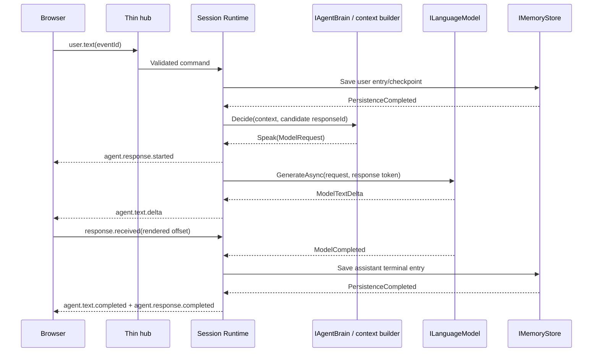
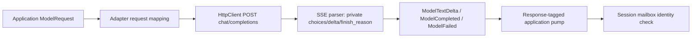

# Backend Implementation Specification

Recovered conversation dispatch now admits into the same SessionHost runtime registry used by foreground attachment. Creation checks disposal, termination, ownership and runtime capacity under the existing admission gates. Dispatch itself goes through the SessionRuntime mailbox and acknowledges ownership before model completion. Attaching shares that running response; detached finalization holds the same admission gate while marking transport detached, so it cannot detach a newly attached owner. This is a runtime ownership prerequisite for the accepted AgentRun cutover; production still uses the previous execution record until that cutover is complete.

## Capability authorization, projection and discovery

New-mode environment stores `capabilities: {mode,resolvedCapabilities,authorizationFingerprint}` and `projection: {alwaysCapabilities}`. The legacy `toolAllowlist` cannot simultaneously carry grants. Domain validates exact syntax/duplicates and projection subset; Application validates registration and context-only projection restrictions with structured findings. All draft/publication resolution is trusted, deterministic and snapshot-based. New-mode configuration absence is eligibility, not invalid authority. Persisted candidate documents are bounded to 1 MiB; this document-size guard does not impose a capability count limit.

`ToolCatalog.For` delegates projection to `ToolProjectionService` using the existing ToolPolicy-checked eligibility catalog. Legacy definitions keep their broad historical offers; capability-aware definitions project bootstrap + always + trusted context + active Skill required + execution-loaded tools, deduped by exact name. Browser start guidance and response-specific narrowing still apply. Unlike the legacy immutable initial request tool upper bound, new-mode continuations rebuild from pinned authority and current trusted context after a load or Skill activation.

`capabilities.load` ranks exact registered names even when embedded in a longer query (case-insensitive, ignoring surrounding sentence periods), then category/tag/name/summary matches with deterministic ordinal ties. It searches only authorized, discoverable, currently eligible names.

`capabilities.load` returns compact metadata and updates fenced execution state before real schemas appear on the next generation. It never executes a matched capability, changes authority, bypasses approval or reveals unauthorized/unconfigured tools. Loaded interfaces reset each turn/WorkItem and survive retry/reclaim of that same execution. User-turn state uses the existing conversation execution store; durable work uses explicit loaded IDs/count in the checkpoint payload. Ordinary execution still rechecks registry, authority, configuration, scope, owner, lifecycle, occurrence/trust, approval and replay policy even for an unprojected or previously loaded name.

Initialize empty response/epoch-owned load state for each accepted live occurrence. Recheck the current connection before admitting its load, preserve IDs/count through continuation, and never read a completed user turn's load state for another response. Accepted live receipts remain non-replayable; see [Persistence and Configuration](15-persistence-and-configuration.md).


## Agent Workspace v2 tools and policy

Every Session belongs to a real active Agent Instance at creation. Each Agent Instance owns durable `/home`; each Session owns temporary `/working`. New Sessions and reconstructed runtimes start with cwd `/home`. Definition identity is configuration, never an alternative Session owner. Unsupported historical built-ins remain in Git history, outside the runtime catalog. `environment.workspace` may name a template only. General Assistant v16 has 31 tools, including `workspace.cwd`. The canonical registry supplies identical workspace descriptions for discovery, projection and execution.

`workspace.cwd({operation:"get"})` returns `{cwd:"/home"}` initially. Set accepts `{operation:"set",path:"/home/projects/a"}` or an existing `/working` directory. A target must exist, be a directory and remain authorized. Relative read/list/search/write/patch/structure/artifact paths resolve from the current cwd. Omitted list/search path means cwd. `/workspace/working` is rejected in new mode rather than becoming a public alias. Paths cannot escape a root, select another Session/owner or expose host/blob paths. Move/delete/batch affecting cwd or an ancestor fails Conflict.

Ordinary write creates home files, accepting optional expectedRevision/expectedSha256 for replacement. Patch requires current expectedSha256 and exact-once UTF-8 edits. Read/list/search retain bounded content/tree behavior. Same-scope home mkdir/copy/move/delete/batch requires expectedTreeSha256 from a current whole-home listing. Individual `workspace.copy` between `/home` and `/working` supports exact binary bytes, complete trees, empty directories and parents, with destination quota/conflict checks. Existing home file replacement requires CAS; directory destinations never merge. Cross-scope move is Forbidden; copy then separately delete if intended. Batch stays structural, at most 16 operations/16 KiB and single-scope, with full ordered preflight and honest partial execution.

Publish user downloads with `artifacts.create_from_workspace` from either root. Normal model guidance describes durable work directly in home and explicit scratch processing/copy for sandbox. Tool policy and execution both check the pinned policy and actual managed eligibility; background work does not receive Session cwd.

Canonical legacy allowlist validation distinguishes `duplicate_tool` and `invalid_tool_name`; candidate validation retains unregistered_tool and unconfigured_tool. Findings name `environment.toolAllowlist`; authoring Problem Details retains `code:ValidationError` and adds `field`/`validationCode` plus useful detail. The former 32 limit has been removed by the capability enhancement above.


[Interfaces](04-backend-interfaces.md) owns ports, [Architecture](03-system-architecture.md) owns concurrency, and [Controller](05-interaction-controller.md) owns turn-taking. This document owns Agent Definition, text-first context construction and the initial HTTP model adapter. The canonical MVP composes STT → Interaction Controller → text Agent Runtime / LLM → Speech Segmenter → TTS; it requires no multimodal audio-reasoning model.

## Agent Definition

JSON only, UTF-8, files loaded through IAgentDefinitionStore from a configured agents directory. A file contains one definition; shipped names include `agents/examiner.json`, `agents/customer-support.json`, `agents/compliance.json`, versioned `general-assistant` files, and `agents/secretary-v1.json`. Approved knowledge bodies live beside them under `agents/knowledge/{identity}.md` and are not copied into session workspaces. Store published older versions in version subdirectories if needed; recursively index by (id, version), fail startup on duplicate keys. Versions are immutable positive integers. schemaVersion=1 identifies the format; version identifies that agent's revision. Optional `skills` stay on schemaVersion 1 and are omitted when null, so existing files and snapshots remain valid with an empty Skill set. Reject unknown schema versions and unknown fields to catch spelling mistakes. A session pins and persists the validated definition so editing files cannot alter an existing identity. `FileAgentDefinitionStore` validates field rules and that `ProviderPreferences` aliases resolve (`primary-llm`, and when Voice.Enabled `primary-stt` / `primary-tts` in Synthetic). Missing versions return null from `GetAsync`.

Concrete Domain records (camelCase JSON via System.Text.Json):

```csharp
public sealed record AgentDefinition(int SchemaVersion, string Id, int Version,
    AgentIdentity Identity, IReadOnlyList<string> Goals, string SystemInstructions,
    BehaviorPolicy BehaviorPolicy, ConversationPolicy ConversationPolicy,
    InitiativePolicy InitiativePolicy, VoiceConfiguration Voice,
    ProviderPreferences ProviderPreferences, IReadOnlyDictionary<string, string> Metadata);
public sealed record AgentIdentity(string Name, string Role, string Description,
    string Tone);
public sealed record BehaviorPolicy(string InterruptionStyle, bool AcknowledgeInterruption,
    bool AvoidUnsupportedClaims);
public sealed record ConversationPolicy(string ResponseLength, bool AskOneQuestionAtATime,
    string Language, int MaxOutputTokens);
public sealed record InitiativePolicy(bool Enabled, int SilenceThresholdMs,
    int CooldownMs, int MaxPerSilencePeriod, IReadOnlyList<string> Triggers,
    int? MaxConsecutiveProactiveTurns = null, int? MaxSilentEvaluations = null,
    int? MaxInactivityMs = null);
public sealed record VoiceConfiguration(bool Enabled, string VoiceId, double SpeakingRate);
public sealed record ProviderPreferences(string LanguageModel, string? SpeechRecognizer,
    string? SpeechSynthesizer, string InterruptionClassifier = "heuristic");
public sealed record RoleEnvironment(
    IReadOnlyList<string>? Harness = null,
    IReadOnlyList<KnowledgeSourceRef>? KnowledgeSources = null,
    IReadOnlyList<string>? ToolAllowlist = null,
    WorkspaceTemplatePolicy? Workspace = null,
    AttachmentStorePolicy? Attachments = null);
```

Optional `environment` (default empty harness/knowledge/tools, empty workspace template, `allowUnreadUnsupportedTypes=false`) is omitted from historical MVP examples below; shipped fixtures include it. `process`/`shell` remain denied even if listed. Physical template application copies `agents/templates/{templateId}` into `/working` only (no harness/knowledge corpora). Shipped initiative pins: examiner `maxConsecutiveProactiveTurns=1`, customer-support `2` (`maxPerSilencePeriod=2`, 60s silence / 120s cooldown in JSON; text runtime floors still apply), compliance `0`.

All fields above required except speech provider aliases, the three optional initiative bounds, and `environment`. id: lowercase `[a-z0-9-]`, 1..64; version positive; identity strings 1..256 except description up to 1,024; goals 1..10 nonempty strings <=500; systemInstructions <=8,000. InterruptionStyle=`acknowledgeThenContinue|answerNewTurn`; ResponseLength=`concise|balanced`; `conversationPolicy.language` is `auto` (match the user's conversational language unless they request otherwise) or a fixed BCP-47-like tag for specialized agents; maxOutputTokens 1..4,096; silenceThresholdMs 1,000..120,000; cooldownMs 5,000..600,000; maxPerSilencePeriod 1..8 (shipped examiner/compliance 1, customer-support 2). When omitted, `MaxConsecutiveProactiveTurns` defaults to 1, `MaxSilentEvaluations` to 8, `MaxInactivityMs` to 900000. Triggers are unique values `longSilence|environmentUpdate|unfinishedInteraction`. speakingRate=0.5..2.0. `LanguageModel` is always required and must resolve. When `Voice.Enabled`, `SpeechRecognizer` and `SpeechSynthesizer` are required and must resolve to configured adapters. When `Voice.Enabled` is false, those aliases must be null/omitted; a text-only process must start without STT/TTS. `InterruptionClassifier` defaults to `heuristic` if omitted. Metadata <=16 string pairs, values <=256, never secrets. Every other nullable or optional policy alternative has been removed from this initial schema; startup validation surfaces missing required values.

Examiner:

```json
{
  "schemaVersion": 1,
  "id": "examiner",
  "version": 1,
  "identity": {"name": "Alex", "role": "Speaking examiner", "description": "Practice a speaking examination.", "tone": "Calm, formal and patient"},
  "goals": ["Conduct a realistic practice speaking examination", "Keep the candidate talking", "Offer feedback only when requested"],
  "systemInstructions": "You are Alex, a practice examiner. Ask one question at a time and wait for the answer. Do not claim to issue an official score or certification. If interrupted, attend to the candidate's new request.",
  "behaviorPolicy": {"interruptionStyle": "acknowledgeThenContinue", "acknowledgeInterruption": true, "avoidUnsupportedClaims": true},
  "conversationPolicy": {"responseLength": "concise", "askOneQuestionAtATime": true, "language": "en", "maxOutputTokens": 256},
  "initiativePolicy": {"enabled": true, "silenceThresholdMs": 8000, "cooldownMs": 30000, "maxPerSilencePeriod": 1, "maxConsecutiveProactiveTurns": 1, "triggers": ["longSilence", "unfinishedInteraction"]},
  "voice": {"enabled": true, "voiceId": "default", "speakingRate": 1.0},
  "providerPreferences": {"languageModel": "primary-llm", "speechRecognizer": "primary-stt", "speechSynthesizer": "primary-tts", "interruptionClassifier": "heuristic"},
  "metadata": {"scenario": "practice-exam", "owner": "demo"}
}
```

Customer Support Representative:

```json
{
  "schemaVersion": 1,
  "id": "customer-support",
  "version": 1,
  "identity": {"name": "Sam", "role": "Customer support representative", "description": "Resolve a simulated support issue.", "tone": "Warm, practical and clear"},
  "goals": ["Understand the customer's issue", "Explain available simulated order updates", "Summarize useful next steps"],
  "systemInstructions": "You are Sam in a support demonstration. Ask for missing context. Treat order updates as supplied simulation data. Never claim that you actually issued a refund, changed an order or accessed a live customer account.",
  "behaviorPolicy": {"interruptionStyle": "answerNewTurn", "acknowledgeInterruption": true, "avoidUnsupportedClaims": true},
  "conversationPolicy": {"responseLength": "balanced", "askOneQuestionAtATime": true, "language": "en", "maxOutputTokens": 2048},
  "initiativePolicy": {"enabled": true, "silenceThresholdMs": 60000, "cooldownMs": 120000, "maxPerSilencePeriod": 2, "maxConsecutiveProactiveTurns": 2, "triggers": ["longSilence", "environmentUpdate", "unfinishedInteraction"]},
  "voice": {"enabled": true, "voiceId": "default", "speakingRate": 1.0},
  "providerPreferences": {"languageModel": "primary-llm", "speechRecognizer": "primary-stt", "speechSynthesizer": "primary-tts", "interruptionClassifier": "heuristic"},
  "metadata": {"scenario": "support", "owner": "demo"}
}
```

The same provider aliases resolve to synthetic or real implementations by profile. VoiceId is an application alias mapped by TTS configuration, not a vendor object. Static definition is distinct from mutable Agent Runtime State: active response, history, current utterance, heard estimate, summary and initiative counters belong to the session.

## Agent Runtime and prompt/context builder

Implement a concrete PromptContextBuilder invoked by the default IAgentBrain. Keep named, independently testable sections in Application, not scattered concatenation inside endpoints or adapters. Order:

1. System message: product interaction guardrails, identity, goals, systemInstructions, behavior and conversation policies.
2. System message: application-owned current mode/state and interrupted-response note. For assistant history, use the entry's deliveryMode: `received` prefix for text-delivered responses, `heard` prefix for voice-delivered responses. Include only that validated prefix; say that the rest of that response was not delivered. Unseen/unheard tails never enter this or later turns, including after a mode switch.
3. System message: labeled session summary and minimal user preferences, treated as remembered data rather than instructions. Active Skill procedures come from the frozen effective catalog in a separate system section. Enabled Always procedures initialize every execution; tool-capable prompts include compact enabled catalog metadata for OnDemand discovery. No keyword routing or live procedure reread occurs during retries. Required capabilities do not grant tools, credentials, or approval. Store reviews distinguish requested subsets from whole-grid results. A filter action is not evidence that the filter succeeded; aggregates must be supported by the observed result set, otherwise the review reports uncertainty. `skills.load` and `app.message.send` are mailbox effects on that user-turn pump. An application message is not a prompt turn.
4. System message: approved harness/knowledge identities and tool allowlist. Permission is runtime-enforced and is not granted by model text.
5. Chronological user/assistant messages from retained history; omit unseen assistant tails and non-turn backchannels. Avoid duplicating the current user entry.
6. User message containing the current environment event, when applicable, clearly delimited as observed data. For proactive triggers, generation runs only after a separate compact initiative evaluation (`initiative-decision-v2`) returns `speak` with `intent` and `objective` plan fields. That evaluation prompt includes a compact agent context (identity, goals, clipped system instructions, conversation and initiative policy) plus session state (trigger, recent turns, silence duration, proactive counters). When the summary boundary is valid, recent turns start after it and the persisted summary is included as labeled remembered data. An invalid boundary keeps raw recent turns. The full turn prompt is built only after `speak`, applying trusted `intent` (server allowlist / `InitiativeIntent`) as fixed framework instructions and passing `objective` only as untrusted planner context (`initiative_planner_observation` JSON) subordinate to identity/system prompts. `InitiativePlan` enforces intent and note bounds at the Ports boundary. Planner JSON is appended as a final User-role model message (internal context, not a human turn).

History includes the just-committed user turn exactly once. Do not send partial transcripts as completed turns. Do not grant environment/profile/summary text system instruction authority: wrap as quoted data with a fixed application instruction explaining its status. Adapters receive fully formed ModelRequest and only translate it. No adapter constructs identity prompts.

Context budget baseline: retain newest 20 entries, maximum 24,000 UTF-16 characters of history, summary <=2,000 characters and profile <=2,000 characters. Drop oldest complete entries first and retain the current user turn; reject an over-budget current turn rather than silently changing meaning. Fixed system/definition budget is <=12,000 characters; validate it when loading definitions. These conservative character limits are not universal model token counts: the configured model must support at least a 16k-token context, and provider contract tests must validate the chosen model/limits. A provider with a smaller limit requires lower configured context budgets, not truncation inside the adapter.

A persisted session summary is remembered data, not a system instruction. It excludes ordinary raw history only when `SummarizedThroughEntrySequence` is a valid boundary: summary text is non-empty, the sequence is positive and no greater than the durable last entry sequence, and it does not reach into the current trailing user batch. Raw entries at or below that sequence are omitted before the newest-20 / 24,000-character history budget. The current trailing user batch still appears exactly once. An invalid or overlapping boundary fails open to raw history, records the content-free `summary_boundary_rejected` diagnostic, and does not rewrite persistence during prompt construction. Initiative and completion evaluation requests use that same boundary: recent turns stay strictly after it, and the persisted summary is included in those payloads as labeled remembered data. An invalid boundary leaves those requests on raw history. Assistant history uses the received prefix for text and the heard prefix for voice. The runtime does not refresh a rolling excerpt summary when a user turn is admitted. `ConversationCompactor` proposes a format-1 summary from the previous summary plus a bounded durable prefix strictly after the committed boundary. It reads at most 41 history rows, keeps at least 20 raw entries, sends no tools or response envelope, and returns a candidate without writing the store. Empty, oversized, malformed, unsafe, or failed model output leaves the prior summary unchanged. Legacy summaries stay format 0 until a candidate replaces them. After a durable completed assistant turn, the session runtime may run that service outside the mailbox when at least 40 eligible rows remain, no approval is pending, and no response or queued user batch is active. The candidate returns through the mailbox. The mailbox commits it only when the operation generation, base summary, and source boundary still match, then persists the summary without rewriting raw rows. Detach and reattach reuse one in-flight operation. Finalization cancels it, and a late result cannot replace a newer summary. A history read that throws, or a result the mailbox cannot accept, releases that operation without changing the summary so a later completed turn can compact. A reopened snapshot loads the newest restore window, so an early raw row can be absent from that window while the committed summary still carries its content. Content-free diagnostics are `compaction_rejected`, `compaction_cancelled`, and `compaction_stale`. No embeddings or vector database. When `MemoryPolicy.SessionMemory` is set, active session memories are added as a separate learned-data system block labeled remembered data, not instructions. When `MemoryPolicy.IdentityUserRetrieval` is set and the session has an agent instance plus a trusted profile, active IdentityUser memories for that instance and profile join the same block. The block states that identity and trusted profile values outrank learned memory on a conflict, and each subject and content stay on one line. Voice unheard suffixes come from speech text, the same string assistant history uses. The block stays apart from the trusted profile and persona lines. It omits another session, instance, or profile. It stays empty when neither gate is enabled, and a missing instance id does not retrieve IdentityUser items. When `MemoryPolicy.UserRetrieval` is set, active User memories for that trusted profile join the same block. A definition that leaves `UserRetrieval` off does not receive them. `UserPromotion` is a separate gate and does not by itself inject the items.

IAgentBrain checks initiative eligibility and contextual usefulness. UserTurn returns Speak without initiative evaluation. For LongSilence, EnvironmentUpdate, and UnfinishedInteraction, `DefaultAgentBrain` first applies hard gates (caps, completed assistant turn for idle, allowlisted environment, pending topic). Ineligible gates return `StaySilent` with `CountsTowardSilentCap=false` so proactive caps do not advance silent-evaluation pause. When eligible and `ILanguageModel` is configured, a compact JSON initiative evaluation (`speak|staySilent|deactivate`) decides whether generation is worthwhile; only `speak` builds the normal ModelRequest. Optional `nextWaitMs` applies to `staySilent` and proactive `speak` only: the runtime clamps it (text sessions use higher minimum silence/cooldown floors than voice) and treats null/unusable values as the existing deterministic StaySilent backoff or the normal post-Speak silence threshold. `deactivate`/`RequestDeactivate` pauses without arming a next wait. Reaching proactive caps denies further LongSilence evaluation without pausing the session; silent-evaluation and inactivity bounds still pause via `ApplyDeactivate` with durable `pauseReason`. UserTurn normally returns Speak. The controller rechecks eligibility after asynchronous decisions return and enforces hard runtime caps even when the brain returns Speak.

## Text sequence


```mermaid
sequenceDiagram
    participant C as Browser
    participant H as Thin hub
    participant S as Session Runtime
    participant B as IAgentBrain / context builder
    participant L as ILanguageModel
    participant M as IMemoryStore
    C->>H: user.text(eventId)
    H->>S: Validated command
    S->>M: Save user entry/checkpoint
    M-->>S: PersistenceCompleted
    S->>B: Decide(context, candidate responseId)
    B-->>S: Speak(ModelRequest)
    S-->>C: agent.response.started
    S->>L: GenerateAsync(request, response token)
    L-->>S: ModelTextDelta
    S-->>C: agent.text.delta
    C->>S: response.received(rendered offset)
    L-->>S: ModelCompleted
    S->>M: Save assistant terminal entry
    M-->>S: PersistenceCompleted
    S-->>C: agent.text.completed + agent.response.completed
```

MVP waits for user entry persistence before generating a reply, while mailbox processing continues. In-memory store satisfies this boundary in early milestones. agent.text.completed is queued at model terminal behind preceding text; agent.response.completed follows successful terminal persistence (and voice playback if applicable). No provider request executes inside a DbContext transaction.

## OpenAI-compatible HTTP adapter

Decision: Infrastructure/OpenAICompatibleLanguageModel implements ILanguageModel using IHttpClientFactory, System.Text.Json and direct HTTP, no vendor SDK. The preferred hosted configuration targets OpenRouter, while direct OpenAI or local compatible inference use the same adapter. Named configuration supplies BaseUrl, ApiKey, DefaultModel, optional ReasoningEffort (OpenAI-compatible `reasoning_effort` on chat completions), AdditionalHeaders, Timeouts and capabilities. For the initial hosted **adapter smoke** configuration only, DefaultModel may be `openrouter/free`. The Real/demo **default** must be a **fixed** operator-selected OpenRouter model ID; do not use the random free-model router as `DefaultKey`. The shipped Real catalog still offers `openrouter/free`, `openai/gpt-4o-mini-2024-07-18`, `openai/gpt-4.1`, and `openai/gpt-5.6-luna` as explicit session choices. Bind ApiKey from `OPENROUTER_API_KEY` or equivalent backend configuration; never from the browser. BaseUrl is the API root ending in `/v1/`; append `chat/completions` without resetting an existing path prefix. Reject non-http(s) URLs and embedded userinfo; allow local HTTP only for explicitly configured demo/self-hosted endpoints. Values come from trusted backend operator configuration, never browser requests.

Map normalized System/User/Assistant messages to endpoint roles, MaxOutputTokens to `max_tokens`, optional Temperature to `temperature`, and the adapter configuration's DefaultModel to `model`. A tool-offered conversational turn sends `max_tokens` 8192. `finish_reason=length` with a partial tool-call draft fails as `toolCallTruncated` and does not emit a tool call. `LengthLimit` before a parseable semantic envelope fails as `outputLimit` rather than `missingDisplayText`. Session-scoped reasoning effort on `ModelRequest` overrides configured `LanguageModelProviderOptions.ReasoningEffort` for that request; do not mutate the singleton options object. When `ReasoningObjectWire` is enabled (OpenRouter Real profile), map effort to a `reasoning` object with `exclude: true` so compute remains available without user-visible chain-of-thought. Stream `delta.reasoning` / `reasoning_details` into `ModelReasoningDelta` only; never concatenate them into `ModelTextDelta` or assistant display. Require `stream=true`. Send Authorization Bearer only when ApiKey is nonempty; forbid AdditionalHeaders overriding Authorization, Host or content framing headers. No tool fields or structured response schema in MVP.

Use ResponseHeadersRead. Parse UTF-8 SSE incrementally across arbitrary network/line/JSON boundaries, tolerate CRLF and comments, combine multiline data fields, bound each SSE event to 1 MiB, process `[DONE]`. Normalize only text from the first supported choice; multiple choices are an InvalidRequest/UnsupportedCapability, never multiple application responses. Ignore known role-only/usage-only chunks; preserve whitespace text exactly. Map finish_reason stop→Completed, length→LengthLimit, content_filter→ContentFiltered; tool/function calls→UnsupportedCapability. Delay ModelCompleted until stream terminator so trailing usage can be included. EOF after a valid finish marker is accepted; EOF without finish marker or `[DONE]` is Unavailable. `[DONE]` without finish marker means Completed if at least a valid choice was observed; otherwise malformed stream. Malformed JSON is normalized failure, not silently skipped.


```mermaid
flowchart LR
    Request[Application ModelRequest] --> Translate[Adapter request mapping]
    Translate --> HTTP[HttpClient POST chat/completions]
    HTTP --> SSE[SSE parser: private choices/delta/finish_reason]
    SSE --> Normalized[ModelTextDelta / ModelCompleted / ModelFailed]
    Normalized --> Pump[Response-tagged application pump]
    Pump --> Mailbox[Session mailbox identity check]
```

## Timeouts and retry policy

Infrastructure disables automatic HTTP retries/hedging for generation POSTs. Session Runtime permits one transient retry per generation before visible output, with no admitted tool calls and while its cancellation/overall budget remains live. Eligible reasons are `transportFailure`, `http5xx`, `setupTimeout`, initial `streamIdle`, `streamMalformed`, `streamIncomplete`, `providerStreamError`, and `incompleteToolCall`. `setupTimeout` and initial `streamIdle` use Timeout; other eligible reasons use Unavailable. Prior completed tool rounds are retained and never replayed by a generation retry. Total or unclassified timeouts, rate limits, authentication, invalid requests, cancellation, open circuits and unsupported capabilities remain terminal. A setup/idle timeout cannot prove that upstream billable work was not accepted; the bounded retry trades that possibility for recovery from transient stalls. Never stitch a retry onto visible partial text.

Separate default budgets: headers/connect 10 seconds, stream idle 60 seconds reset on any transport read (including SSE comment/heartbeat lines), total response 120 seconds per provider call. The native Real `http-openrouter` profile and Real Compose overlay override setup to 30 seconds, retaining idle 60 and total 120. HttpClient.Timeout is infinite so explicit linked deadlines own cancellation. FailureReason distinguishes `setupTimeout` (no response headers received), `streamIdle`, and `totalTimeout`; the total deadline wins when it expires during setup. Caller cancellation remains Cancelled. Setup failure messages include the configured seconds without provider bodies or host paths. Existing logs, realtime errors, persisted failure references and UI diagnostic copy carry the bounded reason. Circuit breaker defaults: 50% transport/5xx failures, minimum 5 requests over 30 seconds, break 15 seconds. It rejects quickly as Unavailable; it does not replay requests. API keys and provider bodies are excluded from logs.

Map 401/403 Authentication, 429 RateLimited (safe RetryAfter), 400/422 InvalidRequest, 5xx/network disconnect Unavailable, local deadline Timeout, caller token Cancelled, requested unsupported feature UnsupportedCapability, others Unknown. Malformed or unusable assistant output after the request was accepted is `InvalidResponse`, not `InvalidRequest`. An Infrastructure `SemanticResponseLanguageModel` decorator around resolved language models normalizes the assistant response into `ModelSemanticResponseReady` and never logs raw JSON, function arguments, or marker payloads. When display and action are otherwise valid, omitted speech normalizes to `same` and malformed speech normalizes to `none` so the Chat answer is still delivered; `llm.speech.normalized` records `speechOmitted` or `speechMalformed` without the envelope. The strict schema and `agent_core_respond` require `disposition` and `action` (`chat.respond` or null) for general activations. Direct `UserTurn` requests carry `ModelResponseContract.RequireChatResponse`, tightening structured output and `agent_core_respond` to `Continue` or `Complete` with required `chat.respond` and non-empty `displayText`; runtime admission (`InvalidAgentStep`) remains the fail-closed guard if a provider ignores that schema. Text turns (`SpeechWillBeUsed` false) canonicalize a missing or unusable speech object to `same` with null text and keep a well-formed `none` or `custom` projection. Voice turns ignore text on `same` and `none`. Omitted speech normalizes to `same`, and an unknown mode or empty `custom` text normalizes to `none` without failing the answer. The parser does not log response arguments. Application `AgentStepNormalizer` maps that provider-neutral envelope to one Agent Step. Omitted disposition and action, including the plain-text compatibility channel, become `Complete` and one `chat.respond`. An explicit null action stays empty. Memory proposals stay beside the action. `AgentStepController` decides the effect without mutating Session, AgentRun, approval, trigger, or memory. `Complete` or `Continue` with one Chat action delivers that action once. `Continue` does not start another generation. `Wait`, and `Complete` or `Continue` with no Chat action, return control without a Chat effect, memory admission, or successful assistant completion. Session Runtime removes the streaming assistant placeholder for those paths instead of marking it `Interrupted`, and live `ResponseCompletedOutput` does not set `interruptReason`. User-turn execution still commits as cancelled after persistence reconciles the removed row. Direct user-turn no-chat steps (`Wait`, `Complete`, or `Continue` without `chat.respond`) fail as `InvalidAgentStep` rather than returned control. Terminal assistant `Failed` rows always persist a `FailureReference` and publish a matching live `error` event with the same diagnostic id. `app.message.send` is not offered on the initial model generation of a direct user turn; it becomes available only after substantive non-message work (for example workspace, web, email, sandbox, or HTTP tools) in the same execution completes and only on a later generation within that turn. Tool calls from one generation share a pinned intermediate-messaging admission snapshot; unlocking does not apply mid-batch. `PumpModelAsync` treats the brain `Speak` request tool list as an upper bound and may narrow it or append only `app.message.send` after admission; it does not widen other brain-selected tools. `skills.load` alone does not unlock it. `ApplicationMessagePolicy` (defaults: twelve admitted messages per execution, 2000 characters per message, 8000 aggregate admitted characters) is enforced authoritatively in Session Runtime admission; recovered durable `ApplicationMessage` rows for the same `responseId` reduce the remaining budget. When `app.message.send` is offered, its tool description states the remaining message and aggregate character budget and the offered JSON schema `text.maxLength` is `min(2000, remainingCharacters)` for that generation; successful or duplicate tool results return `remainingMessages` and `remainingCharacters`. An exhausted budget omits the tool on the next generation and returns `over_budget` for hallucinated calls without failing the user turn. `Blocked` uses the existing diagnostic failure path. A following model completion for that response is ignored. Invalid disposition, action, payload, or a model-supplied session, destination, profile, tenant, or recipient is `InvalidResponse` with a low-cardinality failure reason and no effect. The native parser rejects those destination fields and an unknown `action` or `disposition` instead of stripping them. Hidden reasoning is not part of the step. Chat delivery maps the admitted `ChatRespondAction` through `SemanticResponseMapper`. `ChatActionAdmission` allows ordinary same-session Chat without a new approval and denies detached Session Chat. A later semantic result refreshes the same assistant entry. A terminal response ignores a duplicate observation. Native `response_format` / `json_schema` is used only when `ModelRequest.ResponseContract` is present and trusted `ModelCapabilities.StructuredOutput` is true. When structured output is absent and `ModelCapabilities.Tools` is true, the same decorator adds the adapter-only function `agent_core_respond` and reads that call as the structured response. That function is not a session tool and does not write memory. `[[memory:...]]` remains a best-effort parser for models with neither channel. `OpenAICompatibleLanguageModel` does not log native structured response bodies. A midstream failure yields ModelFailed, cancels downstream TTS and leaves the partial response failed. A future user retry creates a new response ID. [Tests](16-testing-strategy.md) specifies chunk-boundary and partial-failure tests.

`AssistantResponseSchema` separates response-function and marker-compatibility instructions. Function-capable models without native structured output receive terminal `agent_core_respond` guidance with typed blocks and structured speech/memory, forbidding compatibility controls in display text. Marker-only models retain their marker grammar and artifact provenance guidance. `SemanticResponseLanguageModel` resolves these provider protocols before the UI; the parsers and UI rendering stay unchanged.

Speech adapters independently advertise **effective** capabilities and formats. Observed selectable hosted speech is `OpenAiSpeechSynthesizer` and `OpenAICompatibleBatchSpeechRecognizer`, selected independently of the OpenRouter text configuration. `OpenAiSpeechRecognizer` remains a registered realtime transcription adapter class but is not a selectable runtime path while its live session is a no-op. It is speech-to-text only; it is not native speech-to-speech reasoning and must not be treated as an INativeRealtimeProvider. Bind hosted speech secrets from `OPENAI_API_KEY` or equivalent backend configuration when the operator supplies it. Implement the adapters on the existing milestone schedule; default tests and Synthetic DI must not resolve or call hosted speech adapters, and missing OpenAI credentials must not fail normal build/test. Selecting Synthesis Adapter=`OpenAI` with a backend API key registers `OpenAiSpeechSynthesizer` without an outbound call until `SynthesizeAsync`. Selecting Recognition Adapter=`OpenAICompatibleBatch` with a backend API key registers `OpenAICompatibleBatchSpeechRecognizer` without an outbound call until utterance-end transcription. The primary real demo uses OpenAI TTS plus the supported hosted STT path (`OpenAICompatibleBatch` until realtime transcription is selectable) with configurable model (recommended realtime default `gpt-live-transcribe`). Batch STT is a separate degraded adapter (`OpenAICompatibleBatch`) with `speechAndFinal` / `speechActivity` barge-in and **no partials**. Recognition Adapter=`OpenAI` must not resolve the no-op `OpenAiSpeechRecognizer`. Provider replacement is governed by the [port rule](04-backend-interfaces.md#speech-provider-replacement-rule) and [configuration/DI mapping](15-persistence-and-configuration.md#provider-selection-and-di), with no vendor branches in runtime/controller code.


## OpenAI realtime transcription adapter

The shipped `OpenAiSpeechRecognizer` live session is a no-op `DeferredSession`; `SpeechFactory` does not select Recognition Adapter=`OpenAI`. The remainder of this section is the **deferred/unshipped** streaming contract, not current runtime behavior. Selectable hosted STT today is `OpenAICompatibleBatch`.

When implemented, `OpenAiSpeechRecognizer` opens an OpenAI Realtime **transcription** session (`session.type = transcription`). Recommended configuration:

```text
OpenAiSpeechRecognizer
    → OpenAI realtime transcription session
    → configurable realtime transcription model
    default recommendation: gpt-live-transcribe
```

Model IDs stay in Infrastructure options (`DefaultModel`); Application never embeds them. The adapter opens a **backend** WebSocket to the current OpenAI Realtime transcription endpoint using the configured API key; the browser never receives that key. Optional vendor fields such as `audio.input.transcription.delay` are **adapter-local**: send them only when the selected API/model version documents support for that field; contract-test both omit and include paths. Do not treat `delay=low` (or any delay value) as a required or default Agent Core setting. Canonical audio is PCM16 mono 24 kHz (`audio/pcm` rate 24000), matching the session format. Continuously forward admitted PCM (`input_audio_buffer.append`). Map `conversation.item.input_audio_transcription.delta` to `SpeechPartial` and `conversation.item.input_audio_transcription.completed` to `SpeechFinal` for the `utteranceId` bound to that provider `item_id`. Map transport/auth/rate-limit/session errors to `RecognitionFailed`/`ProviderFailure`. Cancel and dispose the provider session on voice stream end, mode exit to text, detach, disconnect or recognition cancel. Provider reconnect creates a **new** transcription session and application streamId; do not splice PCM or reuse item bindings.

Prefer `turn_detection: null` and commit with `input_audio_buffer.commit` from `ObserveBoundaryAsync(Ended)` so Agent Core owns turns. If a concrete API revision requires provider turn detection, treat its speech-started/stopped events as evidence only: they may refine activity timing but must not authorize `Speak`, allocate a response, or split/merge browser `utteranceId`s. Browser VAD and the Interaction Controller remain authoritative.

Utterance mapping and races are specified on [ISpeechRecognizer](04-backend-interfaces.md#independent-speech-ports). Advertise effective `StreamingAudio=true`, `PartialTranscripts=true`, `SpeechBoundaryEvents` according to whether provider VAD events are consumed as evidence, and `Cancellation=true` for local session disposal. Do not claim timing/confidence fields `gpt-live-transcribe` does not return.

## Compatible batch STT (degraded)

`OpenAICompatibleBatch` is a **separate** adapter. Do not configure `OpenAiSpeechRecognizer` as batch and pretend it streams. It appends `audio/transcriptions` to its own BaseUrl and posts multipart form data: model=DefaultModel, language=RecognitionOptions.Language, response_format=json, and file=a WAV-wrapped canonical utterance. Require a JSON text string, normalize it to one SpeechFinal for the captured utteranceId, then release the buffered WAV. Effective capabilities: StreamingAudio=false, PartialTranscripts=false, SpeechBoundaryEvents=false. Barge-in policy is `speechAndFinal` (default) or configured `speechActivity`. The 20-second final-transcript application deadline cancels an outstanding batch request even when the general provider total timeout is longer. No automatic POST retries.

## Compatible speech HTTP mappings (TTS)

The speech HTTP implementation (OpenAiSpeechSynthesizer for the initial OpenAI configuration; OpenAICompatibleSpeech for another compatible endpoint) appends `audio/speech` to its own BaseUrl and posts JSON model=DefaultModel, input=segment text, voice=resolved alias, speed=SpeakingRate, response_format=pcm. Its initial supported provider response is raw PCM16 little endian mono 24 kHz; reframe into canonical frames while reading. Require configured support for that response format before enabling voice. If another endpoint returns only compressed media or a different rate, a separately tested adapter conversion is required; do not silently interpret compressed bytes as PCM. The initial HTTP speech adapter has StreamingAudio=true for streamed response bytes, TimingMarks=false, Cancellation=true for local stream cancellation; discovery must lower streaming capability if the endpoint buffers the whole response. Normalize HTTP failures using the LLM error taxonomy. Synthetic implementations implement the same ports without HTTP.

## Session ready projection

Application builds `SessionReadyProjection` / `ReadyOutput` ([Event Model](07-event-model.md)). It contains only data the API may map to `session.ready`: public agent descriptor, mode, pendingMode, status, streamId, audioFormat, **effective** capabilities, public history, pagination metadata (`hasOlderHistory`, `historyBeforeSequence`), and lastEntrySequence. The ready transcript window is the newest durable history page (`ReadHistoryPageAsync`, limit 50), overlaid with current runtime rows by entry identity so live streaming rows keep the published display prefix; it is not derived from the bounded `HistoryRestoreWindow` runtime snapshot used for prompt context. HTTP history and non-live rows use the ordinary received-clamped projection. During reattach, the one active Streaming assistant row may include the already-published display prefix through the runtime's last emitted `textStart + text.length`; this makes its text length contiguous with the next `agent.text.delta` without changing durable `receivedTextEndExclusive` or exposing a generated-but-never-published tail. It must not include session summary, Agent system instructions, provider configuration, credentials, unpublished generated assistant tails, mailbox/queue/timer/provider handles or other internal runtime state. Persistence `SessionSnapshot` stays on IMemoryStore and is never sent to Contracts. The rolling session summary remains server-only prompt/context data.

Environment trigger Text contains a serialized, validated data-only representation of the allowlisted payload, including orderReference/status or pending topic. AgentContext supplies Mode, PendingTopic and HelpOfferedDuringSilence explicitly; the brain never reads mutable Session Runtime fields. The runtime sets PendingTopic from an unfinished_interaction fixture via `IEnvironmentEventIngress` and clears it after a delivered intervention or an explicit fixture clear (empty topic); it does not infer a workflow or autonomous task from arbitrary user text.


## Portable protocol versus provider differences

OpenAICompatibleLanguageModel is the architectural HTTP protocol adapter; OpenRouter is the preferred hosted deployment configuration, not an Application dependency. Resolve per-identity aliases to adapter instances with their own DefaultModel. Keep stream variants, usage events, optional reasoning fields, parameter names and error payload quirks within Infrastructure parsing/configuration. For example, a recognized provider error inside an SSE data event must become ModelFailed even if the initial HTTP status was 200. Never concatenate hidden reasoning fields into spoken text or expose provider-specific deltas/model IDs through normalized events.

Only text messages and streamed text output are required for the composed voice path. Tool calling is observed on the OpenAI-compatible adapter: when `ModelRequest.Tools` is nonempty it maps canonical dotted tool names to provider-safe wire names (underscores), maps `tools`/`tool_calls` into `ModelToolCallEvent` and `ModelStopReason.ToolCalls`, and reverse-maps returned calls back to canonical names; unexpected tool output without offered tools still produces UnsupportedCapability. Image-bearing logical tool results flatten through `MapMessages` one tool-call round at a time: every textual `role=tool` message (JSON metadata only, no base64) is emitted together, then multipart `role=user` wire continuation(s) framed as untrusted tool data with existing `image_url` mapping; those wire-only user messages never enter Session history, triggers, or browser output. Non-2xx responses read a bounded error body and log status, model, phase, and a sanitized provider `code`/`type`/`message`; the public failure stays normalized, for example `Provider rejected follow-up request (400)`. Request telemetry (`llm.request`) records model, provider, call number, message count, tool-result count, image presence and byte size, structured-output flag, and HTTP status, without prompt or image content. `HasImageParts` includes tool `Parts`; non-vision adapters fail before HTTP. Session Runtime owns the bounded tool loop. Application `ToolResultAdmission` strips image `Parts` for non-vision models and surfaces `vision_required` JSON in tool text. Do not expand ModelRequest into every vendor option. If a chosen model needs a parameter variant, implement a bounded adapter-local configuration mapping and contract test it. The default mapping remains documented above; compatibility does not promise identical behavior across every model family.

OpenRouter uses the configured API root `/api/v1/`; joining `chat/completions` must preserve `/api/`. Keep the existing no-replay rule for partially observed streams, including gateway errors. The default hosted test model is the Free Models Router; model-specific quality tuning is a later operator configuration change, not controller/agent reasoning logic. Speech segmentation remains exclusively the application concern specified in [Voice](06-realtime-voice.md#speech-segmentation). [Tests](16-testing-strategy.md#default-versus-live-provider-verification) owns offline fixtures versus opt-in OpenRouter smoke skips.

## P5 triggers (observed)

`TriggerSchedulerHostedService` scans due registrations and then routes once. Agent tools are `automation.create`, `automation.list`, `automation.inspect`, `automation.update`, `automation.disable`, `automation.delete`, and `automation.run`. Owned inspection is read-only; future-behavior mutations require current-turn authority. Inspection includes the full trigger, optional model and immutable provenance. The host passes `IAutomationService` into `SessionToolExecutor`. The model cannot set owner, provenance, or authorization origin. Occurrence evidence is clipped user-role data. Meter `AgentCore.Runtime` records `trigger_scheduler_events`, `trigger_registration_events`, and `trigger_due_lag_ms` without intent or evidence text. See [Persistence](15-persistence-and-configuration.md#p5-trigger-store-observed).

## P6 durable work (observed)

`DurableOccurrenceExecution` bounds the complete serialized model/tool checkpoint to 64 KiB independently of the shared 8 MiB tool-output ceiling. Before dispatch it includes the next tool-message envelope in remaining checkpoint headroom and supplies adapters a conservative text budget accounting for JSON escaping. Result admission verifies the exact serialized document; oversized results become explicitly truncated, bounded prefixes. Every checkpoint is size-checked before construction. An oversized initial prompt, tool batch or exhausted result capacity returns terminal `checkpoint-capacity`, not an exception/retry loop. New checkpoints reserve space for the blocked-action hash needed by browser recovery. A legacy full checkpoint that cannot hold its recovery flag/hash fails closed without replaying the uncertain effect. Succeeded dispatch fences clear only after a tool-result checkpoint commits; capacity failure or restart cannot reexecute a completed write.

Ordinary batches/results additionally preserve one maximum valid `work.complete` and its serialized envelope, derived from the trigger's actual completion contract, plus browser recovery metadata and one bounded Core capacity notice. Valid terminal arguments use compact UTF-16 base64 storage so every permitted summary character has a fixed bound; the resumed arguments undergo normal completion/authority validation. Ordinary tool arguments and completed-effect identity remain unchanged. Before approval or external dispatch, insufficient result space returns `finish_required` and asks the model to finish from collected evidence. One bounded refusal can be checkpointed and followed by completion; further ordinary calls may fail `checkpoint-capacity`. The limit remains 64 KiB.

After routing, `BackgroundOccurrenceIntakeHostedService` atomically admits child Session graphs. `AgentRunHostedService` reconciles pending Experience/input intent and dispatches runnable claims through `AgentRunCoordinator`. Scheduling/routing remains separate from shared Session execution; waiting and terminal Runs hold no claim. Lifecycle counters carry bounded outcomes only.

Observed execution-model pin: `ExecutionModelPolicy` runs before live-versus-durable routing. Precedence is the registration's `ModelOverrideCatalogKey`, then the Agent Instance `UnattendedModelCatalogKey`, then `SessionModelBinder.PinDefault`. The pin (catalog key, provider alias, model id, reasoning effort, and source) is immutable on the occurrence after it is stored. Later default edits apply only to occurrences admitted afterward. Live occurrence turns resolve that pin with `ModelPurpose.Conversation`. A catalog mismatch retries as `model-unavailable` on a durable item until attempts are exhausted, still naming the original pin. See [Architecture](03-system-architecture.md) and [Persistence](15-persistence-and-configuration.md).

## P7B definition lifecycle (observed)

`AgentDefinitionLifecycleService` owns fork/create, exact-revision draft update/delete, validated publish, publication list, and metadata-only deprecate. Draft delete removes only unpublished draft state (including draft resource bindings and evaluation evidence), records `DraftDeleted` history atomically, and never removes immutable publications. `IAgentDefinitionAdminStore` persists drafts and publications (InMemory for tests, SQLite `AgentDefinitionDrafts` / `AgentDefinitionPublications` in production paths). `CompositeAgentDefinitionStore` implements `IAgentDefinitionStore` by overlaying durable publications on `FileAgentDefinitionStore` without changing Session Runtime call sites. Owner Admin lifecycle HTTP maps in `AgentCore.Api/AdminEndpoints.cs`: draft create/fork/list/read/update/delete/publish under `/api/v2/admin/definition-drafts` (including `DELETE .../{draftId}?expectedRevision=` and `POST .../{draftId}/publish`), and publication list/deprecate under `/api/v2/admin/definitions/{definitionId}/publications` (including `POST .../{version}/deprecate`). All routes share the owner-protected `/api/v2/admin` group. Provider DTOs and raw persistence records do not cross into Application or Domain. Candidate validation stays in Application with a pure Domain structural pass. See [Interfaces](04-backend-interfaces.md#p7b-definition-lifecycle-observed), [Persistence](15-persistence-and-configuration.md#p7b-definition-lifecycle-store-observed), and [P7B report](reports/p7b-definition-lifecycle.md).

## P7C harness resources (observed)

`AgentDefinitionResourceService` and `IAgentDefinitionResourceAdminStore` manage draft resource bindings with expected draft revision, immutable publication snapshots, and `IDefinitionResourceContentStore` blobs. `DefinitionPublicationResourceReader` feeds `FileSessionWorkspace` read-only `/agent/resources` paths; template-kind resources copy into `/workspace/working` on first `EnsureAsync` when `WorkspacePolicy.TemplateId` matches. Admin resource HTTP (list/upload/bind/remove/content, publication list) and `GET /api/v2/admin/tools` live in `AdminEndpoints.cs`. Admin UI draft tabs cover Instructions, Capabilities (`RoleEnvironment`), and Resources. See [Interfaces](04-backend-interfaces.md#p7c-definition-resources-observed), [Persistence](15-persistence-and-configuration.md#p7c-definition-resource-store-observed), and [P7C report](reports/p7c-harness-resources-workspace.md).

## P7D managed instances (observed)

`AgentInstanceService` implements managed create, persona update, lifecycle archive/unarchive, archived hard delete when the instance has no durable references, and version reassociation with optimistic `Revision` / `PersonaRevision` checks. `AdminEndpoints.cs` maps `POST /api/v2/admin/agent-instances` and `PATCH .../persona`, `PATCH .../lifecycle`, and `PATCH .../active-version` with strict JSON contracts (`AdminAgentInstancePersonaHttp`, lifecycle and version DTOs). v2 `SessionCreateHttp` routes mutually exclusive `agentInstanceId` (managed pin path) or legacy `agentId` (compatibility). `SessionRuntime` `BuildReady` and `PublicHistory.FromSnapshot` project pinned persona into `session.ready` and public history for reopened managed chats. Trigger admission paths reject archived managed owners at schedule create and due execution. See [Interfaces](04-backend-interfaces.md#p7d-managed-instances-observed), [Persistence](15-persistence-and-configuration.md#p7d-managed-instance-store-observed), [Protocol](14-api-and-realtime-protocol.md), and [P7D report](reports/p7d-managed-instance-identity.md).

## P7E memory and automation Admin (observed)

`AdminMemoryService` and `AdminAutomationService` expose owner-protected list/delete/reset and trigger registration cancel through existing P4/P5 stores with scope confirmation and revision checks. `TriggerInstancePolicyReconciliationService` suspends ineligible future registrations on managed version downgrade or archive without cancelling accepted P6 work. HTTP routes under `/api/v2/admin/agent-instances/{instanceId}/learned-memory` and `.../automations` map in `AdminEndpoints.cs`. See [Interfaces](04-backend-interfaces.md#p7e-memory-and-automation-admin-observed) and [P7E report](reports/p7e-memory-automation-admin.md).

## P7F validate, evaluate, diff, publish (observed)

`AgentDefinitionDraftValidationService`, evaluation scenario store/runner, `AgentDefinitionDraftDiffService`, and `AgentDefinitionDraftPublishService` implement the exact-revision publish gate with `configurationFingerprint`, `scenarioVersion`, and required Synthetic evidence checks. Admin HTTP covers validate, evaluation CRUD/run/results, diff, and publish on `/api/v2/admin/definition-drafts/{draftId}/...`. See [Interfaces](04-backend-interfaces.md#p7f-validation-evaluation-and-publish-gate-observed) and [P7F report](reports/p7f-validation-evals-publish-gate.md).

## P7G Admin history (observed)

`IAdminEventStore` append-only persists allowlisted lifecycle events with `OperationId` idempotency; mutators record events in the same transaction as durable Admin mutations at the store boundary. `GET /api/v2/admin/events` lists safe projections only. Docker Compose persists SQLite and `Persistence__DefinitionResourceRoot=/data/definition-resources` on the same volume so Admin publication resource bytes survive container recreate (`scripts/compose-sqlite-volume.sh`). See [Persistence](15-persistence-and-configuration.md#p7g-admin-events-observed), [Operations](17-observability-and-operations.md#docker-compose-integration-and-demo), and [P7G report](reports/p7g-history-rollback-final-gate.md).

## Post-MVP

Observed: owner-capability filter; catalog/lifecycle in the revision stream; `IAttachmentStore` HTTP streamed pending→bound uploads with opaque blobs outside SQLite and outside `local/`; bind after durable user entry; speech-staged pending files; TTL and durable-delete cleanup. Observed `IAttachmentProcessor` runs off the mailbox with 256 KiB / 10 s / 256 MiB / 32 MP fail-closed limits, AttachmentId+version cache, no remote fetch, and typed unsupported results. Stale off-mailbox `AttachmentsProcessed` completions for superseded turns do not launch brain work; idle accounting pairs the extraction `BeginWork()` with a single dispatch `EndWork()`; `processingAttachments` output clears on stale completion only when that response still owns attachment progress. Production OpenAI-compatible adapters report `Vision` honestly and map normalized image parts or return `UnsupportedCapability`. Observed rich envelope persistence: `ConversationEntries.EnvelopeJson` stores display/speech/blocks and delivery flags atomically with status and heard/received offsets. TTS waits for a validated semantic speech projection (`speech.mode`): `custom` uses authored `speech.text`; `same` uses completed display after `SpokenOutput.ForPlayback` deterministic cleanup; `none` synthesizes nothing. Compatibility `[[speech:]]` markers exist only inside Infrastructure unstructured parsing and never in Application prompting or SessionRuntime generation; the first `[[speech:…]]` marker in stream order wins (including `[[speech:none]]`) so early compatibility speech publication cannot be revised by a later marker. Completion fallback never invents runtime-authored spoken prose; dump-like display yields no speakable fallback. Public history projects the received display prefix for Streaming/Interrupted entries, full terminal display text for Completed/Failed entries, and display-delivered blocks. Attachment refs authorize ids bound on conversation entries plus `fixture-attachment-1`; artifact refs authorize stored ArtifactIds plus `fixture-artifact-1`. Observed `ISessionWorkspace`: lazy provision, logical execution view, 250 MiB `/workspace` writes, template copy without secret/corpus injection, durable-delete cleanup. Observed `IArtifactStore`: binaries under `data/artifacts`, 50 MiB each / 250 MiB per session, explicit attachment materialize with hash/provenance. Observed typed tools: Application `SessionToolExecutor` scoped capabilities (knowledge, AttachmentId reads, logical workspace read/list/write/patch, artifacts including `artifacts.create_from_workspace`, optional `sandbox.run`, bounded `web.search`/`web.fetch`, and `email.*`); standard 24 / 30 s / 180 s / 8 MiB caps, with the larger browser profiles in [Technology Decisions](10-technology-decisions.md#planned-resource-limits); `runningTools` initiative hold; late/stale results rejected; OpenAI-compatible tool_calls mapping with offline adapter tests. `ToolRegistry`/`ToolEffect` and execution-time allowlist rechecks gate every call before integration access; `RequireApproval` sensitive writes pause the per-tool and overall execution clocks until `agent.approval.respond` on the owning response, then start a fresh per-tool timer. `FileSessionWorkspace.PatchTextAsync` applies edits in memory then commits via atomic replace. Public web uses Infrastructure `PublicWebFetcher`/`SocketsPublicWebTransport` with per-connect DNS validation and SSRF denials; Synthetic/Brave search providers register by profile. Email uses Synthetic or `GmailEmailProvider` with MimeKit draft MIME, Bcc-preserving raw reread (fail-closed without RFC822), draft-hash-gated send, and Gmail `drafts.send` with approved `message.raw`; indeterminate send outcomes consume the approval. Web tool text is ephemeral to the current request and is not written into `ConversationEntries`. Scripted Support/Compliance workflows emit concise text plus Markdown and artifact refs. Uploads are never executed. No process tool by default. **Phase I not-applicable:** Support, Compliance, and `sandbox.run` still have no durable WorkItems after `RequestDeactivate`. P6 WorkItems are a separate observed path for trigger occurrences. The future Phase I trigger remains in [Technology Decisions](10-technology-decisions.md#post-mvp-planned-until-verified).

Observed container sandbox: `ISandboxExecutor` registered as `DockerSandboxExecutor` in Infrastructure DI. Commands are normalized (`echo`, `true`, `cat` of `/workspace/working`, `sleep` 1–5 s). Isolation and resource facts inspect Docker `HostConfig` (network none, 64 MiB, 0.5 CPU, 32 PIDs, read-only root, cap-drop ALL, no-new-privileges) and a single working-dir mount; cancellation kills and reaps; export uses session-scoped `IArtifactStore`. When attach is stopped because output reached the cap, inspect the container `State.ExitCode` (via `docker wait`/`inspect`) and set `SandboxResult.Truncated=true` without converting truncation into success. Docker sandbox facts skip when the CLI or `busybox:1.36` is missing. Provider image/tool DTOs stay in Infrastructure.

## P9 visible browser (observed)

`SessionToolExecutor` admits `browser.navigate`, `browser.observe`, `browser.act`, and `browser.close` on direct user turns and eligible managed scheduled, application-event or authored Automation occurrences under current capability policy, and only when the configuration gate sees `Browser:Enabled` plus an Infrastructure Chromium readiness signal. `PolicyMode` `Restricted` checks `NavigationOrigins` for top-level pages, `InteractionOrigins` for `browser.act`, and `ResourceOrigins` for subresources. A resource origin cannot become a document navigation. Redirects are revalidated and popups are closed. `PolicyMode` `OpenWeb` allows ordinary `http`/`https` navigation, interaction, and resources through native Chromium networking, keeps a same-session popup as the active page, and still denies `file`, `javascript`, credential user-info, and link-local metadata targets. `ProfileMode` `EphemeralSession` creates a disposable Playwright context per session. `ProfileMode` `PersistentAgent` launches one persistent context per `AgentInstanceId` under `ProfileRoot` and reuses it across that instance's sessions. Releasing a session drops element refs; `EphemeralSession` also closes its context, while `PersistentAgent` leaves the Agent Instance profile running. Process shutdown closes the browser and leaves the directory. Owner-confirmed Browser profile reset closes that instance's persistent context and deletes only its profile directory. `browser.close` still leaves the directory. A second controller for the same directory returns `profile_busy`; an unreadable profile directory returns `profile_unavailable`. The loopback fixture starts only when `FixtureEnabled` is true and is not required for provider readiness. Opaque `el_` refs are in-memory and die with the page generation. Password values are always redacted. Existing password controls offer only `fill_credential`, with no state/value. Ordinary fill is denied for password controls. The secure operation accepts only an opaque ref and bound alias, requires direct UserTurn, checks current ref/type/origin/host policy, and resolves an active bound Password internally. Registration/password creation/change/reset and human verification remain intervention. Reflected protected material is registered before effect and redacted from text, state, URLs, captures and downloaded content. Detached work reuses existing authentication and requires attention at a login wall. Cookie and storage values of four or more characters are redacted, as are shorter values whose key looks credential-like (`token`, `auth`, `secret`, `password`, `session`, `jwt`, `credential`). A short generic cookie or storage value is not treated as a global page token. Redaction of longer values is a substring replacement; short secrets are removed only as whole tokens. Whitespace-only values are not treated as secrets. `browser.act` stays one public tool. Its canonical parameters schema is a `oneOf` of operation branches: click, check, and uncheck require `operation` and `ref`; fill and select also require `value`; press also requires `key`; upload also requires `artifactId`; fill_credential requires `credentialRef` and rejects raw value or other properties. The OpenAI-compatible adapter projects root object unions into one object with merged properties and the intersection of required fields, preserving differing field schemas as nested alternatives and removing empty `required` arrays. This avoids OpenAI function-schema rejection before generation. It does not enable provider strict mode or change the canonical schema; operation-specific validation remains in Core. Application `BrowserToolArguments.TryAct` remains the authority and still rejects missing operation-specific fields, selectors, filesystem paths, scripting properties, invalid opaque refs, unsupported keys, and unknown properties. A local rejection includes a closed `reason` (`missing_ref`, `invalid_ref`, `missing_value`, `value_too_long`, `missing_key`, `unsupported_key`, `missing_artifact_id`, `invalid_artifact_id`, or `unsupported_property`) and does not add the rejected ref, value, key text, artifact id, or path to that code. `target_denied` is returned as tool JSON. It does not terminalize the turn; a direct user turn still needs a valid `chat.respond`. Cancellation throws `OperationCanceledException` and stops the in-flight navigation. Release failures are a static warning and do not fail session end.

## P9.5 connection and attention (closed)

`ApplicationConnectionService` is the only writer of application connection status. Connect, reauthenticate, and open browser navigate to `{origin}/admin` and classify the page. `Connected` requires a secret-free observation past the login wall. Every Automation activation enters the generic durable tool loop, including while Chat is attached. Its tools are projected from the active definition, execution context and current policy; browser access still requires its authorized connected lease. `work.complete` requires a bounded summary and NoAction/ActionCompleted/AttentionRequested with a consistent attention flag. A plain final answer does not finish an Automation. `SessionToolExecutor` rejects `work.complete` on a user turn. Ordinary loops stay at 24 steps and 180 seconds. A user turn authorized for browser tools uses 48 steps and 300 seconds; a Run holding the bound application-browser lease uses 32 steps and 240 seconds. A succeeded side-effect fence whose tool result was not checkpointed stores `already_completed` with `replayed` false, blocks the action hash, and does not repeat the mutation. `ExternalEventIngress` creates one occurrence per matching active Event Automation with configured Instructions and untrusted normalized evidence before the HTTP response returns. Dedupe is per Automation. Source labels distinguish Automation Schedule, Automation Event and Manual invocation. The public work read model omits evidence; per-tool timeout stays 30 seconds. Normal observations omit hidden, disabled, detached, and collapsed controls, while a connected file input may still be offered with only `upload` and is reserved inside the element cap. Its accessible name can be a short caption beside the control, and the observation does not include the file path. Text, choice, check, and Save controls are kept ahead of in-page actions, and those stay ahead of navigation chrome, when that cap is reached. An element may include bounded `state` (`value`, `checked`, or `selectedText`) only for fields the provider can observe. Password, hidden, file, and other credential-like controls omit it, and the strings that remain are clipped and redacted with the observation. A checkbox or radio with no paint box is offered through its visible label as `click` when that label can be used; otherwise it is `check` or `uncheck`. An action that was not advertised returns `unsupported_operation` with `allowedActions` and is logged as `actionNotOffered`. A provider rejection of an advertised action is logged as `providerUnsupportedOperation`. During one model execution, only the newest successful browser observation keeps its elements and control state. Every earlier successful observation becomes a bounded receipt with no element refs or state, because a new capture invalidates older refs. The latest receipt for each distinct page URL keeps a visible-text excerpt of up to 1200 characters from the start and end of that page. An older duplicate of the same URL keeps the first 240 characters. Only repeated `browser.observe` results count toward that streak. The fingerprint is the URL, visible text, settled flag, and each element's role, name, actions, and control state, without element refs. A successful `browser.navigate`, `browser.act`, or `browser.close` clears it. The first observation records the page. Two further observations with that same evidence stop the tool loop and ask for an answer from the evidence already collected. The 48-step ceiling remains the final safety net. Durable chat history is unchanged. See [p9.5-freeze-candidate.md](reports/p9.5-freeze-candidate.md).

## Post-P9.5 bounded browser settle

After `browser.navigate`, and after `browser.act` operations `click`, `press`, `select`, `check`, and `uncheck`, the provider waits for observable page stability before capture. `fill` and `upload` capture immediately. The wait gives asynchronous work 300 ms to start, then requires 450 ms without meaningful DOM mutations and without in-flight `fetch` or `XMLHttpRequest` activity. The automatic deadline is 1600 ms. `browser.observe` with `waitFor` `stable` uses the same quiet condition and the caller’s `timeoutMs` (100–5000, default 2500). Empty `browser.observe` does not run that wait. Each settle-state read is bounded by the remaining settle deadline. An internal read timeout returns `settled` false; caller cancellation still propagates cancellation. A read completing after the deadline cannot report stability. A page that keeps changing returns at the deadline with `settled` false and the latest observation. Guidance allows one settled re-observation of an incomplete page, then the result is observed or unknown. The per-tool timeout remains the outer bound. Safe tool traces may record `waitFor=stable`, `settled`, `timeoutMs`, and the existing duration. They do not record page text, refs, or control values. P9 remains frozen on `bba1de4`. P9.5 remains closed on `1012653`.

## Follow-on P1 observed and frozen

Observed `LoadMetadataAsync` / bounded `LoadAsync` restore windows; `LastEntrySequence` is durable; HTTP newest/`before`/`after` paging is observed; additive purpose/policy/`lifecycleStatus` persist beside protocol-v1 `status`. Observed: Application `LifecycleTransition` with explicit Paused/Active/terminal routing (Active never terminalizes), first-party lifecycle always `User`, trusted-host `/api/v2/host/sessions` purpose/policy create, RequestComplete, first-party terminal UI, and Application `SpeechLocale` (BCP-47-like validation, persisted override, public effective locale). Observed: Browser STT/TTS locale selection, hosted batch STT language hints, and hosted TTS locale/voice maps in adapters. SessionRuntime still has no provider DTOs and no Browser/OpenAI locale branches. See [Technology Decisions](10-technology-decisions.md#decision-provider-neutral-effective-speech-locale).

## P9.7 Authoring implementation

`HarnessChatTools` integrates fixed semantic functions through `ToolRegistry`, `ToolCatalog` and contextual `ToolPolicy`. The normal `SessionRuntime` worker loads live instance context, retains receipts from successful normal source tools and invokes `SessionToolExecutor` with current owner-turn provenance. Execution reloads authority after any approval wait. Model tools support, attached UserTurn, instance lifecycle, mode/frozen state, scope, expectedVersion and policyRevision gate mutations. No Definition allowlist grants authoring; no background execution receives it.

Each Harness authoring function exposes its own required fields and bounded schema. Knowledge, instructions and tool proposals keep their existing receipts, approvals and verification owners. Instance Skills use separate ordinary registered capabilities with strict object schemas and no model owner argument; these capabilities do not create Definition candidates or publications.

`HarnessManagementService` coordinates the existing lifecycle/resource/validation/evaluation/diff/publish/adoption services under the instance gate. Managed knowledge auto-promotes after actual Core readback checks. All Assisted mutations, instructions and tool selection/configuration require exact runtime Chat grants. Safe candidate checks never perform destructive external actions. Automatic publication/adoption history uses Agent actor attribution. The legacy `HarnessPreparationExecution` and `/continue` were removed; advanced owner candidate lifecycle endpoints remain available.

Failed evidence revokes Ready; stale approvals/versions/policy and concurrent draft mutations fail without active adoption. Published results are terminal for cancellation. Knowledge resource/reference writes require exact successive revisions. Failures retain candidate state and safe diagnostic references; unexpected private exceptions stay in server logs. New requests fork from active state after failure. Existing Session snapshots remain untouched. [Architecture](03-system-architecture.md#p97-authoring-ownership), [HTTP/tool contracts](14-api-and-realtime-protocol.md#p97-owner-http-surface), [gates](16-testing-strategy.md#p97-preparation-gates) own details.

## Unified Automation backend behavior

AdminAutomationAuthoringService is the configuration owner for Name/Instructions and Schedule/Event triggers. CAS, immutable creation provenance, model availability/tool support, source ownership and current policy are checked before transactional save/admission. Current-turn agent tools delegate here; untrusted evidence cannot authorize management. Schedule policy and finite bounds remain shared with Chat. Disabling an unchanged record remains available after its model/policy disappears; re-enabling and Run now require current eligibility.

Scheduler and webhook ingress snapshot configured instructions/revision/model before routing. All authored runs use BackgroundOccurrenceIntake and the shared SessionRuntime tool loop, with normal checkpoints, leases, budgets, exact approval and effect fences. work.complete validates outcome/summary/attention consistency and rejects NoAction after an accepted mutation. Failed/no-change writes cannot masquerade as effects. NoAction remains quiet; Response and NeedsAttention persist a child Session outcome. Edits affect future admissions; accepted execution snapshots remain stable.

ExperienceService projects owned observable Session history/terminal substantive work, excludes streaming or unheard tails, redacts secrets before clipping, and returns a stable cursor. experience.source and experience.record are ordinary semantic tools with bounded content and current policy/settings. Explicit source recording requires the inspected unchanged cursor; same checkpoint deduplicates. Manual review admits a generic ManualInvocation run; deterministic reconciliation repairs missing admissions only. Source outcomes are untouched by failed review. There are no automatic lifecycle synthesis hooks or hosted semantic review cadence.

ContinuityService keeps bounded lexical ranking and ownership/visibility checks over separate Memory, Experience and Session stores. Search/get remain read-only; active-source review uses ordinary Automation instructions. Same-instance provenance and context limits remain enforced, without vector infrastructure or hidden reasoning persistence.

## P9.10 semantic identity maintenance

Core offers `memory.consolidate`, `experience.consolidate` and `memory.forget` through the existing bounded tool loop. Consolidation accepts two to eight unique exact source IDs and a bounded proposed replacement. Memory preserves owner/scope/kind and applies ordinary subject, profile-conflict, forbidden-content and sensitive-content admission checks. Experience preserves exceptions, corrections, failed attempts and temporal/project qualifiers; its existing structured content bounds remain. Search and exact inspection precede semantic judgement. Contradictory or insufficient evidence should complete NoAction or seek current user clarification. Historical text cannot authorize actions.

Execution requires an active Agent Instance, a tools-capable model, current unfrozen policy and the relevant current and pinned retrieval gates. Ownership/profile/origin come from Core admission, never arguments. Safe autonomous Automation consolidation requires the current Allow agent consolidation setting. Inferred IdentityUser Memory can consolidate without approval; User scope and user-explicit sources require the existing exact approval path. Live UserTurn maintenance conservatively requires exact approval for the proposed action even when the toggle is off. Session Memory remains confined to its attached live Session. Reminder/idle/external origins cannot gain this authority.

`memory.forget` requires exact approval and is not offered to unattended runs. It tombstones one learned-memory item and explains that source conversations and other retained continuity are not deleted. It cannot reset Experience, profiles, definitions, files or source history. Consolidation retains source history as Superseded and excludes it from normal learned-state retrieval. A combined memory is independently owned and does not inherit single-parent Session deletion semantics.

Both storage adapters validate the whole operation before mutation and commit sources/result atomically. Memory uses immutable source content/status checks; Experience checks source revisions/visibility. An overlapping consolidation, late delete/suppress/reset or unrelated subject collision aborts without partial supersession. Exact retries, including durable recovery, reuse the result ID. Policy, owner, setting and visibility are rechecked after approval waits; revoked permission does not become authority merely because an action was prepared. Existing replay-safe local-effect checkpoints and receipts carry these semantic tools.

Maintenance approval preparation resolves learned-memory sources through the same Core-owned current/pinned retrieval gates before constructing the preview. Both live and durable approvals show scope, affected kind, source IDs/subjects and the complete bounded replacement. User scope explicitly warns that other Agent Instances for the trusted profile may retrieve the memory. Scope remains absent from model arguments and exact action hashing is unchanged. Durable approval previews permit up to 12,000 characters so the eight-source preview is retained without truncation.

Memory operation identity hashes the semantic owner (Session ID; Agent Instance plus profile for IdentityUser; profile alone for User), sorted immediate parents, kind and canonical subject/content. Shared User exact replay across instances returns the same established result; changing the canonical payload after supersession conflicts. Exact legacy retries by their initiating Agent Instance reuse the earlier deterministic operation hash, with ownership and payload still enforced by the atomic store. Replay preserves the first initiator's provenance. Maintenance Session/WorkItem provenance does not acquire promotion's source-deletion semantics.

## Bounded durable home execution

The Agent Home service and store derive the required AgentInstanceId from trusted Session metadata; no model argument can override it. Read/list/search are bounded and tool-driven. `workspace.copy` transfers files and trees between `/working` and `/home`, preserving exact bytes, empty directories and source Session provenance. Detached execution does not gain Session scratch capabilities.

All supported Definitions use home/scratch semantics. `WriteFileAsync` creates durable files or replaces an existing file only with current revision/hash, preserving its ItemId. File/directory and case-only collisions are rejected across platforms. Limits remain 50 MiB/file, 250 MiB/owner, 4096 files, 512 path characters, eight segments and 256 metadata entries/page. Quota failure records the existing resource-limit category.

Archive preserves home and makes it read-only; Session durable deletion removes scratch and Artifacts without touching retained copies. Managed-instance hard deletion purges home through the existing coordinated lifecycle. Local bytes are written/flushed to a temporary blob, renamed to an immutable opaque key, then metadata commits. Failed commits remove the new blob; superseded/unreachable partial blobs are boundedly cleaned on reopen. No home write admits learned memory. Prompt context contains only a compact capability hint; inventory/content retrieval is tool-driven.

## Native workspace filesystem tools

Workspace tools manage files/directories; sandbox tools execute programs. Canonical descriptors apply to every supported Definition. Relative paths resolve from transient Session cwd, initially `/home`; temporary execution files use explicit `/working`. Home writes/patches require current revision/hash guards. `/agent` and `/attachments` remain read-only. Structural mutations use concrete paths without globs or parent traversal.

| Tool | Effect / replay | Semantics |
| --- | --- | --- |
| `workspace.mkdir` | Write / ReplaySafe | Creates missing parents and meaningful empty directory; existing exact directory succeeds unchanged. |
| `workspace.copy` | Write / NonReplayable | Exact file bytes or complete tree including empty directories; destination must not exist. |
| `workspace.move` | Write / NonReplayable | Structural opt-in: moves/renames a file or complete tree; no overwrite, merge, self/descendant or cross-scope target. Older definitions keep scratch-file-only behavior. |
| `workspace.delete` | Destructive / NonReplayable | File or empty folder; non-empty folder requires `recursive:true`; exact approval. |
| `workspace.batch` | Destructive / NonReplayable | 1–16 ordered mkdir/copy/move/delete operations; entire preflight; exact approval even without delete. |

Requests are bounded to 16 KiB, logical paths to 512 characters/eight segments, traversal to 8192 entries. Copy is checked against cumulative byte/file/entry quotas before execution; moves add no file bytes and deletes free capacity for later steps. Home remains 50 MiB/file, 250 MiB/owner and 4096 files. Scratch retains its existing 250 MiB aggregate limit. Home directory entries consume the entry bound and zero file bytes.

List `/home` and pass its complete `treeSha256` as `expectedTreeSha256` for same-scope durable structural changes. Individual copy may cross home/scratch with durable destination CAS; move and batch remain single-scope. Batch preflight models earlier operations and rejects invalid plans before applying anything. Unexpected execution errors report completed/failed/notExecuted outcomes honestly; each home operation commits independently.

All five tools use registry/allowlist/offer/execution policy, resource admission, normal cancellation, exact-action hashes and observability. Recursive scratch operations guard every traversed child and physical ancestor; home operations guard every referenced blob before admission. Linked entries are unsupported. Session write/patch/list/read share the structural gate; active managed owner/lifecycle checks remain in Application. NonReplayable operations are never automatically repeated after indeterminate completion.

The runtime catalog contains only supported current built-ins. Retired immutable files remain in Git history. Deterministic `synthetic-workspace-filesystem:` and workspace project fixture commands exercise the ordinary model/tool/approval loop without debug endpoints or policy bypasses.

## Credential implementation boundary

Implement the lifecycle through `CredentialService`, `ICredentialStore`, `IAgentCredentialBindingStore` and `ICredentialProtector`; keep resolver values internal to `IBrowserPasswordSink`. Do not deserialize provider secrets into model context. Owner lifecycle and revision checks precede mutations; SQLite uniqueness/foreign keys and in-memory owner locking enforce shared-grant semantics. Browser capability projection remains independent of credentials; active owner profile binding and host policy apply to interactive/occurrence browser operations. `credentials.list` is contextual Core authority, not a Definition capability. Generic owner deletion purges grants/profile without deleting shared Credentials. See [interfaces](04-backend-interfaces.md#system-credentials-and-browser-profiles) for exact behavior.

Definition authorization resolution uses `ToolDescriptor.DefinitionAuthorizable`, independently of registration and discoverability. Only ordinary role/configuration grants and contextually projected attachment reads enter All/Selected grant snapshots and fingerprints. Context-owned tools retain their dedicated runtime checks. Protected browser redaction state deduplicates raw, URL-escaped and HTML-encoded variants under the browser gate, with limits of 256 variants and 1 MiB of UTF-8 content per live browser context. Registration is atomic before any fill effect. Capacity exhaustion returns `user_intervention_required`; prior values remain protected, and repeated use of known values remains eligible. Confirmed profile reset creates fresh redaction state. No eviction may re-expose an earlier injected value.


## Instance Skills implementation

The shared service validates names (1–80), descriptions (1–240), procedures (1–4000), explicit projection/enabled and up to eight unique valid capability requirements. Definition `DefaultEnabled` is initialization only. Current authority is checked on local create/update/customize; lost authority is surfaced as a warning and never re-granted. Effective resolution and admitted Always procedures share the 8000-character aggregate limit. Dynamic load retains four keys/call and two calls/execution, independent of active Skill count. The mailbox persists live Skill admission; durable execution checkpoints its catalog/active keys/load count before generation. SQLite owner and row revisions serialize writes with lifecycle/version transitions. Copy-and-disable is one transaction; stale revision, history failure and cancellation leave no partial copy or state change.
