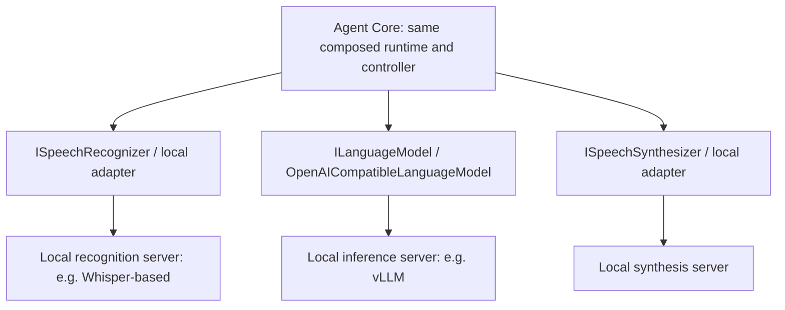

# Observability and Operations

## Latency model

Treat perceived voice latency as independent stages: speech detection + STT partial/final latency + Interaction Controller latency + LLM first-token latency + speech-segmentation delay + TTS first-audio latency + transport/buffering + browser playback. Streaming overlaps parts of this chain; the measured critical path, not a naive sum of overlapping spans, explains the user's wait. Capture each stage to find the bottleneck instead of reporting voice latency as one number.

## Latency instrumentation

Conversation latency is a product feature. Use Application ActivitySource `AgentCore.Runtime` and Meter `AgentCore.Runtime`, ASP.NET Core/HttpClient OpenTelemetry instrumentation, structured Microsoft.Extensions.Logging, and optional OTLP export. Capture server DateTimeOffset for correlation and TimeProvider monotonic timestamps for local durations. Browser uses performance.now() for durations and UTC timestamps only for approximate cross-device correlation. Never subtract unsynchronized browser/server wall clocks and report the result as precise network latency.

| Milestone/event | Capture location | Useful measurement |
| --- | --- | --- |
| speech detected | Browser VAD, plus server ingress receipt | Local speech→duck, ingress→candidate |
| first STT partial transcript | STT pump before mailbox admission | Speech boundary→partial (server observed) |
| final transcript | STT pump and mailbox processing | Final→model request / mailbox delay |
| interruption candidate / confirmed decision | Controller transition | Candidate→decision |
| model request start / first token | Adapter send and first normalized delta | Request→first token |
| first speakable segment | Application SpeechSegmenter release with responseId/segmentIndex | First buffered text→segment release; separate from provider latency |
| TTS start / first TTS audio | Adapter segment request / first PCM | Speakable text→first audio |
| audio sent | Binary output sender at actual send | First TTS audio→send; send→playback ack upper bound |
| client playback start | Worklet consumed first sample, reported ack | Local audio receipt→playback; server first-send→ack is an upper bound including RTT |
| cancel requested | Runtime after supersession mark | Decision→cancellation request |
| playback stopped | Worklet flush acknowledgement | Browser stop receipt→actual stop |
| response completed | Runtime terminal after delivery/save | End-to-end server-observed response lifetime |

Trace spans: session attach, user turn, brain decision, model generation, each TTS segment, interruption, persistence write. Long voice calls should not require one unbounded trace; link per-turn activities by correlation ID. Metrics: histograms for the durations above, mailbox wait, input/output queue depth, active sessions, discarded stale chunks, interruptions by decision, normalized failures, reconnect count and underruns. Use provider alias, decision and error code as low-cardinality metric tags; sessionId/eventId/responseId belong in traces/logs, not metric labels.

Structured log fields where relevant: sessionId, eventId, responseId, provider (logical alias), durationMs, decision, attachmentId, errorCode. Do not log raw audio, API keys, AdditionalHeaders or complete conversations by default. Debug transcript/content logging is explicit local opt-in with a bounded timeline, never an accidental production default. Redact provider URL query strings and failure bodies. Browser receives user-safe messages only.

## MVP optimization targets (not SLAs)

- Local speech detection→gain duck: <=50 ms on a reference desktop browser.
- Server receipt of speech evidence→interruption candidate: <=100 ms; browser speech detection→server candidate aim <=250 ms on local/demo networking, measured with clock uncertainty disclosed.
- Controller explicit-stop decision→stop command queued: <=25 ms.
- Browser receipt of stop→worklet stopped: <=50 ms.
- Browser receipt of first PCM→playback: approximately 60–120 ms with the default prebuffer.
- Final transcript→first model delta and speakable text→first TTS audio: record p50/p95 per provider/profile; initial demo aims below 1 second each, explicitly provider-dependent.

Collect a reproducible 20-turn demo run, report sample size, provider/profile, device, browser, network conditions and percentile values. Do not claim universal guarantees. Optimize queueing/cancellation before increasing model complexity.

## Running after implementation

The preferred fast developer loop requires no Docker: ASP.NET backend on localhost:5080 and Vite on localhost:5173 with HTTP/WebSocket proxy. Run native .NET and Vite processes for fast startup, direct debugging, hot reload and no container rebuilds. Milestone 1 uses in-memory persistence (`Persistence:Provider=InMemory`); select SQLite when Milestone 11 exists. Provider profile and storage selection are independent.

```text
dotnet run --project src/AgentCore.Api --launch-profile http
cd web
npm ci
npm run dev
```

`GET /health` confirms Synthetic boot (`{"status":"healthy","profile":"Synthetic","protocolVersion":1}`). Open http://127.0.0.1:5173, start a conversation, and send text over `/hubs/session`. Voice click preflights capture, then streams PCM after Mode=voice. In voice mode, streamed assistant text is segmented and played through the output AudioWorklet (not an HTML audio element); microphone capture remains active during playback. Mute stops PCM only; End or disconnect releases capture, recognition and synthesis. Saying Wait (or sending a new turn) supersedes live playback after a worklet flush. Idle and environment initiative stay in-process (`IEnvironmentEventIngress`); there is no public arbitrary-event inject endpoint. Playwright: `cd web && CI=1 npx playwright test` (text pending-voice, fake-device capture, playback while capture stays active, duplex mute/disconnect, voice interrupt). Kestrel JavaScript protocol fixtures run under `dotnet test`. The synthetic STT/TTS scripts emit deterministic transcripts and PCM; use Real with independently configured streaming STT/TTS and OpenRouter text with a **fixed** `DefaultModel` for actual microphone transcription and speech. `openrouter/free` is for opt-in adapter smoke only. Supply `OPENROUTER_API_KEY` and, when live speech is wanted, `OPENAI_API_KEY` from environment or `dotnet user-secrets`. Opt-in OpenAI TTS uses `AGENTCORE_LIVE_OPENAI_TTS=1`. [Configuration](15-persistence-and-configuration.md) defines all profile overrides. Default test commands remain Synthetic and must not require these keys.

```text
dotnet test
cd web
npm ci
npm run test -- --run
npm run build
npx playwright test
```

Demo/production-like packaging: Vite builds static SPA into web/dist; the Dockerfile publish stage copies it to Api wwwroot; ASP.NET serves SPA/static assets, REST and SignalR in one process. Route SPA fallback only for browser paths, never swallow /api, /hubs, /health or OpenAPI errors. Milestone 12 adds container hardening, SQLite volume/restart tests, real-provider Compose configuration, hybrid topology and backup/shutdown polish. Kubernetes is unnecessary.

Bind loopback for local demos. For shared demo hosting use HTTPS with WebSocket upgrade forwarding, a single backend instance and a persistent SQLite volume. Do not horizontally replicate SessionManager against the same SQLite file. During shutdown stop admitting new sessions, mark active responses interrupted, request client flush, save checkpoints and await workers within the 5-second shutdown budget. If process termination prevents clean save, recovery semantics apply.

Back up SQLite using its backup mechanism or a controlled stopped-app copy; copying only the main file while WAL is active is not a reliable backup. Apply EF migrations once at startup before serving traffic for this single-process MVP; fail startup on migration error. Test a restore before a demo that needs durable history.

## Docker Compose integration and demo

Docker Compose is the supported reproducible local integration/demo environment, while Docker remains optional for ordinary development. Native `dotnet run` + Vite remains the fast loop. `docker compose up --build` starts one Synthetic application container (built SPA, in-memory store, no provider keys) on http://127.0.0.1:5080. Building/pulling container dependencies may require network even though synthetic runtime behavior does not. Milestone 12 hardens SQLite volumes, Real-provider configuration and shutdown polish.

```text
docker compose up --build
curl -sS http://127.0.0.1:5080/health
```

```text
Docker Compose
└── agent-core (one application container)
    ├── ASP.NET Core API + SignalR
    ├── built React SPA served as static assets
    └── SQLite file in a mounted persistent volume

Hosted services outside Compose:
OpenAI STT · OpenRouter text model · OpenAI TTS
```

Do not split frontend and backend into separate production runtime containers. Vite is a build stage in this artifact, not a production server. The SQLite volume must survive application container recreation; the container's writable layer is not durable storage. Compose should expose the application locally, pass backend configuration/secrets, and use /health for readiness. No additional reverse proxy, Redis, broker, service mesh or Kubernetes is required.

Future Compose topologies may add `local-stt`, `local-llm` and `local-tts` services beside `agent-core`. Hybrid mode enables only the desired local capabilities; fully on-prem mode uses all three local services. These are inference services at the Infrastructure boundary, not a redesign into Agent Core microservices. SQLite may later be replaced by PostgreSQL through the existing persistence boundary without changing the one-application-container philosophy.

**Invariants:** Provider location is an infrastructure concern. Hosted, hybrid and on-prem provider topologies must not change core Agent Runtime semantics. Docker is an orchestration/deployment tool, not an architectural dependency of Agent Core. Day-to-day source control is the local `git` CLI. Intended repository CI is GitHub Actions after project scripts exist.

## Hosted, hybrid and on-prem deployment

The same composed Session Runtime and Interaction Controller support all three topologies:

| Deployment | Speech Recognizer / STT | Text Language Model via compatible adapter | Speech Synthesizer / TTS |
| --- | --- | --- | --- |
| Hosted MVP | OpenAI realtime transcription initially (`gpt-live-transcribe` recommended); replaceable STT | OpenRouter hosted gateway | OpenAI initially; replaceable TTS |
| Hybrid | Local STT | OpenRouter or other hosted endpoint | Local TTS |
| Future fully on-prem | Local STT | Local OpenAI-compatible inference server | Local TTS |



Specific local projects are examples, not mandatory dependencies. Inference processes may live on the same machine or private network; that does not split Agent Core into application microservices. Replace the text endpoint/model configuration and independently select local speech adapters. No Agent Runtime/Interaction Controller rewrite is required. OpenRouter is not on-prem; a fully local deployment must avoid hosted provider calls and disable external telemetry export, while using locally available model assets. Validate model licenses, hardware capacity, streaming support and latency when choosing actual local providers; no GPU provisioning or inference-server implementation is part of this docs task.

[Configuration](15-persistence-and-configuration.md#hosted-and-on-prem-provider-configurations) owns concrete endpoint overrides. Native speech-to-speech is not required to achieve hosted, hybrid or fully on-prem deployment.

## Security and public-service boundary

Authentication is deferred. Session IDs are high-entropy local/demo bearer references; possession allows viewing/ending that session. Keep them out of public links and frontend analytics. Provider secrets exist only on the backend. Same-origin production serving is preferred; development uses a Vite proxy or narrowly allowed origins.

Before exposing a production multi-user service, add authenticated identity, explicit per-user session authorization on every HTTP/hub/audio operation, session-token handling/rotation, origin validation, abuse/rate limits, storage retention/deletion policy and operational secret management. These are deployment prerequisites for that future scope, not an OAuth implementation in this MVP. CORS is not authentication.

Recoverable provider failures leave a safe partial conversation entry and permit an explicit new turn. Connection loss stops playback immediately and follows the reconnect snapshot flow. Storage corruption or repeated concurrency conflict is a fatal session error and should require operator review, not a misleading automatic retry loop. [Protocol](14-api-and-realtime-protocol.md#error-policy) owns browser error taxonomy.
