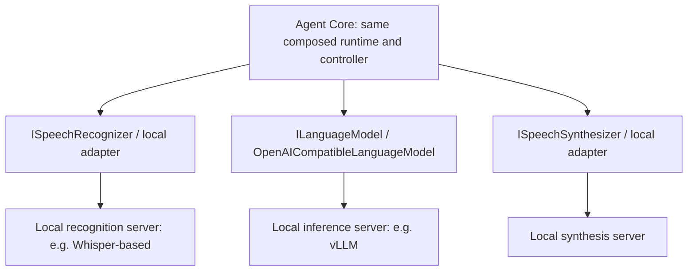

# Observability and Operations

## Capability projection measurements

`AgentCore.Runtime` records `capability_projection` histograms by low-cardinality `kind`, configured provider and catalog model key: authorizedCapabilityCount, eligibleCapabilityCount, projectedCapabilityCount, projectedToolSchemaBytes (normalized definitions including names/descriptions/schemas), coreBootstrapCount, definitionAlwaysCount, contextProjectedCount, skillProjectedCount, loadedProjectedCount and capabilityLoadInvocationCount. `capability_loads` counts safe outcomes load_matched, load_no_match, load_already_projected, load_over_budget and load_stale. capabilityLoadMatchCount measures each invocation's matches. Raw discovery queries and schemas are not default log or metric tags. Counts from overlapping projection sources are informational and need not sum to the deduped total.


## Latency model

Treat perceived voice latency as independent stages: speech detection + STT partial/final latency + Interaction Controller latency + LLM first-token latency + speech-segmentation delay + TTS first-audio latency + transport/buffering + browser playback. Streaming overlaps parts of this chain; the measured critical path, not a naive sum of overlapping spans, explains the user's wait. Capture each stage to find the bottleneck instead of reporting voice latency as one number.

## Latency instrumentation

Conversation latency is a product feature. Use Application ActivitySource `AgentCore.Runtime` and Meter `AgentCore.Runtime`, ASP.NET Core/HttpClient OpenTelemetry instrumentation, structured Microsoft.Extensions.Logging, and optional OTLP export. Capture server DateTimeOffset for correlation and TimeProvider monotonic timestamps for local durations. Browser uses performance.now() for durations and UTC timestamps only for approximate cross-device correlation. Never subtract unsynchronized browser/server wall clocks and report the result as precise network latency.

| Milestone/event | Capture location | Useful measurement |
| --- | --- | --- |
| speech detected | Browser VAD, plus server ingress receipt | Local speech→duck, ingress→candidate |
| first STT partial transcript | STT pump before mailbox admission | Speech boundary→partial (server observed) |
| final transcript | STT pump and mailbox processing | Final→model request / mailbox delay |
| interruption candidate / confirmed decision | Controller transition | Candidate→decision |
| model request start / first token | Adapter send and first normalized delta | Request→first token |
| first speakable segment | Application SpeechSegmenter release with responseId/segmentIndex | First buffered text→segment release; separate from provider latency |
| TTS start / first TTS audio | Adapter segment request / first PCM | Speakable text→first audio |
| audio sent | Binary output sender at actual send | First TTS audio→send; send→playback ack upper bound |
| client playback start | Worklet consumed first sample, reported ack | Local audio receipt→playback; server first-send→ack is an upper bound including RTT |
| cancel requested | Runtime after supersession mark | Decision→cancellation request |
| playback stopped | Worklet flush acknowledgement | Browser stop receipt→actual stop |
| response completed | Runtime terminal after delivery/save | End-to-end server-observed response lifetime |

Trace spans: session attach, user turn, brain decision, model generation, each TTS segment, interruption, persistence write. Long voice calls should not require one unbounded trace; link per-turn activities by correlation ID. Metrics: histograms for the durations above, mailbox wait, input/output queue depth, active sessions, discarded stale chunks, interruptions by decision, normalized failures, reconnect count and underruns. Pause counters `session.auto_paused` and `session.pause_reason` use only the canonical pause-reason enum (`manual|inactivity|silentEvaluation|initiative|disconnected|recovered|persistence|other`) as a `reason` tag. Speech counters `speech.partial.count` and `speech.playback.complete` have no content tags. Histograms `speech.final.latency`, `speech.segment.latency`, and `speech.playback.start.latency` are untagged milliseconds. Counter `speech.cancel.reason` uses only `reason=userStop|userBargeIn|newText|userSteer|disconnected|modeChange|ended|deactivated|other`. Counter `speech.error.code` uses a bounded error-code tag (no transcript, PCM, secrets, or vendor bodies). Counter `agent.progress.event` tags only `kind` (`preparing|readingAttachments|runningTool|waitingExternal|finalizing|other`) and `state` (`started|updated|completed|failed|other`). Histogram `agent.progress.active_ms` is milliseconds tagged only with `kind`. Progress instruments never tag message text, operation IDs, tool arguments, reasoning, or attachment content. Do not log native structured JSON, compatibility marker payloads, or speech text. User-text counters `user_text.behavior` and `user_text.queued` use only `behavior=queue|interrupt`. Histogram `user_text.pending_batch_size` records the clamped suffix length `1..8` with no labels when a pending batch starts; counter `user_text.pending_batch_started` has no tags. Response-stop counters `response.cancel.requested` and `response.cancel.stale` have no high-cardinality tags. Use provider alias, decision and error code as low-cardinality metric tags; sessionId/eventId/responseId belong in traces/logs, not metric labels.

Application code records those histograms on `ActivitySource`/`Meter` `AgentCore.Runtime`. Observed synthetic 20-turn numbers live in [Milestone 12 demo verification](reports/m12-demo-verification.md); they are measurements, not SLAs. Compose SQLite volume survival and the owner-capability path are covered by `scripts/compose-sqlite-volume.sh` (also run on Ubuntu in [GitHub Actions](../.github/workflows/synthetic.yml)) and [MVP handoff](reports/m12-mvp-handoff.md).

The existing Synthetic workflow also supports manual branch verification: `gh workflow run synthetic.yml --ref BRANCH` (replace `BRANCH` with the desired branch), then inspect the run's exact `headSha` and all five job results. This uses the same key-free gates when pull-request conflicts prevent automatic scheduling. Passing a branch run verifies its source; resolving conflicts with the target branch remains a separate merge prerequisite.

## Admin lifecycle observability (observed, P7)

Admin routes under `/api/v2/admin` require the same trusted-local **owner capability** as other destructive catalog operations (`X-AgentCore-Owner-Capability` from `POST /api/v1/local/owner-capability` in Synthetic/Compose). Denied or missing capability fails closed with 401; trusted-local restrictions apply before any durable Admin mutation.

Logging and projections for Admin must stay redacted: never log owner-capability tokens, webhook bearer tokens, webhook token hashes, draft or resource bytes, persona JSON payloads, learned-memory content, evaluation prompts or results, provider secrets, or raw `PreparedActionJson`/evidence from durable work. Append-only `AdminEvents` and HTTP list/detail responses carry only allowlisted summary metadata (definition/instance/version/revision identifiers, bounded section names, fingerprints). See [P7G report](reports/p7g-history-rollback-final-gate.md) and [Testing Strategy](16-testing-strategy.md).

There is no separate Admin metrics namespace yet; treat Admin like other HTTP surfaces (ASP.NET request logging, bounded error codes). If Admin-specific **counters or histograms** are added later, tag only bounded low-cardinality values such as `operation`, `outcome`, and resource **kind** (never instance/definition UUIDs, operation ids, or summary JSON bodies). **Traces and structured logs** may include safe resource ids for correlation, consistent with the latency-instrumentation rule that session/event/response ids belong in traces/logs, not metric labels. **Spans** follow the same split: bounded tags on metrics; richer attributes on trace activities only.

**Compose and browser verification:** default Synthetic Compose smoke (`scripts/compose-sqlite-volume.sh`) proves SQLite volume survival for instance-owned Sessions, catalog, redacted Background Work APIs, and an owner-protected Admin fork/publish/managed-instance/managed-session path with safe `AdminEvents` list redaction across container recreate. The P7 whole-phase Admin journey (resources, evaluations, full §8 steps) still runs in Playwright with a **disposable** SQLite file (`PLAYWRIGHT_SQLITE_PATH`, isolated `admin-lifecycle` project in CI). The later Admin authoring journey uses a separate `p76-admin` project and `data/playwright/p76-admin.db`, also deleted before that CI step. Compose also uploads/binds a draft knowledge resource, publishes, and verifies publication resource metadata survives recreate; managed-session `/agent` resource read is checked before recreate ([P7G report](reports/p7g-history-rollback-final-gate.md)).

`DiagnosticId` names one failure occurrence and may be shown or copied. `CorrelationId` remains the logical operation or turn. `TraceId` is copied only from a real `Activity.Current` and is omitted when none exists. Unexpected catches log the exception object with a `DiagnosticLog` record. Present allowlisted fields sit on that record: `DiagnosticId`, `CorrelationId`, `TraceId`, `SessionId`, `ResponseId`, `AgentInstanceId`, `AutomationId`, `TriggerOccurrenceId`, `AgentRunId`, `ErrorCategory`, `ErrorCode`, `ProviderAlias`, `FailureReason`, and `ProviderResponseChannel`. Absent fields are omitted. Conversation and model failures include `AgentInstanceId` and `ProviderAlias` when the pinned session already has them. Provider `InvalidResponse` failures may also include bounded `FailureReason` and `ProviderResponseChannel` on the same `DiagnosticLog` line. Those values name the violated contract, not raw model output. `outputLimit` and `toolCallTruncated` are part of that allowlist. The same tokens may appear on the history failure reference. Those identifiers are not metric labels. A terminal session-end persistence failure publishes `Session` / `SessionPersistenceUnavailable` / `Persistent save failed.` and keeps the exception object on that log line. Expired-claim recovery assigns a safe `DiagnosticId` inside the AgentRun transition. `AgentRunCoordinator` fences recovery and dispatch through the shared Session mailbox; no legacy worker or second execution store is registered. `Observability:OtlpEnabled` still does not attach an exporter.

Scheduling stays domain-owned for registration, schedule semantics, admission, work, approval, and execution. Infrastructure owns waking, persistence, and dispatch through `BackgroundService`, SQLite, one process, and a 1-second cadence. Missed recurrence still coalesces to the latest due occurrence. `CoalesceLatest`, `SkipMissed`, `CatchUp`, Hangfire, and Quartz stay deferred.

Structured log fields where relevant: sessionId, eventId, responseId, provider (logical alias), durationMs, decision, attachmentId, errorCode. Do not log raw audio, API keys, AdditionalHeaders or complete conversations by default. Debug transcript/content logging is explicit local opt-in with a bounded timeline, never an accidental production default. Redact provider URL query strings and failure bodies. OpenAI-compatible non-2xx responses log status, model, phase, and a bounded sanitized provider error code, type, and message; `llm.request` records model, provider, call number, message and tool-result counts, image presence and byte size, structured output, and HTTP status without prompt or image bytes. Browser receives user-safe messages only. Content-free compaction counters on `dropped_items` are `compaction_rejected`, `compaction_cancelled`, and `compaction_stale`. Structured-memory admission, conflict, capacity, and cross-session policy denials use `memory_rejected`. Successful session-memory prompt loads record `memory_retrieval` with result `included` or `empty`. These counters carry no summary, memory, or conversation text. `SessionRuntime` records counter `agent_steps` when a terminal Agent Step is accepted or rejected. Tags are `outcome` (`accepted` or `rejected`), `disposition` (the disposition name or `none`), `action` (`chat.respond` or `none`), `rejection` (`none`, `unknownDisposition`, `unknownAction`, `malformedPayload`, or `modelSuppliedDestination`), and `executed` (`chat` or `none`). The matching log line carries session id, response id, disposition, action, and rejection category. It does not include display text, speech, reasoning, or a diagnostic id as a metric label. Observed `stage_duration_ms` stages also include `extraction`, `workspace`, `tools`, `sandbox`, `initiative`, `initiative_eval`, `initiative_disposition`, `cleanup`, `speech.partial.count`, `speech.final.latency`, `speech.segment.latency`, `speech.playback.start.latency`, `speech.playback.complete`, `speech.cancel.reason`, `speech.error.code`, `agent.progress.event`, `agent.progress.active_ms`, and `agent.step.terminal`. `agent.step.terminal` is the time from accepting the Chat action to successful response completion. It carries no display text. Timeline details for progress are `kind:state` or `kind` only. `speech.input.transport` / `speech.output.transport` and compact capability flags remain metadata only. `initiative_eval` and `initiative_disposition` timeline entries always carry compact JSON (`triggerEventId`, evaluated/reasonCode, admitted/blockReason, silence/counters; no planner note or transcript text). Optional `reasonDetail` appears only when debug content logging is enabled. Other tool/sandbox details are names only and are omitted from the default timeline unless debug content logging is enabled.

## P7.5 observability audit (observed)

The add rows are recorded by `OperationalDiagnostics`. Metric tags stay bounded (`phase`, `reason`, `state`, `outcome`, `scope`, `result`, `operation`). Definition ids, instance ids, catalog keys, and provider aliases stay in the diagnostic timeline, not on metric labels. Those records do not include tool arguments, approval grants, memory text, summary text, or payload bytes. `IncludesConversationContent` stays opt-in. `GET /health` is the readiness response: it returns `status`, `profile`, and `protocolVersion` only after persistence initialization. Instruments are the BCL `ActivitySource` and `Meter` named `AgentCore.Runtime`. No OpenTelemetry package is referenced. `Observability:OtlpEnabled` defaults to false; when true, startup requires an absolute `OtlpEndpoint`, and the flag still does not attach an exporter. A later host can listen to the existing meter and activity source without changing call sites, and local or Synthetic runs do not require a collector.

| Area | Decision | Evidence |
| --- | --- | --- |
| Model and provider calls | Keep and add | `PumpModelAsync` starts an activity span named `model`. It records stage `llm` and a presence-only `llm.reasoning.delta`. `agent_run_events` records retry on the same durable AgentRun; attempt count and bounded failure classification remain inspectable without logging prompt/model text. `llm.response.repair` records a repairable presentation reason (`missingDisplayText` or `invalidBlocks`) with phase `initial` or `follow-up`. Every `started` repair records exactly one later outcome: `succeeded` when the repaired semantic response is accepted, `failed` when the repair ends without one, or `cancelled` when the response is cancelled. A successful repair does not mark the activity as an error. Neither counter includes prompt or model text. Nothing calls `RuntimeTelemetry.Record("model")`. The activity span is the model-duration evidence, so this row does not add a `stage_duration_ms` sample named `model`. `OpenAICompatibleLanguageModel.RecordRequest` records `llm.request` with default model, adapter, call number, response id, counts, and HTTP status. `HandleModelSelectionAsync` records `model.selection` with result `selected`. The timeline detail carries the catalog key and provider alias after `SafeLogRedactor`. The method does not write those values to the application log. `HandleSemanticReadyAsync` records `agent_steps` with bounded outcome, disposition, action, rejection, and executed tags. Active Skill procedures record `active_skills` with a count tag of 0–4 and do not log procedure text. `skill_loads` and `application_messages` record an `outcome` tag only (`admitted`, `denied`, `duplicate`, `stale`, `over_budget`, and the other small admission outcomes). They do not label message text, procedure text, or raw Skill ids. |
| Session, response, and conversation execution | Keep | Attach records stage `attach`. The controller and persist paths record `controller` and `persist`. `TerminalizeActiveResponseAsync` logs session id, response id, and reason. The coordinator and `AgentRunHostedService` dispatch claimed AgentRuns through SessionHost. Activation/Run/background lifecycle telemetry uses bounded operation and outcome labels. |
| Queue | Keep | `UserTextQueueTelemetry.Record` covers queued and immediate user text. `RecordPendingBatchStarted` covers a pending batch. |
| Steer and interrupt | Keep | Text steer calls `TerminalizeActiveResponseAsync` with `userSteer`. `SpeechTelemetry.RecordCancel` keeps `userSteer` as its own reason. Voice barge-in uses `userBargeIn`. |
| Detach | Add | `HandleDetachAsync` records `SessionPauseTelemetry` `"disconnected"` only when it applies a new pause. The ended-or-ending return, the transport-only return (including auto when accepted conversation work exists), and the already-paused return record `session.detach` with a phase and reason. |
| Reattach | Add | A successful attach records stage `attach` with elapsed time only, including a paused session that does not require explicit resume. A deadline expiry and an explicit-resume refusal return before that record. The success record adds `session.attach` phase `cold` or `resumed`. Those two refusals record phase `refused` with reason `deadline` or `explicitResume`. |
| Tool calls | Keep and add | Stage `tools` records the tool name. `SafeExecutionTrace` also records `tool.step` with session id, response id, sequential step number, canonical tool name, normalized outcome, duration, and bounded browser metadata (path, operation, safe target role/name, element count, intervention flag, and a closed `argumentReason` when local browser argument validation rejects the call). It does not log tool arguments, fill values, element refs, upload bytes, artifact ids, or page text. `generation.terminal` records structural completion metadata (channel, stop reason, disposition, action kind, display-text presence, failure category/code) without assistant text, reasoning, or model JSON. Web, email, and sandbox handlers record their own stages. |
| Approvals | Add | `SessionRuntime.Approval.cs` records `approval.outcome` and `approval.wait_ms` with state and reason. It does not log the grant or argument payload. |
| Sandbox | Keep | `SessionToolExecutor` records stage `sandbox` with the verb. |
| Compaction | Keep and add | Rejected, cancelled, and stale compaction call `RecordDropped`. `HandleCompactionReturned` records `compaction.outcome` `accepted` before persist. The detail is the word `accepted` and does not include summary text. |
| Memory mutation | Keep and add | `SessionMemoryPrompt` records `memory_retrieval` as `included` or `empty`. `StructuredMemoryService` records only `memory_rejected` on admission failure. A mutation that passes admission records `memory.mutation` with scope and result. It does not log memory text. |
| Definition, version, and instance resolution | Add | `AdminReadService.GetEffectiveConfigurationAsync` records `admin.operation` `resolve`. The timeline detail carries definition id, version, instance id, and state. Those ids are not metric labels. |
| Draft, publish, rollback, and deprecation | Add | `AgentDefinitionLifecycleService`, `AgentDefinitionDraftPublishService`, and `AdminAgentInstanceService` record `admin.operation` and `admin.operation_ms` with operation, outcome, and reason. The timeline detail carries ids and state. It does not include draft bytes, persona JSON, or memory text. |
| Trigger registration, occurrence, and scheduler lag | Keep | `RecordAutomation`, `RecordTriggerScheduler`, and `RecordTriggerDueLag` already cover this area. |
| AgentRun lifecycle | Keep | Shared stores record committed admission, claim, attempt, retry, approval and terminal transitions; the coordinator records lease recovery through those transitions. |
| Policy denials | Keep and add | Trigger registration records `authorization_denied`, `forbidden`, and `policy`. The interactive `ToolPolicyDecision.Deny` branch records `tool.denial` reason `forbidden` and the tool name. It does not log arguments. |
| Bounded resource failures | Keep and add | Mailbox pressure records `mailbox`. Cancelled tool execution records `tools`. Audio overflow records `audio`. `AttachmentStreamIntake` records `resource.limit` `attachmentItem` or `attachmentSession` before the 25 MiB and 250 MiB throws. `WorkspaceEndpoints` records `workspaceContentLength` or `workspaceStream` before `WorkspaceQuotaExceeded`, ahead of `WriteWorkspaceAsync`. `FileSessionWorkspace` records `workspaceStore` before the same error. `SqliteArtifactStore` and `InMemoryArtifactStore` record `artifactItem` or `artifactSession` before `ArtifactQuotaExceeded`. `InMemoryArtifactStore` is the artifact store when the persistence provider is not Sqlite. Those reason codes do not include payload bytes. |
| Health and readiness | Keep | `GET /health` returns `status`, `profile`, and `protocolVersion` after persistence initialization. That is the readiness response for native, Compose, and CI. Do not add a second health service or an exported collector. |

## MVP optimization targets (not SLAs)

- Local speech detection→gain duck: <=50 ms on a reference desktop browser.
- Server receipt of speech evidence→interruption candidate: <=100 ms; browser speech detection→server candidate aim <=250 ms on local/demo networking, measured with clock uncertainty disclosed.
- Controller explicit-stop decision→stop command queued: <=25 ms.
- Browser receipt of stop→worklet stopped: <=50 ms.
- Browser receipt of first PCM→playback: approximately 60–120 ms with the default prebuffer.
- Final transcript→first model delta and speakable text→first TTS audio: record p50/p95 per provider/profile; initial demo aims below 1 second each, explicitly provider-dependent.

Collect a reproducible 20-turn demo run, report sample size, provider/profile, device, browser, network conditions and percentile values. Do not claim universal guarantees. Optimize queueing/cancellation before increasing model complexity.

## Running after implementation

The preferred fast developer loop requires no Docker: ASP.NET backend on localhost:5080 and Vite on localhost:5173 with HTTP/WebSocket proxy. Run native .NET and Vite processes for fast startup, direct debugging, hot reload and no container rebuilds. Milestone 1 uses in-memory persistence (`Persistence:Provider=InMemory`); select SQLite when Milestone 11 exists. Provider profile and storage selection are independent.

```text
dotnet run --project src/AgentCore.Api --launch-profile http
cd web
pnpm install --frozen-lockfile
pnpm run dev
```

MessagePack stays the realtime default. To inspect JSON frames in DevTools, configure the diagnostic transport for the **Vite** process, not the ASP.NET API. Vite reads `VITE_AGENTCORE_REALTIME_PROTOCOL` from `web/` env files or the shell that starts `pnpm dev`. The repo-root `.env` used for Compose interpolation and optional `source .env` for native .NET does **not** configure native Vite. Restart the Vite dev server after changing the variable; a browser refresh alone is not enough if Vite was already running. Changing it on the API process or a running container after the SPA is built does not switch the browser.

```bash
cd web
VITE_AGENTCORE_REALTIME_PROTOCOL=json pnpm dev
```

The same assignment can live in gitignored `web/.env.local` (see `web/.env.example`). Default `docker compose build` leaves the variable unset, so the image stays MessagePack. A JSON diagnostic image passes it during the frontend build, then runs the container:

```bash
docker compose build --build-arg VITE_AGENTCORE_REALTIME_PROTOCOL=json
docker compose up
```

Durable trigger telemetry on meter `AgentCore.Runtime` is `trigger_scheduler_events`, `trigger_registration_events`, and `trigger_due_lag_ms`. Canonical execution adds `activation_events`, `agent_run_events` and `background_session_events` with bounded outcome tags described below. Do not log schedule intent, occurrence evidence, result text, prepared action JSON, or secrets. `GET /health` confirms Synthetic boot (`{"status":"healthy","profile":"Synthetic","protocolVersion":1}`). Open http://127.0.0.1:5173, start a conversation, and send text over `/hubs/session`. Voice click preflights capture, then streams PCM after Mode=voice. In voice mode, streamed assistant text is segmented and played through the output AudioWorklet (not an HTML audio element); microphone capture remains active during playback. Mute stops PCM only; End or disconnect releases capture, recognition and synthesis. Saying Wait (or sending a new turn) supersedes live playback after a worklet flush. Idle and environment initiative stay in-process (`IEnvironmentEventIngress`); there is no public arbitrary-event inject endpoint. Playwright: `cd web && CI=1 pnpm exec playwright test` (text pending-voice, fake-device capture, playback while capture stays active, duplex mute/disconnect, voice interrupt). Kestrel JavaScript protocol fixtures run under `dotnet test`. The synthetic STT/TTS scripts emit deterministic transcripts and PCM; use Real with independently configured streaming STT/TTS and OpenRouter text with a **fixed** `DefaultModel` for actual microphone transcription and speech. `openrouter/free` is for opt-in adapter smoke only. Supply `OPENROUTER_API_KEY` and, when live speech is wanted, `OPENAI_API_KEY` from environment or `dotnet user-secrets`. Opt-in OpenAI TTS uses `AGENTCORE_LIVE_OPENAI_TTS=1`. [Configuration](15-persistence-and-configuration.md) defines all profile overrides. Default test commands remain Synthetic and must not require these keys.

```text
dotnet test
cd web
pnpm install --frozen-lockfile
pnpm run test --run
pnpm run build
pnpm exec playwright test
```

Demo/production-like packaging: Vite builds static SPA into web/dist; the Dockerfile publish stage copies it to Api wwwroot; ASP.NET serves SPA/static assets, REST and SignalR in one process. Route SPA fallback only for browser paths, never swallow /api, /hubs, /health or OpenAPI errors. Compose mounts a persistent SQLite volume at `/data`. Kubernetes is unnecessary.

Bind loopback for local demos. For shared demo hosting use HTTPS with WebSocket upgrade forwarding, a single backend instance and a persistent SQLite volume. Do not horizontally replicate SessionManager against the same SQLite file. During shutdown the host stops admitting new sessions, interrupts live responses, detaches runtimes, and waits up to five seconds for mailbox drain. If process termination prevents a clean save, crash recovery semantics apply.

Back up SQLite using `SqliteMemoryStore.BackupToAsync` (SQLite backup API) or a copy taken while the process is stopped. Copying only the main file while WAL/`-wal`/`-shm` companions are active is not a reliable backup. Apply schema at startup (`EnsureCreated` for this MVP initial schema; treat it as the first migration) before serving traffic; fail startup on schema error. Test a restore before a demo that needs durable history. Native development can keep `Persistence__Provider=InMemory` or set `Persistence__Provider=Sqlite` with `Persistence__ConnectionString=Data Source=data/agent-core.db`.

## Docker Compose integration and demo

Docker Compose is the supported reproducible local integration/demo environment, while Docker remains optional for ordinary development. Native `dotnet run` + Vite remains the fast loop. `docker compose up --build` starts one Synthetic application container (built SPA, SQLite and definition resource blobs on volume `agent-core-data` via `Persistence__DefinitionResourceRoot=/data/definition-resources`, no provider keys) on http://127.0.0.1:5080. The image runs as the Microsoft runtime `app` user (`USER $APP_UID`); `/data` and `/app/data` are owned by that user. A volume created by an older root image needs ownership `1654:1654` (or a one-time `docker compose down -v`) before SQLite can open. Building/pulling container dependencies may require network even though synthetic runtime behavior does not. `docker compose down` keeps the volume; `docker compose down -v` destroys it. Volume survival plus the frontend owner-capability path (`POST /api/v1/local/owner-capability` → `X-AgentCore-Owner-Capability` → `POST /api/v2/sessions` → catalog GET) is `scripts/compose-sqlite-volume.sh`. Keep host publish on `127.0.0.1`; Compose sets `Hosting__TrustPublishedPortGateway=true` so Docker published-port NAT (the container default gateway) is trusted without opening private IP ranges.

```text
docker compose up --build
curl -sS http://127.0.0.1:5080/health
./scripts/compose-sqlite-volume.sh
```

Real/hosted Compose is the same `agent-core` service and image with `docker-compose.real.yml` overlaid. It does not replace the default file: `docker compose up` stays Synthetic and key-free so CI and local smoke need no credentials. Use two `-f` flags so Compose does not also load an unrelated override file:

```text
# once: cp .env.example .env  && edit OPENROUTER_API_KEY (optional: BRAVE_SEARCH_API_KEY, GMAIL_* for Real web/email)
docker compose -f docker-compose.yml -f docker-compose.real.yml up --build
curl -sS http://127.0.0.1:5080/health
```

`/health` reports `"profile":"Real"`. Compose interpolates a gitignored root `.env` (copy from `.env.example`) or the same variables from the host environment. Do not commit `.env`. Never put secrets in the Compose files. `OPENROUTER_API_KEY` is required to start the Real overlay. `AGENTCORE_LLM_MODEL` defaults to `deepseek/deepseek-v4.1-flash` as a **local development and demo** default (text + tools + reasoning; not a production recommendation). The Real model catalog also offers `openai/gpt-4o-mini-2024-07-18`, `openrouter/free`, `openai/gpt-4.1`, and `openai/gpt-5.6-luna` as explicit session choices. When `AGENTCORE_LLM_MODEL` matches a catalog `ModelId`, the factory retargets `DefaultKey` to that entry; it does not rewrite the DeepSeek catalog identity. Add a catalog entry for ModelIds that are not listed. Do not set `AGENTCORE_LLM_MODEL` to `openrouter/free`. OpenRouter free and low-cost endpoints are rate-limited. Optional `AGENTCORE_LLM_REASONING_EFFORT` (default `medium`) maps to the adapter `reasoning_effort` field when the selected model supports it. Pair capability overrides with the model: `AGENTCORE_LLM_TOOLS` defaults to `true`; `AGENTCORE_LLM_VISION` defaults to `false` (set `true` only with a vision-capable override such as `deepseek/deepseek-v4.1-flash` or `deepseek/deepseek-v4-flash-vision-exp`). Stop with the same files: `docker compose -f docker-compose.yml -f docker-compose.real.yml down`. Synthetic and Real share volume `agent-core-data`. `.env` is not an application `IConfiguration` source; native `dotnet run` does not load it unless you export those variables into the process environment.

The overlay matches the native `http-openrouter` launch profile (language-model setup 30 seconds, stream idle 60 seconds, total 120 seconds): hosted OpenRouter text and tools (`Adapter=OpenAICompatible`, `Vision=false`, `Tools=true` for the pinned model), with `Persistence__Provider=Sqlite` and `Persistence__ConnectionString=Data Source=data/agent-core.db` so local Real runs survive process restarts like Compose Real. Compose reads `AGENTCORE_LLM_VISION` and `AGENTCORE_LLM_TOOLS` alongside `AGENTCORE_LLM_MODEL`. Default Compose `Providers.Speech` remains Synthetic, so voice-enabled agents stay `voiceAvailable` from structurally resolvable Synthetic paths. Native or overlay env can select OpenAI TTS or `OpenAICompatibleBatch` when a backend `OPENAI_API_KEY` is present; Recognition Adapter=`OpenAI` stays unselectable. Selecting those hosted names without a key advertises `voiceAvailable: false`. Real Compose does not by itself opt into live HTTP speech tests. Native processes can pass the same text environment without Compose:

```text
AgentCore__Profile=Real
Providers__LanguageModels__primary-llm__Adapter=OpenAICompatible
Providers__LanguageModels__primary-llm__BaseUrl=https://openrouter.ai/api/v1/
Providers__LanguageModels__primary-llm__DefaultModel=deepseek/deepseek-v4.1-flash
Providers__LanguageModels__primary-llm__ReasoningEffort=medium
Providers__LanguageModels__primary-llm__ReasoningObjectWire=true
Providers__LanguageModels__primary-llm__ExcludeVisibleReasoning=true
Providers__LanguageModels__primary-llm__Vision=false
Providers__LanguageModels__primary-llm__Tools=true
OPENROUTER_API_KEY=<backend-secret>
```

Speech adapter overrides remain in [Configuration](15-persistence-and-configuration.md#hosted-and-on-prem-provider-configurations); they do not change Real Compose until DI selects them.

The native Real stack can be managed with `scripts/dev-real.sh start`, `restart`, `stop` and `status`; use `restart --api-only` to leave nopCommerce alone. It requires Python 3, `lsof`, .NET and pnpm on PATH, plus the configured Real environment. API/Vite launch in separate process sessions and remain running when the initiating terminal command exits. nopCommerce Compose progress updates in place on interactive stderr terminals; captured output (or `TERM=dumb`) shows a single startup message without repeated Docker status lines, while errors remain visible. PID files and logs live in `local/dev`; shutdown targets only recorded processes belonging to this workspace, waits for graceful exit, and preserves SQLite/store volumes. Failed startup reports the exited service and cleans up the partial API/web stack. `stop` returns success when no services are running. Launcher regressions run with `python3 -m unittest discover -s scripts/tests -v` without Docker, credentials or provider calls.

The nopCommerce demo is a second Compose project, not an overlay on `docker-compose.yml`. It does not mount `agent-core-data`, does not change Agent Core's SQLite file, and does not install Chromium in the Agent Core image. Synthetic CI does not start it. Copy the `NOPCOMMERCE_*` placeholders from `.env.example` into the gitignored root `.env`. `NOPCOMMERCE_DB_PASSWORD` is required. Leave `NOPCOMMERCE_ADMIN_PASSWORD` empty to generate it once; the script prints a new password on the operator terminal and does not write it into agent definitions, model context, or ordinary log files.

```text
scripts/nopcommerce-demo.sh start
scripts/nopcommerce-demo.sh stop
scripts/nopcommerce-demo.sh reset
```

On start, Compose waits for SQL health, then restarts the web container before its first HTTP readiness check. This recovers a previously running nopCommerce process that cached a SQL/DNS failure during a database restart, without resetting installed configuration or database volumes.

`start` and `stop` use project name `nopcommerce-demo` only. `reset` runs `docker compose -p nopcommerce-demo -f docker-compose.nopcommerce.yml down -v`, starts again, installs sample data, and applies `deploy/nopcommerce/seed/demo-conditions.sql` (one low-stock product and one pending order). It must not delete Agent Core volumes. Pinned images, with RepoDigests recorded after pull on 2026-10-02, are `nopcommerceteam/nopcommerce:4.90.8` (`sha256:a4043d78041cdf4aa7c2a68dea613212ba5841cf3a05b23ac0240ae258906a79`) and `mcr.microsoft.com/mssql/server:2022-CU22-ubuntu-22.04` (`sha256:db9a8fe3098b7e8bbde41106bdc7caee942e97124e5fdb71b872ca208de3092d`). The SQL Server image is linux/amd64. The store is published only on `http://127.0.0.1:5088`. After start and after reset, the storefront and `/admin` responses, including every redirect, stay on that origin. `localhost`, another host, `https`, or another port fails the script. Admin sign-in uses `NOPCOMMERCE_ADMIN_EMAIL` (default `demo-owner@example.com`). `start` installs `deploy/nopcommerce/plugin/AgentCore.OrderEvents`. Set `AGENTCORE_WEBHOOK_URL` and `AGENTCORE_WEBHOOK_TOKEN` before `start` when the plugin should emit `order.placed`. An agent that investigates the store needs `http://127.0.0.1:5088` in `Browser:NavigationOrigins` and `Browser:InteractionOrigins`. The product image for a later publish journey is `deploy/nopcommerce/assets/ac-keyboard.png`.

Default `docker compose` smoke stays Synthetic/scripted and key-free. Hybrid/on-prem keeps the same `agent-core` service and points STT/LLM/TTS BaseUrl values at local inference processes.

```text
Docker Compose
└── agent-core (one application container)
    ├── ASP.NET Core API + SignalR
    ├── built React SPA served as static assets
    └── SQLite file in a mounted persistent volume

Hosted services outside Compose:
OpenRouter text (selected by docker-compose.real.yml)
OpenAI STT · OpenAI TTS (optional; OpenAI TTS is selectable when Synthesis Adapter=`OpenAI` and a backend key is present; hosted STT is `OpenAICompatibleBatch` with no interims; OpenAI realtime STT remains deferred and unselectable. Live HTTP stays opt-in.)
```

Do not split frontend and backend into separate production runtime containers. Vite is a build stage in this artifact, not a production server. The SQLite volume must survive application container recreation; the container's writable layer is not durable storage. Compose should expose the application locally, pass backend configuration/secrets, and use /health for readiness. No additional reverse proxy, Redis, broker, service mesh or Kubernetes is required.

Future Compose topologies may add `local-stt`, `local-llm` and `local-tts` services beside `agent-core`. Hybrid mode enables only the desired local capabilities; fully on-prem mode uses all three local services. These are inference services at the Infrastructure boundary, not a redesign into Agent Core microservices. SQLite may later be replaced by PostgreSQL through the existing persistence boundary without changing the one-application-container philosophy.

**Invariants:** Provider location is an infrastructure concern. Hosted, hybrid and on-prem provider topologies must not change core Agent Runtime semantics. Docker is an orchestration/deployment tool, not an architectural dependency of Agent Core. Day-to-day source control is the local `git` CLI. Intended repository CI is GitHub Actions after project scripts exist.

## Hosted, hybrid and on-prem deployment

The same composed Session Runtime and Interaction Controller support all three topologies:

| Deployment | Speech Recognizer / STT | Text Language Model via compatible adapter | Speech Synthesizer / TTS |
| --- | --- | --- | --- |
| Hosted (observed selectable) | `OpenAICompatibleBatch` (no partials); OpenAI realtime STT still unselectable | OpenRouter hosted gateway | OpenAI TTS when Adapter=`OpenAI` plus key |
| Hybrid | Local STT | OpenRouter or other hosted endpoint | Local TTS |
| Future fully on-prem | Local STT | Local OpenAI-compatible inference server | Local TTS |


```mermaid
flowchart TD
    Core[Agent Core: same composed runtime and controller] --> STT[ISpeechRecognizer / local adapter]
    Core --> LLM[ILanguageModel / OpenAICompatibleLanguageModel]
    Core --> TTS[ISpeechSynthesizer / local adapter]
    STT --> SR[Local recognition server: e.g. Whisper-based]
    LLM --> LM[Local inference server: e.g. vLLM]
    TTS --> SS[Local synthesis server]
```

Specific local projects are examples, not mandatory dependencies. Inference processes may live on the same machine or private network; that does not split Agent Core into application microservices. Replace the text endpoint/model configuration and independently select local speech adapters. No Agent Runtime/Interaction Controller rewrite is required. OpenRouter is not on-prem; a fully local deployment must avoid hosted provider calls and disable external telemetry export, while using locally available model assets. Validate model licenses, hardware capacity, streaming support and latency when choosing actual local providers; no GPU provisioning or inference-server implementation is part of this docs task.

[Configuration](15-persistence-and-configuration.md#hosted-and-on-prem-provider-configurations) owns concrete endpoint overrides. Native speech-to-speech is not required to achieve hosted, hybrid or fully on-prem deployment.

## P9 visible browser (observed)

Browser CI runners prepare APT with `scripts/prepare-ci-apt.py` before installing Playwright dependencies. It replaces the hosted image's Azure Ubuntu mirror with Ubuntu's official HTTPS archive in direct sources and file-based mirror lists, preserves other repositories, and sets 30-second HTTP/HTTPS timeouts with two retries. This bounds package-network stalls without changing browser test coverage or application configuration.

CI sets `Browser__Headless=true` and does not set one shared `FixturePort` on the job. It builds the Infrastructure test project and runs `pwsh tests/AgentCore.Infrastructure.Tests/bin/Debug/net10.0/playwright.ps1 install --with-deps chromium` before infrastructure tests that launch Chromium. The JavaScript Playwright install does not satisfy the .NET driver. The Compose image does not install Chromium, and both the image and Compose set `Browser__Enabled` false so `browser.*` is not offered there. A native host with `Browser:Enabled` true still probes the configured launch target at startup (Playwright Chromium when `Channel` is unset, or a headless launch probe of the configured `Channel`) and withholds the tools when that probe fails. Diagnostics do not log argument values, page text, cookies, storage, profile directories, or raw Playwright errors. An operation failure logs `browser.operation.failure` with `operation` (`navigate`, `observe`, or `act`), `stage` (`launch`, `interaction`, `capture`, or `lifecycle`), and `reason` (`staleElement`, `actionNotOffered`, `providerUnsupportedOperation`, `timeout`, `pageChanged`, `pageClosed`, `contextClosed`, or `browserDisconnected`). Application records `browser.operation.duration_ms` with canonical `browser.provider`, `browser.feature`, `browser.operation` and closed `browser.outcome` tags. Tool-step details retain settled state, counts, roles and HTTP origins; accessible names, URL user information, paths and queries are omitted. A missing browser binary logs the static line `Browser provider is unavailable.` A locked or unreadable persistent profile logs `Browser profile is unavailable.` and returns `profile_busy` or `profile_unavailable` without a filesystem path.

## Shared Event webhook operations

Global Admin Connections → Events creates a validated immutable Event key and a one-time bearer secret. Operators can edit the display name, rotate or revoke. Revoke clears the hash immediately and keeps historical receipts and Runs. The public Event key is an address, independently authenticated by the secret. `POST /api/v1/hooks/{eventKey}` checks the bearer, admits bounded generic JSON evidence, and returns. It does not run the agent or the browser. The admission log records the outcome, Event key, receipt id, and how many new subscriber occurrences were created. Pending deliveries are the subscribers snapshotted when the event was admitted. The scheduler pass finishes those rows after a restart, and a duplicate delivery finishes the same rows. A subscriber who joins later is not added. The nopCommerce plugin retries a failed delivery three times, waiting 0.5s, then 1s, then 2s, and stops immediately on 401 or 403. A delivery failure does not fail the store order. It does not record the token, the hash, the raw body, or subscriber identities. `deploy/nopcommerce/plugin/AgentCore.OrderEvents` emits that envelope from a nopCommerce order. `deploy/nopcommerce/emit-order-placed.sh` only POSTs the same JSON.

When upgrading existing webhook resources, back up SQLite and deploy the data-preserving [Shared Event migration](15-persistence-and-configuration.md#shared-event-resource-upgrade). Read assigned keys from global Events, then update producer URLs and remove the retired `type` field. Existing hashed secrets remain valid for the assigned key; secret rotation still requires updating every client. The nopCommerce plugin and helper emit the generic envelope with `data.orderReference`; `order.placed` is a possible resource key, not a hardcoded event type. Event details shows actual subscribers and bounded admission status; use the owning Automation’s Runs for execution outcomes. Do not reset a non-demo database.

## Security and public-service boundary

Authentication is deferred. Session IDs are high-entropy local/demo bearer references; possession allows viewing/ending that session. Keep them out of public links and frontend analytics. Provider secrets exist only on the backend. Same-origin production serving is preferred; development uses a Vite proxy or narrowly allowed origins.

**Planned until verified:** trusted-local owner capability ([R1](10-technology-decisions.md#decision-trusted-local-owner-capability-r1)) is still not public multi-user authentication. Do not log raw attachment content, secrets, or full conversation unless explicit development content logging is enabled. Attachment/workspace/artifact bytes are application data, not `local/` scratch. Workspace files live under `data/workspaces/` (never `local/tdp-workspace`).

Before exposing a production multi-user service, add authenticated identity, explicit per-user session authorization on every HTTP/hub/audio operation, session-token handling/rotation, origin validation, abuse/rate limits, storage retention/deletion policy and operational secret management. These are deployment prerequisites for that future scope, not an OAuth implementation in this MVP. CORS is not authentication.

Recoverable provider failures leave a safe partial conversation entry and permit an explicit new turn. Connection loss stops playback immediately and follows the reconnect snapshot flow. Storage corruption or repeated concurrency conflict is a fatal session error and should require operator review, not a misleading automatic retry loop. [Protocol](14-api-and-realtime-protocol.md#error-policy) owns browser error taxonomy.

## P9.7 preparation operations

Teaching runs through attached trusted-local owner Chat with a tools-capable selected model and the instance's enabled scopes. Ordinary generation/tool budgets, cancellation, source capability policy and runtime exact approvals apply. No Prepare/Continue model run or required secondary source list exists. Source material is untrusted; only successful content-bearing normal results or current owner-provided material may be retained.

Admin controls mode/scopes/freeze and reads recent changes/evidence. Reload after conflict/failure reads durable state without replay. Freeze revokes execution-time authority, including stale offers; ordinary Chat continues on its pinned version. Automatic Authoring audit uses Agent attribution and records safe operation/revision/policy/evidence outcomes rather than source bodies, procedures, credentials or reasoning. Unexpected failures retain server-owned DiagnosticId and safe Chat/Admin projections. An unused immutable publication may remain after failed adoption; active instance state remains unchanged and a fresh operation recovers.

Run `dotnet test tests/AgentCore.Api.Tests --filter 'FullyQualifiedName~Harness'`. From `web/`, run `PLAYWRIGHT_SQLITE_PATH=../data/playwright/p97-harness.db PLAYWRIGHT_FAITHFUL_MANUAL=1 pnpm exec playwright test --project=p97-harness` against a fresh disposable Synthetic database. [New report](reports/p9.7-chat-first-freeze-candidate.md) owns required local/hosted closure evidence; [old report](reports/p9.7-freeze-candidate.md) remains historical.

## Operating unified Automation and Continuity

Enable Experience under Continuity when retained observations are useful. Configure any recurring review under Automation with a normal Schedule trigger, or react to a shared Event from global Connections by its stable ID. Run now admits ordinary bounded work. Disable/Delete prevents future activations; cancel an accepted Run through its existing work control. Experience reset/suppression changes only derived context, preserving source history and separately owned Memory/harness/workspace.

Run/result/approval diagnostics retain bounded lifecycle and safe metadata. Automation history logs operation, IDs, revisions and hashes; it excludes configured instructions, payloads and credentials. Work telemetry does not create a separate “thinking” category. Event dedupe is per source event and matching Automation. Paired rootAgentRunId/triggerDepth preserves correlation and rejects depths above four; producers must propagate correlation when an action emits a new event.

Use standard Synthetic tests and isolated ports/data. The current acceptance status is in [unified Automation verification](reports/unified-automation-model-verification.md). Historical freeze reports remain unchanged.

## Operating P9.10 identity maintenance

In instance Admin → Continuity, enable **Allow agent consolidation** only when autonomous safe consolidation is desired. Configure/run an ordinary Automation independently; changing permission schedules no work. Turning it off prevents later autonomous mutation, including approval resumption. Explicit live owner maintenance remains available through exact approval. Use narrow search/inspection and conservative consolidation; contradictory state is a valid quiet NoAction. Consolidation reduces active retrieval/capacity while retained source records remain inspectable.

The `identity_maintenance_events` Runtime meter has bounded outcomes attempted, completed, conflict, rejected_by_policy, forget_completed and forget_rejected. Semantic execution records attempted and a terminal success/conflict/bounded-rejection outcome (exact successful retries count as completed); cancellation retains the ordinary runtime/work telemetry semantics. admission/approval validation can record rejection before execution. Mutation outcome mapping lives in IdentityMaintenanceService, while tool admission denials remain in the executor. Generic Automation NoAction stays in ordinary work telemetry; consolidation permission alone does not identify a maintenance evaluation. It records no content, IDs, secrets, parent arrays or summaries. Existing work progress/outcome/approval/receipt and Admin audit paths provide ownership-scoped inspection. No new endpoint dumps identity context or hidden reasoning.

Local acceptance commands are the standard full .NET and frontend gates plus `CI=1 pnpm --dir web exec playwright test --project=p910-continuity-maintenance`. Use isolated Synthetic ports/data and do not clear user catalogs. Hosted Synthetic includes this explicit project. The bounded opt-in Real semantic gate is `AGENTCORE_LIVE_IDENTITY_MAINTENANCE=1 dotnet test tests/AgentCore.Api.Tests --filter FullyQualifiedName~LiveIdentityMaintenanceTests`; credentials come from the existing environment/user-secrets path, never logs or committed fixtures. [Verification report](reports/p9.10-final-verification.md) records actual gate results.

### Unified Automation demo reset

Migration 20261007072939_UnifiedAutomation intentionally clears pre-release Automation-related executions/events/Experience and creates the final schema. It preserves independent owners. Stop the known demo API first; then `python3 scripts/reset-automation-demo.py --demo-data /absolute/path/to/disposable.db` removes that explicitly selected database and SQLite sidecars. Restart the same Synthetic host to migrate/reseed its catalog. This is a full database reset for disposable fixtures only; use the migration to preserve independent owners. Existing blob directories are left intact and may be removed separately only when they belong to the disposable fixture.

No ContinuityMaintenance operator options or per-instance cadence endpoint remains. Ordinary scheduler polling and deterministic request repair continue under their existing host owners.

## Agent Workspace deletion cleanup

Run only one authoritative writable Agent Core host per database and `Persistence:WorkspaceRoot`; writable replicas sharing these roots are unsupported. Back up/restore both together as described in [workspace persistence](15-persistence-and-configuration.md#agent-instance-home-persistence).

`WorkspaceCleanupHostedService` retries committed instance-deletion receipts at startup and every five minutes. Failed cleanup logs a bounded warning and retries later without restoring the deleted owner. Physical leftovers remain inaccessible; do not remove the Admin receipts needed for recovery. An exact repeated internal deletion command can also finish cleanup; the HTTP delete endpoint generates its own operation id. Logical-commit failure leaves the archived instance and its workspace intact.

## Instance Skills local data reset

The Instance Skills cutover requires explicit `projection` and `defaultEnabled` in stored Definition Skills and complete execution catalog/key JSON. Startup rejects incompatible Session/publication/draft Skill JSON or executions without pins with **Legacy Skill data reset required**, before crash recovery. A schema migration does not rewrite existing JSON or initialize legacy ownership state. No development script silently resets or converts this data.

If `scripts/dev-real.sh` fails with this reset message (or the older missing `projection`/`defaultEnabled` JSON exception), stop the API and preserve its configured SQLite database, WAL/SHM and data roots together. For the default native paths:

```bash
scripts/dev-real.sh stop
mkdir -p local/dev/backups
mv src/AgentCore.Api/data "local/dev/backups/before-instance-skills-$(date +%Y%m%d-%H%M%S)"
scripts/dev-real.sh start --api-only
```

This starts a fresh local installation; recreate owners in Admin. Keep the backup for inspection, and do not restore its old JSON into the new installation. If persistence paths were overridden, back up those actual paths together instead. Startup itself makes no provider generation request; Real text/voice checks remain explicit opt-in.

## Unified workspace reset and isolated verification

Migration `20261007014134_UnifiedAgentWorkspace` refuses databases with compatibility owners or Sessions whose AgentInstanceId is null/empty. Startup reports **Legacy data reset required**. It does not reset, convert, or reassign data. Filesystem startup also refuses raw-GUID workspace directories, the obsolete split home tree, and Session trees with a physical `workspace/` intermediate directory, reporting **Legacy workspace layout/data reset required** without moving or deleting bytes. Fresh databases have required Session ownership and no instance identity discriminator. The runtime catalog contains only supported built-in versions; create an Agent Instance explicitly in Admin before starting Chat. Empty Chat shows that guidance.

For native development, stop the API first and preserve or discard its **configured** SQLite file (including WAL/SHM) together with AttachmentRoot, WorkspaceRoot, ArtifactRoot and DefinitionResourceRoot. Relative persistence paths resolve from the API process working directory. The supplied `dotnet run --project src/AgentCore.Api` and `scripts/dev-real.sh` launches use `src/AgentCore.Api/data`; Playwright explicitly configures repository `data/playwright`, and Compose configures absolute `/data` roots. With the default `src/AgentCore.Api/data` paths, this explicit operator-run backup/reset flow starts a fresh instance:

```bash
# API stopped; repository root. Keeps a recoverable copy of all default data.
mv src/AgentCore.Api/data "src/AgentCore.Api/data.before-final-workspace-cleanup-$(date +%Y%m%d-%H%M%S)"
dotnet run --project src/AgentCore.Api
```

If ConnectionString or roots were overridden, move those configured paths instead; do not mix the old database with fresh blob roots. Keep the backup until the new installation is verified. No development/restart script performs this reset automatically.

For Compose, after saving any data that is needed, the explicit destructive reset is:

```bash
docker compose down -v
docker compose up --build -d
```

This destroys that Compose project's persisted data. For verification alongside another running application, choose a separate project and port:

```bash
COMPOSE_PROJECT_NAME=agent-core-unified-check AGENTCORE_COMPOSE_PORT=5087 ./scripts/compose-sqlite-volume.sh
```

The smoke recreates the application container and verifies owned Session/catalog, home exact bytes, current Session scratch, fresh Session scratch isolation, publication resources and safe Background Work records. It retains its isolated volume on normal shutdown. Every database/blob persistence root still has one authoritative writer.

## Credential key-ring operations

Keep `Persistence:CredentialProtectionKeyRoot` alongside the SQLite database in durable storage; Compose uses `/data/credential-protection-keys`. Back up and restore both together under restricted filesystem access. A missing/corrupt/unwritable key provider returns safe `credential_unavailable` and never falls back to plaintext. Do not log create/replace bodies, protector exceptions, protected values, browser cookies or key paths. Safe metadata is operator-authored non-secret data. Rotation replaces one resource for all grants. Disabling/unbinding prevents future secure resolution and does not log a website out; use the confirmed instance Browser profile reset when sign-out is intended. Instance deletion clears its grants/profile while shared Credentials remain. System Credentials do not include Event hashed bearer tokens or host/provider keys. Upgrade drops legacy connection rows without deleting profiles or importing `.env` material.

## AgentRun cutover operations

The approved cutover removes the legacy execution tables and production owners. Historical migration source files remain immutable. Startup applies pending forward migrations to tracked canonical databases whose complete known migration history reaches `RetireLegacyExecution`, then validates the current model. Fresh databases migrate normally; untracked EnsureCreated databases must match the exact current model before stamping. Legacy or incomplete demo shapes fail explicitly and are reset with `python3 scripts/reset-automation-demo.py --demo-data /absolute/path/to/agent-core.db` after stopping that host. The reset removes only the disposable SQLite database and its WAL/SHM companions.

`activation_events` tags only `outcome=admitted|duplicate`. `agent_run_events` tags only `outcome=created|claimed|attempt|retry|approval|completed|failed|cancelled|recovered|unconfirmed-effect`. `background_session_events` tags only `outcome=admitted|foregrounded|completion-emitted|completion-deduped|completion-skipped`. Store events are recorded after committed changes; duplicate receipts retain their original execution identity. These counters carry no UUIDs, instructions, evidence, checkpoint JSON, approval bodies or result text. Existing `work_events` now records occurrence coalescing only.

Background Work lists owned Sessions. Each Session exposes its ordered AgentRun history and bounded artifacts. Admin Runs inspects the same executions and links to their Automation or Experience source. Continue in chat adds the ChatList surface to the same Session; it retains provenance and does not admit a new turn. Follow-up input admits a new normal user Run.

For simultaneous isolated Playwright runs, set `PLAYWRIGHT_FIXTURE_PORT`, `PLAYWRIGHT_BROWSER_STT_FIXTURE_PORT` and `PLAYWRIGHT_BROWSER_BROWSER_FIXTURE_PORT` as well as the six API/web ports and SQLite path. Their defaults are 5091/5092/5093. Sharing a fixture port lets one run depend on another host's lifetime; it does not establish isolation. `PLAYWRIGHT_FAITHFUL_MANUAL=1` limits a focused primary-host run to its API/Vite pair.

## Native browser provider diagnostics

Effective configuration exposes safe provider id/display name and engine, readiness, advertised feature names and bounded limits. It omits profile directories, secret values, storage contents and browser handles. Unsupported features stay out of configuration-aware tool discovery. Browser status reports provider support independently of role/context authority; it never grants tool access. Native concurrent development uses CLI/environment port and profile/storage overrides with disposable directories; do not edit tracked defaults or reuse another running checkout's persistent browser profile for tests.

### Isolated browser environment checks

Use process overrides, for example `Browser__Environment__Device="Pixel 5"`, `Browser__Environment__Locale=fr-FR` and `Browser__Environment__TimezoneId=Europe/Paris`, with a fresh disposable profile/storage root and separate API/Vite ports. No UserSecretsId, tracked appsettings or original-checkout paths need changing. These apply on new context creation; close existing browser state explicitly before expecting changed host defaults. Do not reuse a user's profile for tests. `browser.get_config` can inspect disabled/unavailable engines without starting them and exposes current native viewport and safe environment/media/permission summaries once a context exists. Definition grants remain independent of provider support and must be published explicitly for new tools.

Service workers are blocked because their requests evade HTTP routes. WebSocket destinations follow the HTTP(S) resource-origin policy; frames are not logged or returned. Chromium may additionally require its native local-network permission for loopback traffic. Core does not silently grant that permission or override other browser permission prompts. [The audit](reports/browser-v2-completeness-and-polish.md) records the isolated test-only grant used to verify WebSocket policy independently.

## Automation target and report-back operations

Inspect Automation executionTarget, completionDelivery, suspensionReason and latest Run separately from immutable authorship provenance. Background Work exposes requested delivery state and its bound conversation. Pending/admitted is not Delivered; failed/skipped results stay in the child. Diagnostic reasons include target-unavailable, target-queue-overflow, policy-revoked, target-model-unavailable, parent-unavailable and quiet-outcome. No raw task payload, credential or private child context enters logs or report instructions.

Apply the additive AutomationDestinations migration through normal stopped-host deployment/startup; old authored rows become BackgroundSession/None. Back up the database and durable roots before upgrade. Do not reset user data. Exact EnsureCreated validation remains strict. If conflicting active Session claims prevent the new uniqueness constraint, inspect/recover them under the existing lease policy; migration does not erase them. An eligible explicit Automation edit restores a suspended destination. Do not replace an unavailable conversation with a background child.

Verification uses isolated temporary SQLite paths and ports. Compose smoke proves retained Automation destination/delivery alongside Sessions, Runs, Skills, workspace, resources and credential protection. [Verification ledger](reports/automation-targets-background-reportback-verification.md) records local commands and exact hosted closure; historical reset commands apply only to their explicitly approved old demo cutover.


## Completion inbox and wait operations

Continue using the existing SessionRuntime, coordinator and BackgroundCompletionReporter. No additional worker service or broker is required. Recover initial terminal completions idempotently from immutable Runs; claim expiry/failure/cancel releases uncommitted consumption. Busy parents, ordinary restart, transport detach and capacity retain results; unavailable or revoked parents persist an inspectable skip reason.

AgentRun telemetry adds waiting-signal, wait-wake, wait-timeout and wait-cancelled. Background Session telemetry adds inbox pending/claim/ack-intent/handled/released/delivery-queued/delivered/skipped/expiry events with low-cardinality operation labels. Tokens, usage text, identifiers and result contents are not metric labels. Timeout metrics inspect the latest wait tool result, avoiding a timeout from an older checkpoint. Apply the forward migration through normal startup and retain populated-upgrade/restore tests; never use a demo reset to validate this enhancement.

## Focused native browser verification

Use the key-free embedded dense fixture; do not substitute an external application's selectors or credentials. Run `dotnet test tests/AgentCore.Application.Tests --filter FullyQualifiedName~BrowserReliability` and `dotnet test tests/AgentCore.Infrastructure.Tests --filter FullyQualifiedName~BrowserReliabilityJourneyTests`, then both complete affected suites. On hosts where MSBuild worker IPC is blocked, single-process `-m:1 -nr:false -p:UseSharedCompilation=false` avoids that worker dependency; native Chromium/local test-host execution still needs working local process/socket permissions. Preserve concurrent work and user databases. Snapshot metadata exposes presentation bounds and recovery guidance; raw secrets, page scripts and provider filesystem paths are never diagnostic evidence. Final evidence and hosted status live in [the native verification ledger](reports/native-playwright-wrapper-verification.md).

## Historical native browser definition adoption

The native wrapper replaces the browser implementation for all executions; there is no engine switch or legacy schema translator. That historical follow-up published General Assistant v20 / Secretary v7 and retained v18/v6 pins. The semantic rollout below retires these executable catalog versions. Those pins identify historical proof instances; use v21/v8 and the current Admin adoption workflow for new executions. In-flight semantic refs/checkpoints should be completed or canceled before deploying the changed schemas; restart the host after normal backup and upgrade. Browser profiles and System Credentials remain independent, owner-bound data.

This cutover uses temporary test databases/profiles only and resets no user/demo database, credential store or authenticated owner profile. Any later clean demo reset requires an explicit inventory and scope approval. Native output and diagnostics may be stale evidence after restart; use fresh semantic discovery rather than translating persisted refs.

The live generic-fixture proof is opt-in: `AGENTCORE_NATIVE_BROWSER_LIVE=1 dotnet test tests/AgentCore.Application.Tests --filter FullyQualifiedName~NativeBrowserLiveJourneyTests`. Supply the backend OpenRouter key and configured model through process environment only, and obtain explicit provider/destination/payload authorization before running it. Default tests skip live inference. The payload contains the generic local SPA, schema and synthetic form values; no external application is encoded in browser fixtures. Historical nopCommerce browser probes were removed; the event plugin has its own independent tests.

## Browser semantic rollout

Before switching an existing host, inventory and finish/cancel old browser Runs through normal owner APIs. Preserve databases, credentials, profile roots and workspaces. Current built-in pins are General Assistant v21 and Secretary v8. Retired instructions and historical browser checkpoint versions fail closed; publish/adopt current instructions and start a new Session rather than replaying old effects. No dual provider or compatibility flag exists. Use disposable ports/data for Synthetic verification and explicit opt-in for paid-model benchmarks. [Cutover storage policy](15-persistence-and-configuration.md#browser-semantic-contract-cutover) and [verification ledger](reports/browser-semantic-redesign-verification.md) own migration scope and actual results.
