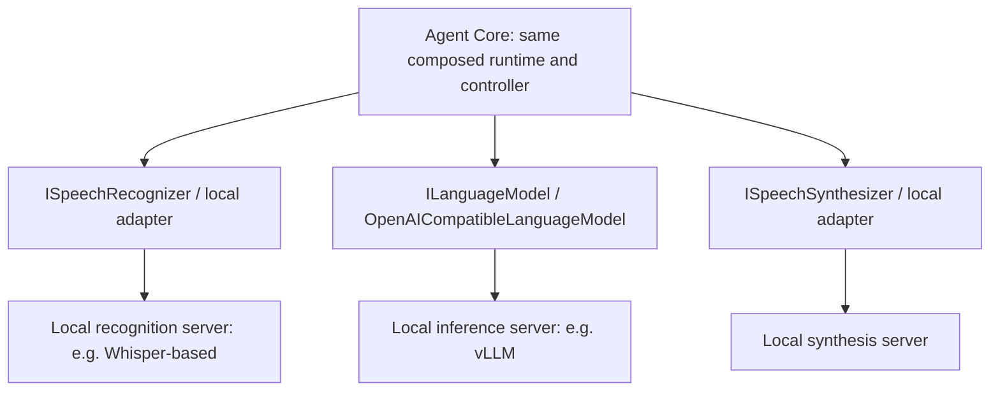

# Observability and Operations

## Latency model

Treat perceived voice latency as independent stages: speech detection + STT partial/final latency + Interaction Controller latency + LLM first-token latency + speech-segmentation delay + TTS first-audio latency + transport/buffering + browser playback. Streaming overlaps parts of this chain; the measured critical path, not a naive sum of overlapping spans, explains the user's wait. Capture each stage to find the bottleneck instead of reporting voice latency as one number.

## Latency instrumentation

Conversation latency is a product feature. Use Application ActivitySource `AgentCore.Runtime` and Meter `AgentCore.Runtime`, ASP.NET Core/HttpClient OpenTelemetry instrumentation, structured Microsoft.Extensions.Logging, and optional OTLP export. Capture server DateTimeOffset for correlation and TimeProvider monotonic timestamps for local durations. Browser uses performance.now() for durations and UTC timestamps only for approximate cross-device correlation. Never subtract unsynchronized browser/server wall clocks and report the result as precise network latency.

| Milestone/event | Capture location | Useful measurement |
| --- | --- | --- |
| speech detected | Browser VAD, plus server ingress receipt | Local speech→duck, ingress→candidate |
| first STT partial transcript | STT pump before mailbox admission | Speech boundary→partial (server observed) |
| final transcript | STT pump and mailbox processing | Final→model request / mailbox delay |
| interruption candidate / confirmed decision | Controller transition | Candidate→decision |
| model request start / first token | Adapter send and first normalized delta | Request→first token |
| first speakable segment | Application SpeechSegmenter release with responseId/segmentIndex | First buffered text→segment release; separate from provider latency |
| TTS start / first TTS audio | Adapter segment request / first PCM | Speakable text→first audio |
| audio sent | Binary output sender at actual send | First TTS audio→send; send→playback ack upper bound |
| client playback start | Worklet consumed first sample, reported ack | Local audio receipt→playback; server first-send→ack is an upper bound including RTT |
| cancel requested | Runtime after supersession mark | Decision→cancellation request |
| playback stopped | Worklet flush acknowledgement | Browser stop receipt→actual stop |
| response completed | Runtime terminal after delivery/save | End-to-end server-observed response lifetime |

Trace spans: session attach, user turn, brain decision, model generation, each TTS segment, interruption, persistence write. Long voice calls should not require one unbounded trace; link per-turn activities by correlation ID. Metrics: histograms for the durations above, mailbox wait, input/output queue depth, active sessions, discarded stale chunks, interruptions by decision, normalized failures, reconnect count and underruns. Pause counters `session.auto_paused` and `session.pause_reason` use only the canonical pause-reason enum (`manual|inactivity|silentEvaluation|initiative|disconnected|recovered|persistence|other`) as a `reason` tag. Speech counters `speech.partial.count` and `speech.playback.complete` have no content tags. Histograms `speech.final.latency`, `speech.segment.latency`, and `speech.playback.start.latency` are untagged milliseconds. Counter `speech.cancel.reason` uses only `reason=userStop|userBargeIn|newText|userSteer|disconnected|modeChange|ended|deactivated|other`. Counter `speech.error.code` uses a bounded error-code tag (no transcript, PCM, secrets, or vendor bodies). Counter `agent.progress.event` tags only `kind` (`preparing|readingAttachments|runningTool|waitingExternal|finalizing|other`) and `state` (`started|updated|completed|failed|other`). Histogram `agent.progress.active_ms` is milliseconds tagged only with `kind`. Progress instruments never tag message text, operation IDs, tool arguments, reasoning, or attachment content. Do not log native structured JSON, compatibility marker payloads, or speech text. User-text counters `user_text.behavior` and `user_text.queued` use only `behavior=queue|interrupt`. Histogram `user_text.pending_batch_size` records the clamped suffix length `1..8` with no labels when a pending batch starts; counter `user_text.pending_batch_started` has no tags. Response-stop counters `response.cancel.requested` and `response.cancel.stale` have no high-cardinality tags. Use provider alias, decision and error code as low-cardinality metric tags; sessionId/eventId/responseId belong in traces/logs, not metric labels.

Application code records those histograms on `ActivitySource`/`Meter` `AgentCore.Runtime`. Observed synthetic 20-turn numbers live in [Milestone 12 demo verification](reports/m12-demo-verification.md); they are measurements, not SLAs. Compose SQLite volume survival and the owner-capability path are covered by `scripts/compose-sqlite-volume.sh` (also run on Ubuntu in [GitHub Actions](../../.github/workflows/synthetic.yml)) and [MVP handoff](reports/m12-mvp-handoff.md).

## Admin lifecycle observability (observed, P7)

Admin routes under `/api/v2/admin` require the same trusted-local **owner capability** as other destructive catalog operations (`X-AgentCore-Owner-Capability` from `POST /api/v1/local/owner-capability` in Synthetic/Compose). Denied or missing capability fails closed with 401; trusted-local restrictions apply before any durable Admin mutation.

Logging and projections for Admin must stay redacted: never log owner-capability tokens, draft or resource bytes, persona JSON payloads, learned-memory content, evaluation prompts or results, provider secrets, or raw `PreparedActionJson`/evidence from durable work. Append-only `AdminEvents` and HTTP list/detail responses carry only allowlisted summary metadata (definition/instance/version/revision identifiers, bounded section names, fingerprints). See [P7G report](reports/p7g-history-rollback-final-gate.md) and [Testing Strategy](16-testing-strategy.md).

There is no separate Admin metrics namespace yet; treat Admin like other HTTP surfaces (ASP.NET request logging, bounded error codes). If Admin-specific **counters or histograms** are added later, tag only bounded low-cardinality values such as `operation`, `outcome`, and resource **kind** (never instance/definition UUIDs, operation ids, or summary JSON bodies). **Traces and structured logs** may include safe resource ids for correlation, consistent with the latency-instrumentation rule that session/event/response ids belong in traces/logs, not metric labels. **Spans** follow the same split: bounded tags on metrics; richer attributes on trace activities only.

**Compose and browser verification:** default Synthetic Compose smoke (`scripts/compose-sqlite-volume.sh`) proves SQLite volume survival for legacy sessions, catalog, redacted Background Work APIs, and an owner-protected Admin fork/publish/managed-instance/managed-session path with safe `AdminEvents` list redaction across container recreate. The P7 whole-phase Admin journey (resources, evaluations, full §8 steps) still runs in Playwright with a **disposable** SQLite file (`PLAYWRIGHT_SQLITE_PATH`, isolated `admin-lifecycle` project in CI). The later Admin authoring journey uses a separate `p76-admin` project and `data/playwright/p76-admin.db`, also deleted before that CI step. Compose also uploads/binds a draft knowledge resource, publishes, and verifies publication resource metadata survives recreate; managed-session `/agent` resource read is checked before recreate ([P7G report](reports/p7g-history-rollback-final-gate.md)).

`DiagnosticId` names one failure occurrence and may be shown or copied. `CorrelationId` remains the logical operation or turn. `TraceId` is copied only from a real `Activity.Current` and is omitted when none exists. Unexpected catches log the exception object with a `DiagnosticLog` record. Present allowlisted fields sit on that record: `DiagnosticId`, `CorrelationId`, `TraceId`, `SessionId`, `ResponseId`, `AgentInstanceId`, `TriggerRegistrationId`, `TriggerOccurrenceId`, `WorkItemId`, `ErrorCategory`, `ErrorCode`, `ProviderAlias`, `FailureReason`, and `ProviderResponseChannel`. Absent fields are omitted. Conversation and model failures include `AgentInstanceId` and `ProviderAlias` when the pinned session already has them. Provider `InvalidResponse` failures may also include bounded `FailureReason` and `ProviderResponseChannel` on the same `DiagnosticLog` line. Those values name the violated contract, not raw model output. `outputLimit` and `toolCallTruncated` are part of that allowlist. The same tokens may appear on the history failure reference. Those identifiers are not metric labels. A terminal session-end persistence failure publishes `Session` / `SessionPersistenceUnavailable` / `Persistent save failed.` and keeps the exception object on that log line. Expired-claim recovery still assigns one `DiagnosticId` inside the store. `RecoverExpiredClaimsAsync` returns the recovered count and the newly terminal failures. `DurableReminderExecutor` logs those failures with the stored id. It does not mint another. `Observability:OtlpEnabled` still does not attach an exporter.

Scheduling stays domain-owned for registration, schedule semantics, admission, work, approval, and execution. Infrastructure owns waking, persistence, and dispatch through `BackgroundService`, SQLite, one process, and a 1-second cadence. Missed recurrence still coalesces to the latest due occurrence. `CoalesceLatest`, `SkipMissed`, `CatchUp`, Hangfire, and Quartz stay deferred.

Structured log fields where relevant: sessionId, eventId, responseId, provider (logical alias), durationMs, decision, attachmentId, errorCode. Do not log raw audio, API keys, AdditionalHeaders or complete conversations by default. Debug transcript/content logging is explicit local opt-in with a bounded timeline, never an accidental production default. Redact provider URL query strings and failure bodies. OpenAI-compatible non-2xx responses log status, model, phase, and a bounded sanitized provider error code, type, and message; `llm.request` records model, provider, call number, message and tool-result counts, image presence and byte size, structured output, and HTTP status without prompt or image bytes. Browser receives user-safe messages only. Content-free compaction counters on `dropped_items` are `compaction_rejected`, `compaction_cancelled`, and `compaction_stale`. Structured-memory admission, conflict, capacity, and cross-session policy denials use `memory_rejected`. Successful session-memory prompt loads record `memory_retrieval` with result `included` or `empty`. These counters carry no summary, memory, or conversation text. `SessionRuntime` records counter `agent_steps` when a terminal Agent Step is accepted or rejected. Tags are `outcome` (`accepted` or `rejected`), `disposition` (the disposition name or `none`), `action` (`chat.respond` or `none`), `rejection` (`none`, `unknownDisposition`, `unknownAction`, `malformedPayload`, or `modelSuppliedDestination`), and `executed` (`chat` or `none`). The matching log line carries session id, response id, disposition, action, and rejection category. It does not include display text, speech, reasoning, or a diagnostic id as a metric label. Observed `stage_duration_ms` stages also include `extraction`, `workspace`, `tools`, `sandbox`, `initiative`, `initiative_eval`, `initiative_disposition`, `cleanup`, `speech.partial.count`, `speech.final.latency`, `speech.segment.latency`, `speech.playback.start.latency`, `speech.playback.complete`, `speech.cancel.reason`, `speech.error.code`, `agent.progress.event`, `agent.progress.active_ms`, and `agent.step.terminal`. `agent.step.terminal` is the time from accepting the Chat action to successful response completion. It carries no display text. Timeline details for progress are `kind:state` or `kind` only. `speech.input.transport` / `speech.output.transport` and compact capability flags remain metadata only. `initiative_eval` and `initiative_disposition` timeline entries always carry compact JSON (`triggerEventId`, evaluated/reasonCode, admitted/blockReason, silence/counters; no planner note or transcript text). Optional `reasonDetail` appears only when debug content logging is enabled. Other tool/sandbox details are names only and are omitted from the default timeline unless debug content logging is enabled.

## P7.5 observability audit (observed)

The add rows are recorded by `OperationalDiagnostics`. Metric tags stay bounded (`phase`, `reason`, `state`, `outcome`, `scope`, `result`, `operation`). Definition ids, instance ids, catalog keys, and provider aliases stay in the diagnostic timeline, not on metric labels. Those records do not include tool arguments, approval grants, memory text, summary text, or payload bytes. `IncludesConversationContent` stays opt-in. `GET /health` is the readiness response: it returns `status`, `profile`, and `protocolVersion` only after persistence initialization. Instruments are the BCL `ActivitySource` and `Meter` named `AgentCore.Runtime`. No OpenTelemetry package is referenced. `Observability:OtlpEnabled` defaults to false; when true, startup requires an absolute `OtlpEndpoint`, and the flag still does not attach an exporter. A later host can listen to the existing meter and activity source without changing call sites, and local or Synthetic runs do not require a collector.

| Area | Decision | Evidence |
| --- | --- | --- |
| Model and provider calls | Keep and add | `PumpModelAsync` starts an activity span named `model`. It records stage `llm` and a presence-only `llm.reasoning.delta`. Nothing calls `RuntimeTelemetry.Record("model")`. The activity span is the model-duration evidence, so this row does not add a `stage_duration_ms` sample named `model`. `OpenAICompatibleLanguageModel.RecordRequest` records `llm.request` with default model, adapter, call number, response id, counts, and HTTP status. `HandleModelSelectionAsync` records `model.selection` with result `selected`. The timeline detail carries the catalog key and provider alias after `SafeLogRedactor`. The method does not write those values to the application log. `HandleSemanticReadyAsync` records `agent_steps` with bounded outcome, disposition, action, rejection, and executed tags. Active Skill procedures record `active_skills` with a count tag of 0–4 and do not log procedure text. `skill_loads` and `application_messages` record an `outcome` tag only (`admitted`, `denied`, `duplicate`, `stale`, `over_budget`, and the other small admission outcomes). They do not label message text, procedure text, or raw Skill ids. |
| Session, response, and conversation execution | Keep | Attach records stage `attach`. The controller and persist paths record `controller` and `persist`. `TerminalizeActiveResponseAsync` logs session id, response id, and reason. `ConversationExecutionHostedService` logs the dispatched turn count when it is greater than zero. |
| Queue | Keep | `UserTextQueueTelemetry.Record` covers queued and immediate user text. `RecordPendingBatchStarted` covers a pending batch. |
| Steer and interrupt | Keep | Text steer calls `TerminalizeActiveResponseAsync` with `userSteer`. `SpeechTelemetry.RecordCancel` keeps `userSteer` as its own reason. Voice barge-in uses `userBargeIn`. |
| Detach | Add | `HandleDetachAsync` records `SessionPauseTelemetry` `"disconnected"` only when it applies a new pause. The ended-or-ending return, the transport-only return (including auto when accepted conversation work exists), and the already-paused return record `session.detach` with a phase and reason. |
| Reattach | Add | A successful attach records stage `attach` with elapsed time only, including a paused session that does not require explicit resume. A deadline expiry and an explicit-resume refusal return before that record. The success record adds `session.attach` phase `cold` or `resumed`. Those two refusals record phase `refused` with reason `deadline` or `explicitResume`. |
| Tool calls | Keep | Stage `tools` records the tool name. Web, email, and sandbox handlers record their own stages. |
| Approvals | Add | `SessionRuntime.Approval.cs` records `approval.outcome` and `approval.wait_ms` with state and reason. It does not log the grant or argument payload. |
| Sandbox | Keep | `SessionToolExecutor` records stage `sandbox` with the verb. |
| Compaction | Keep and add | Rejected, cancelled, and stale compaction call `RecordDropped`. `HandleCompactionReturned` records `compaction.outcome` `accepted` before persist. The detail is the word `accepted` and does not include summary text. |
| Memory mutation | Keep and add | `SessionMemoryPrompt` records `memory_retrieval` as `included` or `empty`. `StructuredMemoryService` records only `memory_rejected` on admission failure. A mutation that passes admission records `memory.mutation` with scope and result. It does not log memory text. |
| Definition, version, and instance resolution | Add | `AdminReadService.GetEffectiveConfigurationAsync` records `admin.operation` `resolve`. The timeline detail carries definition id, version, instance id, and state. Those ids are not metric labels. |
| Draft, publish, rollback, and deprecation | Add | `AgentDefinitionLifecycleService`, `AgentDefinitionDraftPublishService`, and `AdminAgentInstanceService` record `admin.operation` and `admin.operation_ms` with operation, outcome, and reason. The timeline detail carries ids and state. It does not include draft bytes, persona JSON, or memory text. |
| Trigger registration, occurrence, and scheduler lag | Keep | `RecordTriggerRegistration`, `RecordTriggerScheduler`, and `RecordTriggerDueLag` already cover this area. |
| WorkItem lifecycle | Keep | `DurableWorkIntake` records `skipped`, `accepted`, and `existing`. `DurableReminderExecutor` records `completed`, `waiting`, `cancelled`, `retry`, and `failed`. |
| Policy denials | Keep and add | Trigger registration records `authorization_denied`, `forbidden`, and `policy`. The interactive `ToolPolicyDecision.Deny` branch records `tool.denial` reason `forbidden` and the tool name. It does not log arguments. |
| Bounded resource failures | Keep and add | Mailbox pressure records `mailbox`. Cancelled tool execution records `tools`. Audio overflow records `audio`. `AttachmentStreamIntake` records `resource.limit` `attachmentItem` or `attachmentSession` before the 25 MiB and 250 MiB throws. `WorkspaceEndpoints` records `workspaceContentLength` or `workspaceStream` before `WorkspaceQuotaExceeded`, ahead of `WriteWorkspaceAsync`. `FileSessionWorkspace` records `workspaceStore` before the same error. `SqliteArtifactStore` and `InMemoryArtifactStore` record `artifactItem` or `artifactSession` before `ArtifactQuotaExceeded`. `InMemoryArtifactStore` is the artifact store when the persistence provider is not Sqlite. Those reason codes do not include payload bytes. |
| Health and readiness | Keep | `GET /health` returns `status`, `profile`, and `protocolVersion` after persistence initialization. That is the readiness response for native, Compose, and CI. Do not add a second health service or an exported collector. |

## MVP optimization targets (not SLAs)

- Local speech detection→gain duck: <=50 ms on a reference desktop browser.
- Server receipt of speech evidence→interruption candidate: <=100 ms; browser speech detection→server candidate aim <=250 ms on local/demo networking, measured with clock uncertainty disclosed.
- Controller explicit-stop decision→stop command queued: <=25 ms.
- Browser receipt of stop→worklet stopped: <=50 ms.
- Browser receipt of first PCM→playback: approximately 60–120 ms with the default prebuffer.
- Final transcript→first model delta and speakable text→first TTS audio: record p50/p95 per provider/profile; initial demo aims below 1 second each, explicitly provider-dependent.

Collect a reproducible 20-turn demo run, report sample size, provider/profile, device, browser, network conditions and percentile values. Do not claim universal guarantees. Optimize queueing/cancellation before increasing model complexity.

## Running after implementation

The preferred fast developer loop requires no Docker: ASP.NET backend on localhost:5080 and Vite on localhost:5173 with HTTP/WebSocket proxy. Run native .NET and Vite processes for fast startup, direct debugging, hot reload and no container rebuilds. Milestone 1 uses in-memory persistence (`Persistence:Provider=InMemory`); select SQLite when Milestone 11 exists. Provider profile and storage selection are independent.

```text
dotnet run --project src/AgentCore.Api --launch-profile http
cd web
pnpm install --frozen-lockfile
pnpm run dev
```

MessagePack stays the realtime default. To inspect JSON frames in DevTools, configure the diagnostic transport for the **Vite** process, not the ASP.NET API. Vite reads `VITE_AGENTCORE_REALTIME_PROTOCOL` from `web/` env files or the shell that starts `pnpm dev`. The repo-root `.env` used for Compose interpolation and optional `source .env` for native .NET does **not** configure native Vite. Restart the Vite dev server after changing the variable; a browser refresh alone is not enough if Vite was already running. Changing it on the API process or a running container after the SPA is built does not switch the browser.

```bash
cd web
VITE_AGENTCORE_REALTIME_PROTOCOL=json pnpm dev
```

The same assignment can live in gitignored `web/.env.local` (see `web/.env.example`). Default `docker compose build` leaves the variable unset, so the image stays MessagePack. A JSON diagnostic image passes it during the frontend build, then runs the container:

```bash
docker compose build --build-arg VITE_AGENTCORE_REALTIME_PROTOCOL=json
docker compose up
```

Durable trigger telemetry on meter `AgentCore.Runtime` is `trigger_scheduler_events`, `trigger_registration_events`, and `trigger_due_lag_ms`. Durable work adds `work_events` with one `outcome` tag (`accepted`, `existing`, `skipped`, `completed`, `failed`, `retry`, `waiting`, `cancelled`). Do not log schedule intent, occurrence evidence, result text, prepared action JSON, or secrets. `GET /health` confirms Synthetic boot (`{"status":"healthy","profile":"Synthetic","protocolVersion":1}`). Open http://127.0.0.1:5173, start a conversation, and send text over `/hubs/session`. Voice click preflights capture, then streams PCM after Mode=voice. In voice mode, streamed assistant text is segmented and played through the output AudioWorklet (not an HTML audio element); microphone capture remains active during playback. Mute stops PCM only; End or disconnect releases capture, recognition and synthesis. Saying Wait (or sending a new turn) supersedes live playback after a worklet flush. Idle and environment initiative stay in-process (`IEnvironmentEventIngress`); there is no public arbitrary-event inject endpoint. Playwright: `cd web && CI=1 pnpm exec playwright test` (text pending-voice, fake-device capture, playback while capture stays active, duplex mute/disconnect, voice interrupt). Kestrel JavaScript protocol fixtures run under `dotnet test`. The synthetic STT/TTS scripts emit deterministic transcripts and PCM; use Real with independently configured streaming STT/TTS and OpenRouter text with a **fixed** `DefaultModel` for actual microphone transcription and speech. `openrouter/free` is for opt-in adapter smoke only. Supply `OPENROUTER_API_KEY` and, when live speech is wanted, `OPENAI_API_KEY` from environment or `dotnet user-secrets`. Opt-in OpenAI TTS uses `AGENTCORE_LIVE_OPENAI_TTS=1`. [Configuration](15-persistence-and-configuration.md) defines all profile overrides. Default test commands remain Synthetic and must not require these keys.

```text
dotnet test
cd web
pnpm install --frozen-lockfile
pnpm run test --run
pnpm run build
pnpm exec playwright test
```

Demo/production-like packaging: Vite builds static SPA into web/dist; the Dockerfile publish stage copies it to Api wwwroot; ASP.NET serves SPA/static assets, REST and SignalR in one process. Route SPA fallback only for browser paths, never swallow /api, /hubs, /health or OpenAPI errors. Compose mounts a persistent SQLite volume at `/data`. Kubernetes is unnecessary.

Bind loopback for local demos. For shared demo hosting use HTTPS with WebSocket upgrade forwarding, a single backend instance and a persistent SQLite volume. Do not horizontally replicate SessionManager against the same SQLite file. During shutdown the host stops admitting new sessions, interrupts live responses, detaches runtimes, and waits up to five seconds for mailbox drain. If process termination prevents a clean save, crash recovery semantics apply.

Back up SQLite using `SqliteMemoryStore.BackupToAsync` (SQLite backup API) or a copy taken while the process is stopped. Copying only the main file while WAL/`-wal`/`-shm` companions are active is not a reliable backup. Apply schema at startup (`EnsureCreated` for this MVP initial schema; treat it as the first migration) before serving traffic; fail startup on schema error. Test a restore before a demo that needs durable history. Native development can keep `Persistence__Provider=InMemory` or set `Persistence__Provider=Sqlite` with `Persistence__ConnectionString=Data Source=data/agent-core.db`.

## Docker Compose integration and demo

Docker Compose is the supported reproducible local integration/demo environment, while Docker remains optional for ordinary development. Native `dotnet run` + Vite remains the fast loop. `docker compose up --build` starts one Synthetic application container (built SPA, SQLite and definition resource blobs on volume `agent-core-data` via `Persistence__DefinitionResourceRoot=/data/definition-resources`, no provider keys) on http://127.0.0.1:5080. The image runs as the Microsoft runtime `app` user (`USER $APP_UID`); `/data` and `/app/data` are owned by that user. A volume created by an older root image needs ownership `1654:1654` (or a one-time `docker compose down -v`) before SQLite can open. Building/pulling container dependencies may require network even though synthetic runtime behavior does not. `docker compose down` keeps the volume; `docker compose down -v` destroys it. Volume survival plus the frontend owner-capability path (`POST /api/v1/local/owner-capability` → `X-AgentCore-Owner-Capability` → `POST /api/v2/sessions` → catalog GET) is `scripts/compose-sqlite-volume.sh`. Keep host publish on `127.0.0.1`; Compose sets `Hosting__TrustPublishedPortGateway=true` so Docker published-port NAT (the container default gateway) is trusted without opening private IP ranges.

```text
docker compose up --build
curl -sS http://127.0.0.1:5080/health
./scripts/compose-sqlite-volume.sh
```

Real/hosted Compose is the same `agent-core` service and image with `docker-compose.real.yml` overlaid. It does not replace the default file: `docker compose up` stays Synthetic and key-free so CI and local smoke need no credentials. Use two `-f` flags so Compose does not also load an unrelated override file:

```text
# once: cp .env.example .env  && edit OPENROUTER_API_KEY (optional: BRAVE_SEARCH_API_KEY, GMAIL_* for Real web/email)
docker compose -f docker-compose.yml -f docker-compose.real.yml up --build
curl -sS http://127.0.0.1:5080/health
```

`/health` reports `"profile":"Real"`. Compose interpolates a gitignored root `.env` (copy from `.env.example`) or the same variables from the host environment. Do not commit `.env`. Never put secrets in the Compose files. `OPENROUTER_API_KEY` is required to start the Real overlay. `AGENTCORE_LLM_MODEL` defaults to `deepseek/deepseek-v4.1-flash` as a **local development and demo** default (text + tools + reasoning; not a production recommendation). The Real model catalog also offers `openai/gpt-4o-mini-2024-07-18` and `openrouter/free` as explicit session choices. When `AGENTCORE_LLM_MODEL` matches a catalog `ModelId`, the factory retargets `DefaultKey` to that entry; it does not rewrite the DeepSeek catalog identity. Add a catalog entry for ModelIds that are not listed. Do not set `AGENTCORE_LLM_MODEL` to `openrouter/free`. OpenRouter free and low-cost endpoints are rate-limited. Optional `AGENTCORE_LLM_REASONING_EFFORT` (default `medium`) maps to the adapter `reasoning_effort` field when the selected model supports it. Pair capability overrides with the model: `AGENTCORE_LLM_TOOLS` defaults to `true`; `AGENTCORE_LLM_VISION` defaults to `false` (set `true` only with a vision-capable override such as `deepseek/deepseek-v4.1-flash` or `deepseek/deepseek-v4-flash-vision-exp`). Stop with the same files: `docker compose -f docker-compose.yml -f docker-compose.real.yml down`. Synthetic and Real share volume `agent-core-data`. `.env` is not an application `IConfiguration` source; native `dotnet run` does not load it unless you export those variables into the process environment.

The overlay matches the native `http-openrouter` launch profile: hosted OpenRouter text and tools (`Adapter=OpenAICompatible`, `Vision=false`, `Tools=true` for the pinned model), with `Persistence__Provider=Sqlite` and `Persistence__ConnectionString=Data Source=data/agent-core.db` so local Real runs survive process restarts like Compose Real. Compose reads `AGENTCORE_LLM_VISION` and `AGENTCORE_LLM_TOOLS` alongside `AGENTCORE_LLM_MODEL`. Default Compose `Providers.Speech` remains Synthetic, so voice-enabled agents stay `voiceAvailable` from structurally resolvable Synthetic paths. Native or overlay env can select OpenAI TTS or `OpenAICompatibleBatch` when a backend `OPENAI_API_KEY` is present; Recognition Adapter=`OpenAI` stays unselectable. Selecting those hosted names without a key advertises `voiceAvailable: false`. Real Compose does not by itself opt into live HTTP speech tests. Native processes can pass the same text environment without Compose:

```text
AgentCore__Profile=Real
Providers__LanguageModels__primary-llm__Adapter=OpenAICompatible
Providers__LanguageModels__primary-llm__BaseUrl=https://openrouter.ai/api/v1/
Providers__LanguageModels__primary-llm__DefaultModel=deepseek/deepseek-v4.1-flash
Providers__LanguageModels__primary-llm__ReasoningEffort=medium
Providers__LanguageModels__primary-llm__ReasoningObjectWire=true
Providers__LanguageModels__primary-llm__ExcludeVisibleReasoning=true
Providers__LanguageModels__primary-llm__Vision=false
Providers__LanguageModels__primary-llm__Tools=true
OPENROUTER_API_KEY=<backend-secret>
```

Speech adapter overrides remain in [Configuration](15-persistence-and-configuration.md#hosted-and-on-prem-provider-configurations); they do not change Real Compose until DI selects them.

Default `docker compose` smoke stays Synthetic/scripted and key-free. Hybrid/on-prem keeps the same `agent-core` service and points STT/LLM/TTS BaseUrl values at local inference processes.

```text
Docker Compose
└── agent-core (one application container)
    ├── ASP.NET Core API + SignalR
    ├── built React SPA served as static assets
    └── SQLite file in a mounted persistent volume

Hosted services outside Compose:
OpenRouter text (selected by docker-compose.real.yml)
OpenAI STT · OpenAI TTS (optional; OpenAI TTS is selectable when Synthesis Adapter=`OpenAI` and a backend key is present; hosted STT is `OpenAICompatibleBatch` with no interims; OpenAI realtime STT remains deferred and unselectable. Live HTTP stays opt-in.)
```

Do not split frontend and backend into separate production runtime containers. Vite is a build stage in this artifact, not a production server. The SQLite volume must survive application container recreation; the container's writable layer is not durable storage. Compose should expose the application locally, pass backend configuration/secrets, and use /health for readiness. No additional reverse proxy, Redis, broker, service mesh or Kubernetes is required.

Future Compose topologies may add `local-stt`, `local-llm` and `local-tts` services beside `agent-core`. Hybrid mode enables only the desired local capabilities; fully on-prem mode uses all three local services. These are inference services at the Infrastructure boundary, not a redesign into Agent Core microservices. SQLite may later be replaced by PostgreSQL through the existing persistence boundary without changing the one-application-container philosophy.

**Invariants:** Provider location is an infrastructure concern. Hosted, hybrid and on-prem provider topologies must not change core Agent Runtime semantics. Docker is an orchestration/deployment tool, not an architectural dependency of Agent Core. Day-to-day source control is the local `git` CLI. Intended repository CI is GitHub Actions after project scripts exist.

## Hosted, hybrid and on-prem deployment

The same composed Session Runtime and Interaction Controller support all three topologies:

| Deployment | Speech Recognizer / STT | Text Language Model via compatible adapter | Speech Synthesizer / TTS |
| --- | --- | --- | --- |
| Hosted (observed selectable) | `OpenAICompatibleBatch` (no partials); OpenAI realtime STT still unselectable | OpenRouter hosted gateway | OpenAI TTS when Adapter=`OpenAI` plus key |
| Hybrid | Local STT | OpenRouter or other hosted endpoint | Local TTS |
| Future fully on-prem | Local STT | Local OpenAI-compatible inference server | Local TTS |


```mermaid
flowchart TD
    Core[Agent Core: same composed runtime and controller] --> STT[ISpeechRecognizer / local adapter]
    Core --> LLM[ILanguageModel / OpenAICompatibleLanguageModel]
    Core --> TTS[ISpeechSynthesizer / local adapter]
    STT --> SR[Local recognition server: e.g. Whisper-based]
    LLM --> LM[Local inference server: e.g. vLLM]
    TTS --> SS[Local synthesis server]
```

Specific local projects are examples, not mandatory dependencies. Inference processes may live on the same machine or private network; that does not split Agent Core into application microservices. Replace the text endpoint/model configuration and independently select local speech adapters. No Agent Runtime/Interaction Controller rewrite is required. OpenRouter is not on-prem; a fully local deployment must avoid hosted provider calls and disable external telemetry export, while using locally available model assets. Validate model licenses, hardware capacity, streaming support and latency when choosing actual local providers; no GPU provisioning or inference-server implementation is part of this docs task.

[Configuration](15-persistence-and-configuration.md#hosted-and-on-prem-provider-configurations) owns concrete endpoint overrides. Native speech-to-speech is not required to achieve hosted, hybrid or fully on-prem deployment.

## P9 visible browser (observed)

CI sets `Browser__Headless=true` and does not set one shared `FixturePort` on the job. It builds the Infrastructure test project and runs `pwsh tests/AgentCore.Infrastructure.Tests/bin/Debug/net10.0/playwright.ps1 install --with-deps chromium` before infrastructure tests that launch Chromium. The JavaScript Playwright install does not satisfy the .NET driver. The Compose image does not install Chromium. Diagnostics do not log argument values, page text, cookies, storage, or raw Playwright errors. A missing browser binary logs the static line `Browser provider is unavailable.`

## Security and public-service boundary

Authentication is deferred. Session IDs are high-entropy local/demo bearer references; possession allows viewing/ending that session. Keep them out of public links and frontend analytics. Provider secrets exist only on the backend. Same-origin production serving is preferred; development uses a Vite proxy or narrowly allowed origins.

**Planned until verified:** trusted-local owner capability ([R1](10-technology-decisions.md#decision-trusted-local-owner-capability-r1)) is still not public multi-user authentication. Do not log raw attachment content, secrets, or full conversation unless explicit development content logging is enabled. Attachment/workspace/artifact bytes are application data, not `local/` scratch. Workspace files live under `data/workspaces/` (never `local/tdp-workspace`).

Before exposing a production multi-user service, add authenticated identity, explicit per-user session authorization on every HTTP/hub/audio operation, session-token handling/rotation, origin validation, abuse/rate limits, storage retention/deletion policy and operational secret management. These are deployment prerequisites for that future scope, not an OAuth implementation in this MVP. CORS is not authentication.

Recoverable provider failures leave a safe partial conversation entry and permit an explicit new turn. Connection loss stops playback immediately and follows the reconnect snapshot flow. Storage corruption or repeated concurrency conflict is a fatal session error and should require operator review, not a misleading automatic retry loop. [Protocol](14-api-and-realtime-protocol.md#error-policy) owns browser error taxonomy.
