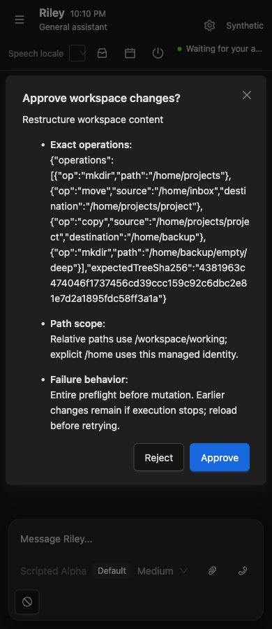
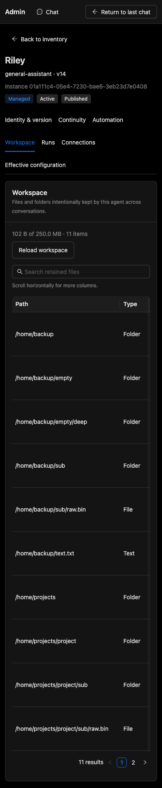

# Bounded workspace filesystem verification

Status: local implementation verified through storage, API/tool integration and live Synthetic browser workflows; broader frontend/browser/Compose and hosted gates are in progress. The original Agent Workspace freeze on `b21484d4` remains historical and unchanged. This follow-on does not open P10/P11.

## Implementation

The shared pure Application `WorkspaceTreePlanner` preflights a complete ordered virtual tree. Existing `ISessionWorkspace` and `IAgentInstanceWorkspaceStore` adapters retain their distinct physical scratch and logical SQLite/InMemory metadata + immutable blob storage. Mutable conversation state remains in the Session Runtime mailbox. No shell wrapper or new runtime is introduced.

Native `mkdir`, `copy`, tree-aware `move`, `delete` and `batch` complement list/read/write/patch/search. Empty folders and parents are meaningful persisted directory entries. Copy preserves exact binary/text bytes and empty descendants; move includes rename. Neither merges nor overwrites. Structural operations remain in one scope; retain/checkout remain the intentional file copy boundaries between scratch and managed home. Scratch content edits still use write/patch, and durable file replacement still uses revision/hash-guarded retain.

Batches accept 1–16 concrete mkdir/copy/move/delete operations within 16 KiB. The full ordered sequence validates source/destination, dependencies, collisions, recursive intent, cycles and cumulative quota before mutation. Unexpected failures stop execution and report completed/failed/notExecuted outcomes, failure index and possibly changed state. Earlier changes remain; there is no batch rollback promise. Incomplete outcome counts describe the plan. Each home operation commits metadata transactionally; the whole batch does not.

Paths are portable/bounded (512 characters, eight segments), tree scans are bounded to 8192 entries, and mutation glob/traversal/protected-root/symlink paths are denied. Scratch guards every physical child/ancestor; home preflights every referenced blob and verifies copied content integrity. Existing owner/lifecycle and execution-time role policies remain authoritative. No model argument chooses an owner, host path or physical root.

Read/list/write/patch/structure serialize through the Session filesystem gate. Home structure/retain/delete serialize through its owner gate and lifecycle exclusion. Directory projection and its token share lifecycle exclusion and read all bounded metadata pages; a large first folder cannot hide later root entries. Whole-tree `expectedTreeSha256` prevents stale or concurrently changed durable plans, including retain. mkdir is ReplaySafe; copy/move/delete/batch are NonReplayable. Delete and every batch use the normal exact-action destructive approval boundary. Copy quotas are cumulative; move adds no file bytes, delete frees later capacity, folders consume entries and zero bytes. Existing 50 MiB/file, 250 MiB/home, 4096-file and 250 MiB scratch bounds remain.

`general-assistant` v14 exposes the new vocabulary and retains the global 32-tool bound by omitting the inline `artifacts.create` capability. File-based Artifact publication remains available; older definitions stay immutable. Automatic approval review rejected the initial proposal to increase that global bound; the final implementation keeps it unchanged.

## Checks and observed workflows

| Check | Result |
| --- | --- |
| Focused storage: `dotnet test tests/AgentCore.Infrastructure.Tests/AgentCore.Infrastructure.Tests.csproj --filter 'FullyQualifiedName~WorkspaceStructureTests\|FullyQualifiedName~AgentWorkspaceStoreTests\|FullyQualifiedName~FileSessionWorkspaceTests' --nologo` | Final focused storage gate 27/27 passed, including recursive linked blobs and teardown serialization. |
| Full backend: `dotnet test AgentCore.sln --nologo` | Domain 145 passed; Application 1267 passed/1 opt-in skip; Infrastructure 762 passed/15 optional skips; API 377 passed/2 opt-in skips; OrderEvents 4 passed. No failures. |
| API/tool journey: `dotnet test tests/AgentCore.Api.Tests/AgentCore.Api.Tests.csproj --filter FullyQualifiedName~AgentWorkspaceJourneyTests --nologo` | Final 5/5 passed: retain/reuse/Artifact/archive; compatibility/owner rejection; host recreation; exact approval/generation/scope/archive structure; paged folder discovery and exact 270-file tree copy. |
| Affected Synthetic browser: `pnpm exec playwright test e2e/workspace-filesystem.spec.ts --project=synthetic` | Scratch and home journeys 2/2 passed. Rejection left sources unchanged; approval completed four ordered steps; complete-tree binary copies and empty-folder metadata matched; explicit recursive deletion removed only backup. A first assertion exposed PascalCase result output; the implementation now returns camelCase and rerun passed. |
| Playwright MCP on disposable native Synthetic SQLite/Vite hosts at 5210/5310 | Visible normal approval completed all four steps; copied content matched exactly; Admin folders visible and download disabled; non-empty owner deletion returned Conflict without removing content; empty-folder confirmed deletion succeeded. |
| MCP presentation | Approval at 1440/390 and Admin at 1440/768/390 had no document overflow. Dialog content did not overflow its container. Screenshots inspected. Console had no product errors during approval/copy; one expected HTTP409 appeared for deliberately rejected non-empty deletion. |
| Frontend build | Passed; existing bundle-size warning only. |
| Full frontend unit gate: `pnpm run test --run --maxWorkers=1` | 703/703 passed in 94 files (Node 22). |
| Broad Synthetic browser and acceptance gates | In progress. |
| Compose/recreation | In progress; gate now asserts explicit retained parent directory metadata and tree token as well as exact bytes after recreation. |
| Hosted exact-candidate workflow | Pending publication. |

Storage scenarios cover nested/idempotent mkdir and file conflict; text/binary recursive copy with empty directories; nested tree move/rename; collision/missing/self/descendant/scope/root/glob/traversal/quota rejection before any batch changes; non-empty deletion requiring recursion; file/empty/tree deletion; ordered copy/move/delete capacity; forced unexpected failure preserving earlier work; cancellation; scratch write/teardown serialization; home stale-tree/identity isolation; linked recursive scratch/home children; and SQLite reopen.

Default live-provider probes remain optional/unverified. Docker sandbox cases skipped locally when the required image was unavailable; hosted/offline and Compose checks are tracked separately rather than treating these skips as execution evidence. Existing Artifact-from-workspace, workspace list/read/write/patch/search, sandbox mount and Continuity regressions are included in applicable gates.

## Canonical documentation and deferred scope

Updated System Architecture, Backend Interfaces, Technology Decisions, Backend/Frontend implementation specifications, API protocol, Persistence/configuration, Testing Strategy and Implementation Plan. README/TODO closure summaries will be synchronized once all required gates pass. The prior Agent Workspace report is preserved.

Deferred: arbitrary shell/terminal access and Unix command wrappers, chmod/links/watchers/subscriptions/mounts, cross-owner sharing, automatic home/scratch synchronization or organization, history/versioning/cloud drive semantics, and a transactional filesystem engine.
